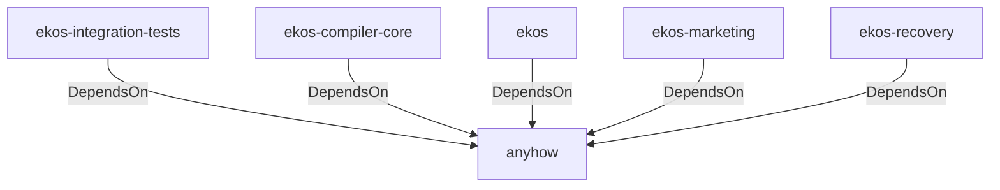

# anyhow (Technology)

## Properties

_No compiled properties._

## Relationships

### DependsOn

- ← ekos-integration-tests (`063808f9-5f19-5d62-b3dd-69eaa93d44cb`) — evidence: ekos-integration-tests depends on anyhow 1
- ← ekos-compiler-core (`2690bc0d-0233-516f-b969-9e87432f623d`) — evidence: ekos-compiler-core depends on anyhow 1
- ← ekos (`abd31cd9-b31d-54c5-87cd-8a4a5b9a30a0`) — evidence: ekos depends on anyhow 1
- ← ekos-marketing (`18dba45d-9534-5035-bd6f-df6b370079ac`) — evidence: ekos-marketing depends on anyhow 1
- ← ekos-recovery (`28244ebb-4e16-5e8d-a637-5e750d01f2b8`) — evidence: ekos-recovery depends on anyhow 1

## Diagram

## Evidence

- `f03325fe-37f9-42cb-b703-54b4b0706346` — ekos-integration-tests depends on anyhow 1 (confidence: 1.00)
- `ae431ea5-5661-4ca8-b985-8ea03465fcc5` — ekos-compiler-core depends on anyhow 1 (confidence: 1.00)
- `dca58a61-295d-40db-b2ef-f771518d09dc` — ekos depends on anyhow 1 (confidence: 1.00)
- `b9b84d37-30c7-45fc-9b75-8e1ff7b02f46` — ekos-marketing depends on anyhow 1 (confidence: 1.00)
- `d0a34d00-2f96-4615-a251-3537f913388a` — ekos-recovery depends on anyhow 1 (confidence: 1.00)
