# async-trait (Technology)

## Properties

_No compiled properties._

## Relationships

### DependsOn

- ← ekos-semantic (`f82d9ce0-df2a-5af8-9f9a-2bd5f8484839`) — evidence: ekos-semantic depends on async-trait 0.1
- ← ekos-runtime (`f4cd2d3b-f0b0-5234-ab2b-39de3275d717`) — evidence: ekos-runtime depends on async-trait 0.1
- ← ekos-compiler-core (`2690bc0d-0233-516f-b969-9e87432f623d`) — evidence: ekos-compiler-core depends on async-trait 0.1
- ← ekos-observation-sdk (`9a955a3a-55bc-587a-942d-fb81d6260052`) — evidence: ekos-observation-sdk depends on async-trait 0.1
- ← ekos-marketing (`18dba45d-9534-5035-bd6f-df6b370079ac`) — evidence: ekos-marketing depends on async-trait 0.1
- ← ekos-recovery (`28244ebb-4e16-5e8d-a637-5e750d01f2b8`) — evidence: ekos-recovery depends on async-trait 0.1
- ← ekos-plugin-oracle (`66e4bdc1-07c6-5f6e-9150-d6db731cf29d`) — evidence: ekos-plugin-oracle depends on async-trait 0.1
- ← ekos-plugin-confluence (`e8d1a3c9-e7b2-5084-bdfc-569e7b604054`) — evidence: ekos-plugin-confluence depends on async-trait 0.1
- ← ekos-plugin-localdocs (`0659fbf3-d2f4-54ba-835f-a7f6f875a7d1`) — evidence: ekos-plugin-localdocs depends on async-trait 0.1
- ← ekos-plugin-sap (`870bf8c4-5212-524c-a442-6fe561baf29d`) — evidence: ekos-plugin-sap depends on async-trait 0.1
- ← ekos-plugin-github (`aff4d491-b33f-56d7-b0ba-e03e884983fd`) — evidence: ekos-plugin-github depends on async-trait 0.1
- ← ekos-plugin-pentaho (`dac1d743-a50e-57a9-8acb-56e29a47ef5e`) — evidence: ekos-plugin-pentaho depends on async-trait 0.1
- ← ekos-plugin-file (`06b65958-abb7-5fe1-a6ee-d35946d39062`) — evidence: ekos-plugin-file depends on async-trait 0.1
- ← ekos-plugin-python (`020c78ca-f337-542f-b351-8b4201393bbb`) — evidence: ekos-plugin-python depends on async-trait 0.1
- ← ekos-plugin-git (`df977fc8-e004-518e-b267-581520ccd448`) — evidence: ekos-plugin-git depends on async-trait 0.1
- ← ekos-plugin-fabric (`aeb0688d-1d00-58a5-b6d6-245dfefa74cf`) — evidence: ekos-plugin-fabric depends on async-trait 0.1
- ← ekos-plugin-snowflake (`0a005794-329c-5fc3-a395-a5c55cf9cfcb`) — evidence: ekos-plugin-snowflake depends on async-trait 0.1
- ← ekos-plugin-salesforce (`a9e38433-d550-5523-8c13-4f5c31f4e742`) — evidence: ekos-plugin-salesforce depends on async-trait 0.1
- ← ekos-plugin-crypto (`835d6e67-5bb0-53e7-9104-338881612548`) — evidence: ekos-plugin-crypto depends on async-trait 0.1
- ← ekos-plugin-rust (`07179bab-d486-5b14-8c68-6e743e45b3f6`) — evidence: ekos-plugin-rust depends on async-trait 0.1

## Diagram

```mermaid
graph TD
    n7c905290824b57e0a55915ff1499b4d6["async-trait"]
    nf82d9ce0df2a5af89f9a2bd5f8484839["ekos-semantic"]
    nf82d9ce0df2a5af89f9a2bd5f8484839 -->|DependsOn| n7c905290824b57e0a55915ff1499b4d6
    nf4cd2d3bf0b05234ab2b39de3275d717["ekos-runtime"]
    nf4cd2d3bf0b05234ab2b39de3275d717 -->|DependsOn| n7c905290824b57e0a55915ff1499b4d6
    n2690bc0d0233516fb9699e87432f623d["ekos-compiler-core"]
    n2690bc0d0233516fb9699e87432f623d -->|DependsOn| n7c905290824b57e0a55915ff1499b4d6
    n9a955a3a55bc587a942dfb81d6260052["ekos-observation-sdk"]
    n9a955a3a55bc587a942dfb81d6260052 -->|DependsOn| n7c905290824b57e0a55915ff1499b4d6
    n18dba45d95345035bd6fdf6b370079ac["ekos-marketing"]
    n18dba45d95345035bd6fdf6b370079ac -->|DependsOn| n7c905290824b57e0a55915ff1499b4d6
    n28244ebb4e165e8da6375e750d01f2b8["ekos-recovery"]
    n28244ebb4e165e8da6375e750d01f2b8 -->|DependsOn| n7c905290824b57e0a55915ff1499b4d6
    n66e4bdc107c65f6e9150d6db731cf29d["ekos-plugin-oracle"]
    n66e4bdc107c65f6e9150d6db731cf29d -->|DependsOn| n7c905290824b57e0a55915ff1499b4d6
    ne8d1a3c9e7b25084bdfc569e7b604054["ekos-plugin-confluence"]
    ne8d1a3c9e7b25084bdfc569e7b604054 -->|DependsOn| n7c905290824b57e0a55915ff1499b4d6
    n0659fbf3d2f454ba835fa7f6f875a7d1["ekos-plugin-localdocs"]
    n0659fbf3d2f454ba835fa7f6f875a7d1 -->|DependsOn| n7c905290824b57e0a55915ff1499b4d6
    n870bf8c45212524ca4426fe561baf29d["ekos-plugin-sap"]
    n870bf8c45212524ca4426fe561baf29d -->|DependsOn| n7c905290824b57e0a55915ff1499b4d6
    naff4d491b33f56d7b0bae03e884983fd["ekos-plugin-github"]
    naff4d491b33f56d7b0bae03e884983fd -->|DependsOn| n7c905290824b57e0a55915ff1499b4d6
    ndac1d743a50e57a98acb56e29a47ef5e["ekos-plugin-pentaho"]
    ndac1d743a50e57a98acb56e29a47ef5e -->|DependsOn| n7c905290824b57e0a55915ff1499b4d6
    n06b65958abb75fe1a6eed35946d39062["ekos-plugin-file"]
    n06b65958abb75fe1a6eed35946d39062 -->|DependsOn| n7c905290824b57e0a55915ff1499b4d6
    n020c78caf337542fb3518b4201393bbb["ekos-plugin-python"]
    n020c78caf337542fb3518b4201393bbb -->|DependsOn| n7c905290824b57e0a55915ff1499b4d6
    ndf977fc8e004518eb267581520ccd448["ekos-plugin-git"]
    ndf977fc8e004518eb267581520ccd448 -->|DependsOn| n7c905290824b57e0a55915ff1499b4d6
    naeb0688d1d0058a5b6d6245dfefa74cf["ekos-plugin-fabric"]
    naeb0688d1d0058a5b6d6245dfefa74cf -->|DependsOn| n7c905290824b57e0a55915ff1499b4d6
    n0a005794329c5fc3a395a5c55cf9cfcb["ekos-plugin-snowflake"]
    n0a005794329c5fc3a395a5c55cf9cfcb -->|DependsOn| n7c905290824b57e0a55915ff1499b4d6
    na9e38433d55055238c134f5c31f4e742["ekos-plugin-salesforce"]
    na9e38433d55055238c134f5c31f4e742 -->|DependsOn| n7c905290824b57e0a55915ff1499b4d6
    n835d6e675bb053e79104338881612548["ekos-plugin-crypto"]
    n835d6e675bb053e79104338881612548 -->|DependsOn| n7c905290824b57e0a55915ff1499b4d6
    n07179babd4865b148c686e743e45b3f6["ekos-plugin-rust"]
    n07179babd4865b148c686e743e45b3f6 -->|DependsOn| n7c905290824b57e0a55915ff1499b4d6
```

## Evidence

- `8bf8732f-3d66-449c-aa58-0daf53824998` — ekos-semantic depends on async-trait 0.1 (confidence: 1.00)
- `2daeea6e-5d53-47bf-bc96-31d658f9af06` — ekos-runtime depends on async-trait 0.1 (confidence: 1.00)
- `2fbc9391-ee64-41d1-9f28-8c7c029c64b0` — ekos-compiler-core depends on async-trait 0.1 (confidence: 1.00)
- `5b05daf3-0fd2-4a58-9f43-c2f1e2da3cd7` — ekos-observation-sdk depends on async-trait 0.1 (confidence: 1.00)
- `570b7f05-b590-40a2-89e7-55de5ac65bb2` — ekos-marketing depends on async-trait 0.1 (confidence: 1.00)
- `7459f90c-2b1b-4823-98ce-1dc48c80efb1` — ekos-recovery depends on async-trait 0.1 (confidence: 1.00)
- `ff65d7ab-2eb3-4de0-aae2-37f159bae28d` — ekos-plugin-oracle depends on async-trait 0.1 (confidence: 1.00)
- `ef24afa9-a7c8-4bdd-8928-5f672c1b77f1` — ekos-plugin-confluence depends on async-trait 0.1 (confidence: 1.00)
- `cc5192a0-7e55-4c9a-bb3c-c2e31c53bf85` — ekos-plugin-localdocs depends on async-trait 0.1 (confidence: 1.00)
- `197d0083-933c-46d1-9688-014b4193a26d` — ekos-plugin-sap depends on async-trait 0.1 (confidence: 1.00)
- `10d59182-385d-47a9-92be-b36677f2e383` — ekos-plugin-github depends on async-trait 0.1 (confidence: 1.00)
- `342fee4b-a12b-4838-8f66-823c5260146f` — ekos-plugin-pentaho depends on async-trait 0.1 (confidence: 1.00)
- `de5ff6b5-2998-4915-8c0d-8157d74b48ee` — ekos-plugin-file depends on async-trait 0.1 (confidence: 1.00)
- `74cbedc4-9d33-457d-8f9f-d419ac074a11` — ekos-plugin-python depends on async-trait 0.1 (confidence: 1.00)
- `08c516b0-e903-49ae-af9d-55673de7199f` — ekos-plugin-git depends on async-trait 0.1 (confidence: 1.00)
- `eac15bc5-d07d-42fb-8b7a-8734c263f3d1` — ekos-plugin-fabric depends on async-trait 0.1 (confidence: 1.00)
- `19df8076-1901-47d9-b5ab-ce6135ecd8a6` — ekos-plugin-snowflake depends on async-trait 0.1 (confidence: 1.00)
- `e182abb1-14f2-49b0-827a-ae0d59bc3c39` — ekos-plugin-salesforce depends on async-trait 0.1 (confidence: 1.00)
- `91fb97eb-ac22-43ae-be93-20bd27f84801` — ekos-plugin-crypto depends on async-trait 0.1 (confidence: 1.00)
- `033866f0-4fdc-4ddb-b9d6-e9b0827fcb50` — ekos-plugin-rust depends on async-trait 0.1 (confidence: 1.00)
