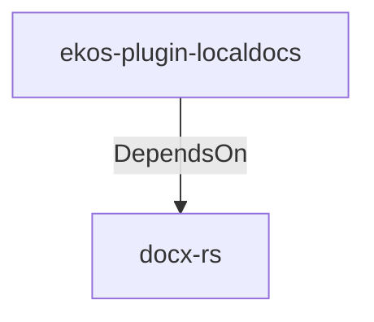

# docx-rs (Technology)

## Properties

_No compiled properties._

## Relationships

### DependsOn

- ← ekos-plugin-localdocs (`0659fbf3-d2f4-54ba-835f-a7f6f875a7d1`) — evidence: ekos-plugin-localdocs depends on docx-rs 0.4

## Diagram

## Evidence

- `5916fefd-d370-48d2-a39b-3b9a1c72d650` — ekos-plugin-localdocs depends on docx-rs 0.4 (confidence: 1.00)
