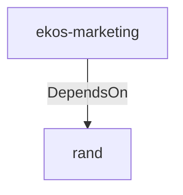

# rand (Technology)

## Properties

_No compiled properties._

## Relationships

### DependsOn

- ← ekos-marketing (`18dba45d-9534-5035-bd6f-df6b370079ac`) — evidence: ekos-marketing depends on rand 0.8

## Diagram

## Evidence

- `a070cc07-485d-4e0c-ae42-03871761bd3c` — ekos-marketing depends on rand 0.8 (confidence: 1.00)
