# reqwest (Technology)

## Properties

_No compiled properties._

## Relationships

### DependsOn

- ← ekos-marketing (`18dba45d-9534-5035-bd6f-df6b370079ac`) — evidence: ekos-marketing depends on reqwest 0.12
- ← ekos-recovery (`28244ebb-4e16-5e8d-a637-5e750d01f2b8`) — evidence: ekos-recovery depends on reqwest 0.12
- ← ekos-plugin-confluence (`e8d1a3c9-e7b2-5084-bdfc-569e7b604054`) — evidence: ekos-plugin-confluence depends on reqwest 0.12
- ← ekos-plugin-sap (`870bf8c4-5212-524c-a442-6fe561baf29d`) — evidence: ekos-plugin-sap depends on reqwest 0.12
- ← ekos-plugin-github (`aff4d491-b33f-56d7-b0ba-e03e884983fd`) — evidence: ekos-plugin-github depends on reqwest 0.12
- ← ekos-plugin-fabric (`aeb0688d-1d00-58a5-b6d6-245dfefa74cf`) — evidence: ekos-plugin-fabric depends on reqwest 0.12
- ← ekos-plugin-snowflake (`0a005794-329c-5fc3-a395-a5c55cf9cfcb`) — evidence: ekos-plugin-snowflake depends on reqwest 0.12
- ← ekos-plugin-salesforce (`a9e38433-d550-5523-8c13-4f5c31f4e742`) — evidence: ekos-plugin-salesforce depends on reqwest 0.12

## Diagram

```mermaid
graph TD
    n70acdf5062955f0c9157cb9866d0ec23["reqwest"]
    n18dba45d95345035bd6fdf6b370079ac["ekos-marketing"]
    n18dba45d95345035bd6fdf6b370079ac -->|DependsOn| n70acdf5062955f0c9157cb9866d0ec23
    n28244ebb4e165e8da6375e750d01f2b8["ekos-recovery"]
    n28244ebb4e165e8da6375e750d01f2b8 -->|DependsOn| n70acdf5062955f0c9157cb9866d0ec23
    ne8d1a3c9e7b25084bdfc569e7b604054["ekos-plugin-confluence"]
    ne8d1a3c9e7b25084bdfc569e7b604054 -->|DependsOn| n70acdf5062955f0c9157cb9866d0ec23
    n870bf8c45212524ca4426fe561baf29d["ekos-plugin-sap"]
    n870bf8c45212524ca4426fe561baf29d -->|DependsOn| n70acdf5062955f0c9157cb9866d0ec23
    naff4d491b33f56d7b0bae03e884983fd["ekos-plugin-github"]
    naff4d491b33f56d7b0bae03e884983fd -->|DependsOn| n70acdf5062955f0c9157cb9866d0ec23
    naeb0688d1d0058a5b6d6245dfefa74cf["ekos-plugin-fabric"]
    naeb0688d1d0058a5b6d6245dfefa74cf -->|DependsOn| n70acdf5062955f0c9157cb9866d0ec23
    n0a005794329c5fc3a395a5c55cf9cfcb["ekos-plugin-snowflake"]
    n0a005794329c5fc3a395a5c55cf9cfcb -->|DependsOn| n70acdf5062955f0c9157cb9866d0ec23
    na9e38433d55055238c134f5c31f4e742["ekos-plugin-salesforce"]
    na9e38433d55055238c134f5c31f4e742 -->|DependsOn| n70acdf5062955f0c9157cb9866d0ec23
```

## Evidence

- `7257d2c7-fbed-4f96-a3a3-0ab4772d9c57` — ekos-marketing depends on reqwest 0.12 (confidence: 1.00)
- `b8e228e9-6f95-420e-964f-15a4aabab58e` — ekos-recovery depends on reqwest 0.12 (confidence: 1.00)
- `c74486c5-cdf3-4705-aa91-7a50d824ffb8` — ekos-plugin-confluence depends on reqwest 0.12 (confidence: 1.00)
- `6f26415f-26d0-442a-87c3-cef2af7c9e03` — ekos-plugin-sap depends on reqwest 0.12 (confidence: 1.00)
- `aec8e510-daa5-49c2-b47d-6dfa772c3a82` — ekos-plugin-github depends on reqwest 0.12 (confidence: 1.00)
- `796ce75c-ad04-4f75-89d2-171e70b675bf` — ekos-plugin-fabric depends on reqwest 0.12 (confidence: 1.00)
- `031bae78-7f6c-4cdd-91ff-96ef5a2d3761` — ekos-plugin-snowflake depends on reqwest 0.12 (confidence: 1.00)
- `e4ebca17-7708-41c7-956a-b80d37997e5c` — ekos-plugin-salesforce depends on reqwest 0.12 (confidence: 1.00)
