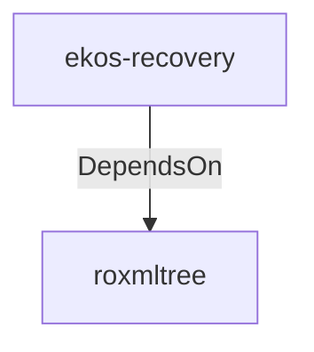

# roxmltree (Technology)

## Properties

_No compiled properties._

## Relationships

### DependsOn

- ← ekos-recovery (`28244ebb-4e16-5e8d-a637-5e750d01f2b8`) — evidence: ekos-recovery depends on roxmltree 0.20

## Diagram

## Evidence

- `c7b7ce68-ffb3-42e6-8e33-d063794f29ac` — ekos-recovery depends on roxmltree 0.20 (confidence: 1.00)
