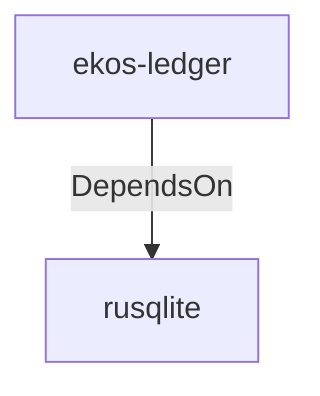

# rusqlite (Technology)

## Properties

_No compiled properties._

## Relationships

### DependsOn

- ← ekos-ledger (`9c977335-c421-519c-a889-558f0487574e`) — evidence: ekos-ledger depends on rusqlite 0.32

## Diagram

## Evidence

- `c232be1f-8d45-4562-a50e-fc3c11c8de8a` — ekos-ledger depends on rusqlite 0.32 (confidence: 1.00)
