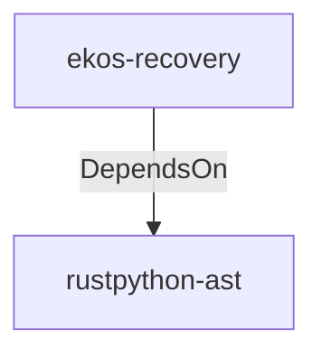

# rustpython-ast (Technology)

## Properties

_No compiled properties._

## Relationships

### DependsOn

- ← ekos-recovery (`28244ebb-4e16-5e8d-a637-5e750d01f2b8`) — evidence: ekos-recovery depends on rustpython-ast 0.4

## Diagram

## Evidence

- `a1973af9-ff81-4c38-a61a-ed8096ae7a9b` — ekos-recovery depends on rustpython-ast 0.4 (confidence: 1.00)
- `82c14887-2207-494e-a6e6-a377f30aaa01` — ekos-recovery depends on rustpython-parser 0.4 (confidence: 1.00)
