# sha2 (Technology)

## Properties

_No compiled properties._

## Relationships

### DependsOn

- ← ekos-compiler-core (`2690bc0d-0233-516f-b969-9e87432f623d`) — evidence: ekos-compiler-core depends on sha2 0.10
- ← ekos-observation-sdk (`9a955a3a-55bc-587a-942d-fb81d6260052`) — evidence: ekos-observation-sdk depends on sha2 0.10
- ← ekos-artifact (`8806bf54-6364-5052-b85a-cef4344e8f19`) — evidence: ekos-artifact depends on sha2 0.10
- ← ekos-common (`dc169f0a-98f1-5c7c-8dd0-1dbc8504e9c9`) — evidence: ekos-common depends on sha2 0.10
- ← ekos-marketing (`18dba45d-9534-5035-bd6f-df6b370079ac`) — evidence: ekos-marketing depends on sha1 0.10
- ← ekos-recovery (`28244ebb-4e16-5e8d-a637-5e750d01f2b8`) — evidence: ekos-recovery depends on sha2 0.10
- ← ekos-ledger (`9c977335-c421-519c-a889-558f0487574e`) — evidence: ekos-ledger depends on sha2 0.10
- ← ekos-plugin-localdocs (`0659fbf3-d2f4-54ba-835f-a7f6f875a7d1`) — evidence: ekos-plugin-localdocs depends on sha2 0.10
- ← ekos-plugin-pentaho (`dac1d743-a50e-57a9-8acb-56e29a47ef5e`) — evidence: ekos-plugin-pentaho depends on sha2 0.10
- ← ekos-plugin-file (`06b65958-abb7-5fe1-a6ee-d35946d39062`) — evidence: ekos-plugin-file depends on sha2 0.10
- ← ekos-plugin-python (`020c78ca-f337-542f-b351-8b4201393bbb`) — evidence: ekos-plugin-python depends on sha2 0.10
- ← ekos-plugin-rust (`07179bab-d486-5b14-8c68-6e743e45b3f6`) — evidence: ekos-plugin-rust depends on sha2 0.10

## Diagram

```mermaid
graph TD
    n64d6fba9eea752e69b3ab2e887a6944f["sha2"]
    n2690bc0d0233516fb9699e87432f623d["ekos-compiler-core"]
    n2690bc0d0233516fb9699e87432f623d -->|DependsOn| n64d6fba9eea752e69b3ab2e887a6944f
    n9a955a3a55bc587a942dfb81d6260052["ekos-observation-sdk"]
    n9a955a3a55bc587a942dfb81d6260052 -->|DependsOn| n64d6fba9eea752e69b3ab2e887a6944f
    n8806bf5463645052b85acef4344e8f19["ekos-artifact"]
    n8806bf5463645052b85acef4344e8f19 -->|DependsOn| n64d6fba9eea752e69b3ab2e887a6944f
    ndc169f0a98f15c7c8dd01dbc8504e9c9["ekos-common"]
    ndc169f0a98f15c7c8dd01dbc8504e9c9 -->|DependsOn| n64d6fba9eea752e69b3ab2e887a6944f
    n18dba45d95345035bd6fdf6b370079ac["ekos-marketing"]
    n18dba45d95345035bd6fdf6b370079ac -->|DependsOn| n64d6fba9eea752e69b3ab2e887a6944f
    n28244ebb4e165e8da6375e750d01f2b8["ekos-recovery"]
    n28244ebb4e165e8da6375e750d01f2b8 -->|DependsOn| n64d6fba9eea752e69b3ab2e887a6944f
    n9c977335c421519ca889558f0487574e["ekos-ledger"]
    n9c977335c421519ca889558f0487574e -->|DependsOn| n64d6fba9eea752e69b3ab2e887a6944f
    n0659fbf3d2f454ba835fa7f6f875a7d1["ekos-plugin-localdocs"]
    n0659fbf3d2f454ba835fa7f6f875a7d1 -->|DependsOn| n64d6fba9eea752e69b3ab2e887a6944f
    ndac1d743a50e57a98acb56e29a47ef5e["ekos-plugin-pentaho"]
    ndac1d743a50e57a98acb56e29a47ef5e -->|DependsOn| n64d6fba9eea752e69b3ab2e887a6944f
    n06b65958abb75fe1a6eed35946d39062["ekos-plugin-file"]
    n06b65958abb75fe1a6eed35946d39062 -->|DependsOn| n64d6fba9eea752e69b3ab2e887a6944f
    n020c78caf337542fb3518b4201393bbb["ekos-plugin-python"]
    n020c78caf337542fb3518b4201393bbb -->|DependsOn| n64d6fba9eea752e69b3ab2e887a6944f
    n07179babd4865b148c686e743e45b3f6["ekos-plugin-rust"]
    n07179babd4865b148c686e743e45b3f6 -->|DependsOn| n64d6fba9eea752e69b3ab2e887a6944f
```

## Evidence

- `83fbee43-7416-4852-bb13-cebffb303fbc` — ekos-compiler-core depends on sha2 0.10 (confidence: 1.00)
- `92d289f2-13fa-4dbf-8938-b8780fb0670a` — ekos-observation-sdk depends on sha2 0.10 (confidence: 1.00)
- `e0dda76a-d2df-4af4-996f-01122fd3ddec` — ekos-artifact depends on sha2 0.10 (confidence: 1.00)
- `918260e6-1423-447e-b053-c1533488dcf6` — ekos-common depends on sha2 0.10 (confidence: 1.00)
- `db8ed89d-01f4-4848-981d-8577081e6bbb` — ekos-marketing depends on sha1 0.10 (confidence: 1.00)
- `6ba66a9f-93ff-4a05-a0d3-a7adf0395f42` — ekos-recovery depends on sha2 0.10 (confidence: 1.00)
- `23705374-fb5a-4f05-9956-71bf2db728f0` — ekos-ledger depends on sha2 0.10 (confidence: 1.00)
- `d317f3f0-b24b-4f39-9f5c-c2f86374c1f8` — ekos-plugin-localdocs depends on sha2 0.10 (confidence: 1.00)
- `11fdc3b1-b3dc-442d-bc5c-69a39a0c4701` — ekos-plugin-pentaho depends on sha2 0.10 (confidence: 1.00)
- `31f8bea2-b24e-4fab-89e4-d02d60cf4157` — ekos-plugin-file depends on sha2 0.10 (confidence: 1.00)
- `2edd4547-a6c9-493d-b00c-30cd7b18b2ca` — ekos-plugin-python depends on sha2 0.10 (confidence: 1.00)
- `eadf547a-990c-46e3-9e1d-c7e27c31a3d5` — ekos-plugin-rust depends on sha2 0.10 (confidence: 1.00)
