# sqlparser (Technology)

## Properties

_No compiled properties._

## Relationships

### DependsOn

- ← ekos-benchmark (`20c26e43-ee96-5ee7-a046-25740fbbd56b`) — evidence: ekos-benchmark depends on sqlparser 0.53
- ← ekos-sql-dialect-sdk (`bf4371bd-7cee-54d1-9457-06a1079a38cf`) — evidence: ekos-sql-dialect-sdk depends on sqlparser 0.53
- ← ekos-recovery (`28244ebb-4e16-5e8d-a637-5e750d01f2b8`) — evidence: ekos-recovery depends on sqlparser 0.53
- ← ekos-plugin-sql-dialect-mssql (`05ad9d89-d39c-5316-b413-2903b6b557db`) — evidence: ekos-plugin-sql-dialect-mssql depends on sqlparser 0.53
- ← ekos-plugin-sql-dialect-databricks (`920f4203-48d4-5079-a5ee-41b212c4858c`) — evidence: ekos-plugin-sql-dialect-databricks depends on sqlparser 0.53
- ← ekos-plugin-sql-dialect-postgres (`ff9a3a7c-0610-5442-ac0b-210e45700aad`) — evidence: ekos-plugin-sql-dialect-postgres depends on sqlparser 0.53
- ← ekos-plugin-sql-dialect-mysql (`001696e1-9479-5c36-ae53-08898760049d`) — evidence: ekos-plugin-sql-dialect-mysql depends on sqlparser 0.53
- ← ekos-plugin-sql-dialect-snowflake (`15989d49-59f8-564e-a77d-c90d2d87c80b`) — evidence: ekos-plugin-sql-dialect-snowflake depends on sqlparser 0.53

## Diagram

```mermaid
graph TD
    nbb72fd94a6bc567284efbdeeb20ad78c["sqlparser"]
    n20c26e43ee965ee7a04625740fbbd56b["ekos-benchmark"]
    n20c26e43ee965ee7a04625740fbbd56b -->|DependsOn| nbb72fd94a6bc567284efbdeeb20ad78c
    nbf4371bd7cee54d1945706a1079a38cf["ekos-sql-dialect-sdk"]
    nbf4371bd7cee54d1945706a1079a38cf -->|DependsOn| nbb72fd94a6bc567284efbdeeb20ad78c
    n28244ebb4e165e8da6375e750d01f2b8["ekos-recovery"]
    n28244ebb4e165e8da6375e750d01f2b8 -->|DependsOn| nbb72fd94a6bc567284efbdeeb20ad78c
    n05ad9d89d39c5316b4132903b6b557db["ekos-plugin-sql-dialect-mssql"]
    n05ad9d89d39c5316b4132903b6b557db -->|DependsOn| nbb72fd94a6bc567284efbdeeb20ad78c
    n920f420348d45079a5ee41b212c4858c["ekos-plugin-sql-dialect-databricks"]
    n920f420348d45079a5ee41b212c4858c -->|DependsOn| nbb72fd94a6bc567284efbdeeb20ad78c
    nff9a3a7c06105442ac0b210e45700aad["ekos-plugin-sql-dialect-postgres"]
    nff9a3a7c06105442ac0b210e45700aad -->|DependsOn| nbb72fd94a6bc567284efbdeeb20ad78c
    n001696e194795c36ae5308898760049d["ekos-plugin-sql-dialect-mysql"]
    n001696e194795c36ae5308898760049d -->|DependsOn| nbb72fd94a6bc567284efbdeeb20ad78c
    n15989d4959f8564ea77dc90d2d87c80b["ekos-plugin-sql-dialect-snowflake"]
    n15989d4959f8564ea77dc90d2d87c80b -->|DependsOn| nbb72fd94a6bc567284efbdeeb20ad78c
```

## Evidence

- `02841957-4d1d-41dc-8919-b01fcbfa184a` — ekos-benchmark depends on sqlparser 0.53 (confidence: 1.00)
- `3f0d0f1e-c266-4993-8b8a-fec7ec6b6959` — ekos-sql-dialect-sdk depends on sqlparser 0.53 (confidence: 1.00)
- `15cecb9c-c7eb-489c-b3d1-dd6410815e3a` — ekos-recovery depends on sqlparser 0.53 (confidence: 1.00)
- `6e9911da-3bad-45a3-812b-c65ffca71267` — ekos-plugin-sql-dialect-mssql depends on sqlparser 0.53 (confidence: 1.00)
- `4f3db0ae-aeb3-4054-a11b-9dd91cd16ca9` — ekos-plugin-sql-dialect-databricks depends on sqlparser 0.53 (confidence: 1.00)
- `32d8c775-8ae3-4c4a-8341-a1aac614e861` — ekos-plugin-sql-dialect-postgres depends on sqlparser 0.53 (confidence: 1.00)
- `b8cc034f-cf82-430e-b802-44b72c8bd062` — ekos-plugin-sql-dialect-mysql depends on sqlparser 0.53 (confidence: 1.00)
- `5ce4771a-83b6-4584-ac21-a456bc84ff6b` — ekos-plugin-sql-dialect-snowflake depends on sqlparser 0.53 (confidence: 1.00)
