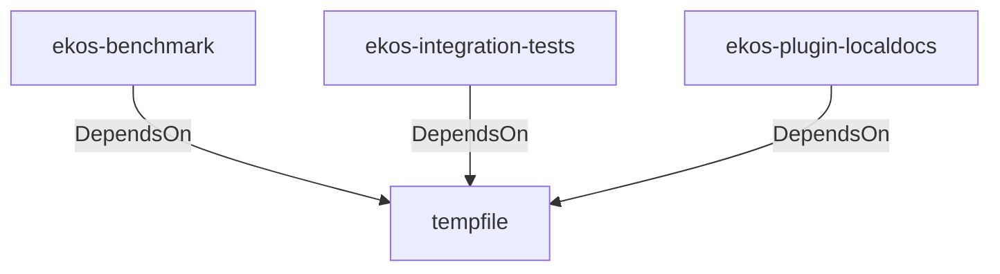

# tempfile (Technology)

## Properties

_No compiled properties._

## Relationships

### DependsOn

- ← ekos-benchmark (`20c26e43-ee96-5ee7-a046-25740fbbd56b`) — evidence: ekos-benchmark depends on tempfile 3
- ← ekos-integration-tests (`063808f9-5f19-5d62-b3dd-69eaa93d44cb`) — evidence: ekos-integration-tests depends on tempfile 3
- ← ekos-plugin-localdocs (`0659fbf3-d2f4-54ba-835f-a7f6f875a7d1`) — evidence: ekos-plugin-localdocs depends on tempfile 3

## Diagram

## Evidence

- `3b69ac22-08a9-4cf1-b000-a2b025a7982f` — ekos-benchmark depends on tempfile 3 (confidence: 1.00)
- `ea4ed272-c059-476d-980d-36597d0e6af2` — ekos-integration-tests depends on tempfile 3 (confidence: 1.00)
- `3e67aa79-e99f-4ddf-8408-ca379a133868` — ekos-plugin-localdocs depends on tempfile 3 (confidence: 1.00)
