# tokio (Technology)

## Properties

_No compiled properties._

## Relationships

### DependsOn

- ← ekos-benchmark (`20c26e43-ee96-5ee7-a046-25740fbbd56b`) — evidence: ekos-benchmark depends on tokio 1
- ← ekos-integration-tests (`063808f9-5f19-5d62-b3dd-69eaa93d44cb`) — evidence: ekos-integration-tests depends on tokio 1
- ← ekos-compiler-core (`2690bc0d-0233-516f-b969-9e87432f623d`) — evidence: ekos-compiler-core depends on tokio 1
- ← ekos (`abd31cd9-b31d-54c5-87cd-8a4a5b9a30a0`) — evidence: ekos depends on tokio 1
- ← ekos-observation-sdk (`9a955a3a-55bc-587a-942d-fb81d6260052`) — evidence: ekos-observation-sdk depends on tokio 1
- ← ekos-marketing (`18dba45d-9534-5035-bd6f-df6b370079ac`) — evidence: ekos-marketing depends on tokio 1
- ← ekos-recovery (`28244ebb-4e16-5e8d-a637-5e750d01f2b8`) — evidence: ekos-recovery depends on tokio 1
- ← ekos-plugin-oracle (`66e4bdc1-07c6-5f6e-9150-d6db731cf29d`) — evidence: ekos-plugin-oracle depends on tokio 1
- ← ekos-plugin-confluence (`e8d1a3c9-e7b2-5084-bdfc-569e7b604054`) — evidence: ekos-plugin-confluence depends on tokio 1
- ← ekos-plugin-localdocs (`0659fbf3-d2f4-54ba-835f-a7f6f875a7d1`) — evidence: ekos-plugin-localdocs depends on tokio 1
- ← ekos-plugin-sap (`870bf8c4-5212-524c-a442-6fe561baf29d`) — evidence: ekos-plugin-sap depends on tokio 1
- ← ekos-plugin-github (`aff4d491-b33f-56d7-b0ba-e03e884983fd`) — evidence: ekos-plugin-github depends on tokio 1
- ← ekos-plugin-pentaho (`dac1d743-a50e-57a9-8acb-56e29a47ef5e`) — evidence: ekos-plugin-pentaho depends on tokio 1
- ← ekos-plugin-file (`06b65958-abb7-5fe1-a6ee-d35946d39062`) — evidence: ekos-plugin-file depends on tokio 1
- ← ekos-plugin-python (`020c78ca-f337-542f-b351-8b4201393bbb`) — evidence: ekos-plugin-python depends on tokio 1
- ← ekos-plugin-git (`df977fc8-e004-518e-b267-581520ccd448`) — evidence: ekos-plugin-git depends on tokio 1
- ← ekos-plugin-fabric (`aeb0688d-1d00-58a5-b6d6-245dfefa74cf`) — evidence: ekos-plugin-fabric depends on tokio 1
- ← ekos-plugin-snowflake (`0a005794-329c-5fc3-a395-a5c55cf9cfcb`) — evidence: ekos-plugin-snowflake depends on tokio 1
- ← ekos-plugin-salesforce (`a9e38433-d550-5523-8c13-4f5c31f4e742`) — evidence: ekos-plugin-salesforce depends on tokio 1
- ← ekos-plugin-crypto (`835d6e67-5bb0-53e7-9104-338881612548`) — evidence: ekos-plugin-crypto depends on tokio 1
- ← ekos-plugin-rust (`07179bab-d486-5b14-8c68-6e743e45b3f6`) — evidence: ekos-plugin-rust depends on tokio 1

## Diagram

```mermaid
graph TD
    n4a4e8d5c51025d1dadddd7fb0bc8d7b9["tokio"]
    n20c26e43ee965ee7a04625740fbbd56b["ekos-benchmark"]
    n20c26e43ee965ee7a04625740fbbd56b -->|DependsOn| n4a4e8d5c51025d1dadddd7fb0bc8d7b9
    n063808f95f195d62b3dd69eaa93d44cb["ekos-integration-tests"]
    n063808f95f195d62b3dd69eaa93d44cb -->|DependsOn| n4a4e8d5c51025d1dadddd7fb0bc8d7b9
    n2690bc0d0233516fb9699e87432f623d["ekos-compiler-core"]
    n2690bc0d0233516fb9699e87432f623d -->|DependsOn| n4a4e8d5c51025d1dadddd7fb0bc8d7b9
    nabd31cd9b31d54c587cd8a4a5b9a30a0["ekos"]
    nabd31cd9b31d54c587cd8a4a5b9a30a0 -->|DependsOn| n4a4e8d5c51025d1dadddd7fb0bc8d7b9
    n9a955a3a55bc587a942dfb81d6260052["ekos-observation-sdk"]
    n9a955a3a55bc587a942dfb81d6260052 -->|DependsOn| n4a4e8d5c51025d1dadddd7fb0bc8d7b9
    n18dba45d95345035bd6fdf6b370079ac["ekos-marketing"]
    n18dba45d95345035bd6fdf6b370079ac -->|DependsOn| n4a4e8d5c51025d1dadddd7fb0bc8d7b9
    n28244ebb4e165e8da6375e750d01f2b8["ekos-recovery"]
    n28244ebb4e165e8da6375e750d01f2b8 -->|DependsOn| n4a4e8d5c51025d1dadddd7fb0bc8d7b9
    n66e4bdc107c65f6e9150d6db731cf29d["ekos-plugin-oracle"]
    n66e4bdc107c65f6e9150d6db731cf29d -->|DependsOn| n4a4e8d5c51025d1dadddd7fb0bc8d7b9
    ne8d1a3c9e7b25084bdfc569e7b604054["ekos-plugin-confluence"]
    ne8d1a3c9e7b25084bdfc569e7b604054 -->|DependsOn| n4a4e8d5c51025d1dadddd7fb0bc8d7b9
    n0659fbf3d2f454ba835fa7f6f875a7d1["ekos-plugin-localdocs"]
    n0659fbf3d2f454ba835fa7f6f875a7d1 -->|DependsOn| n4a4e8d5c51025d1dadddd7fb0bc8d7b9
    n870bf8c45212524ca4426fe561baf29d["ekos-plugin-sap"]
    n870bf8c45212524ca4426fe561baf29d -->|DependsOn| n4a4e8d5c51025d1dadddd7fb0bc8d7b9
    naff4d491b33f56d7b0bae03e884983fd["ekos-plugin-github"]
    naff4d491b33f56d7b0bae03e884983fd -->|DependsOn| n4a4e8d5c51025d1dadddd7fb0bc8d7b9
    ndac1d743a50e57a98acb56e29a47ef5e["ekos-plugin-pentaho"]
    ndac1d743a50e57a98acb56e29a47ef5e -->|DependsOn| n4a4e8d5c51025d1dadddd7fb0bc8d7b9
    n06b65958abb75fe1a6eed35946d39062["ekos-plugin-file"]
    n06b65958abb75fe1a6eed35946d39062 -->|DependsOn| n4a4e8d5c51025d1dadddd7fb0bc8d7b9
    n020c78caf337542fb3518b4201393bbb["ekos-plugin-python"]
    n020c78caf337542fb3518b4201393bbb -->|DependsOn| n4a4e8d5c51025d1dadddd7fb0bc8d7b9
    ndf977fc8e004518eb267581520ccd448["ekos-plugin-git"]
    ndf977fc8e004518eb267581520ccd448 -->|DependsOn| n4a4e8d5c51025d1dadddd7fb0bc8d7b9
    naeb0688d1d0058a5b6d6245dfefa74cf["ekos-plugin-fabric"]
    naeb0688d1d0058a5b6d6245dfefa74cf -->|DependsOn| n4a4e8d5c51025d1dadddd7fb0bc8d7b9
    n0a005794329c5fc3a395a5c55cf9cfcb["ekos-plugin-snowflake"]
    n0a005794329c5fc3a395a5c55cf9cfcb -->|DependsOn| n4a4e8d5c51025d1dadddd7fb0bc8d7b9
    na9e38433d55055238c134f5c31f4e742["ekos-plugin-salesforce"]
    na9e38433d55055238c134f5c31f4e742 -->|DependsOn| n4a4e8d5c51025d1dadddd7fb0bc8d7b9
    n835d6e675bb053e79104338881612548["ekos-plugin-crypto"]
    n835d6e675bb053e79104338881612548 -->|DependsOn| n4a4e8d5c51025d1dadddd7fb0bc8d7b9
    n07179babd4865b148c686e743e45b3f6["ekos-plugin-rust"]
    n07179babd4865b148c686e743e45b3f6 -->|DependsOn| n4a4e8d5c51025d1dadddd7fb0bc8d7b9
```

## Evidence

- `50ed77e6-3336-487b-9579-62239f19d582` — ekos-benchmark depends on tokio 1 (confidence: 1.00)
- `0465fd80-5bad-496d-aee6-34f5bd25aaf0` — ekos-integration-tests depends on tokio 1 (confidence: 1.00)
- `9c47787a-5392-4013-bb22-56066e9a042a` — ekos-compiler-core depends on tokio 1 (confidence: 1.00)
- `8dbc5413-7436-4c37-a580-5e66e3ad8d8f` — ekos depends on tokio 1 (confidence: 1.00)
- `b8acbed1-86b7-4f85-ba02-461c5a3b53bd` — ekos-observation-sdk depends on tokio 1 (confidence: 1.00)
- `a7332c32-77ba-4bbb-9dfc-393418b3bd35` — ekos-marketing depends on tokio 1 (confidence: 1.00)
- `94eb17f1-61df-4a6c-815f-4f6b88be3514` — ekos-recovery depends on tokio 1 (confidence: 1.00)
- `356a4006-7e94-4aaa-8f5f-bd75510ef137` — ekos-plugin-oracle depends on tokio 1 (confidence: 1.00)
- `d84470be-f3b7-48ff-ab01-786e0c7ad098` — ekos-plugin-confluence depends on tokio 1 (confidence: 1.00)
- `646d923e-0563-49da-933f-b3aebb2c8b08` — ekos-plugin-localdocs depends on tokio 1 (confidence: 1.00)
- `f64c1559-df9a-4a11-b7ee-5e8305a6a8af` — ekos-plugin-sap depends on tokio 1 (confidence: 1.00)
- `c789bd75-c5eb-41cb-8a3a-4499ddd6fb4c` — ekos-plugin-github depends on tokio 1 (confidence: 1.00)
- `2a554bc0-dfd3-4fc4-93c7-35b1d95fef69` — ekos-plugin-pentaho depends on tokio 1 (confidence: 1.00)
- `2f8fb127-42bc-470c-b41f-fc17d58c2e74` — ekos-plugin-file depends on tokio 1 (confidence: 1.00)
- `60b87f1c-3cbd-407d-b8a4-8ae513707936` — ekos-plugin-python depends on tokio 1 (confidence: 1.00)
- `a131b46f-ef3c-4bcb-bd1b-d06210f3be7b` — ekos-plugin-git depends on tokio 1 (confidence: 1.00)
- `2da8232b-2025-45bd-bbce-133c5237e31b` — ekos-plugin-fabric depends on tokio 1 (confidence: 1.00)
- `395f5fad-55ff-4137-a730-ba0abee368fc` — ekos-plugin-snowflake depends on tokio 1 (confidence: 1.00)
- `73fcef42-d5c4-464b-a8d7-6ca5f9e511aa` — ekos-plugin-salesforce depends on tokio 1 (confidence: 1.00)
- `9137e9d9-6beb-415a-8298-7b539391c76d` — ekos-plugin-crypto depends on tokio 1 (confidence: 1.00)
- `faff6884-c7e3-4a95-b578-232626d5baba` — ekos-plugin-rust depends on tokio 1 (confidence: 1.00)
