# tracing (Technology)

## Properties

_No compiled properties._

## Relationships

### DependsOn

- ← ekos-semantic (`f82d9ce0-df2a-5af8-9f9a-2bd5f8484839`) — evidence: ekos-semantic depends on tracing 0.1
- ← ekos-compiler-core (`2690bc0d-0233-516f-b969-9e87432f623d`) — evidence: ekos-compiler-core depends on tracing 0.1
- ← ekos (`abd31cd9-b31d-54c5-87cd-8a4a5b9a30a0`) — evidence: ekos depends on tracing 0.1
- ← ekos-artifact (`8806bf54-6364-5052-b85a-cef4344e8f19`) — evidence: ekos-artifact depends on tracing 0.1
- ← ekos-marketing (`18dba45d-9534-5035-bd6f-df6b370079ac`) — evidence: ekos-marketing depends on tracing 0.1
- ← ekos-recovery (`28244ebb-4e16-5e8d-a637-5e750d01f2b8`) — evidence: ekos-recovery depends on tracing 0.1
- ← ekos-ledger (`9c977335-c421-519c-a889-558f0487574e`) — evidence: ekos-ledger depends on tracing 0.1
- ← ekos-plugin-oracle (`66e4bdc1-07c6-5f6e-9150-d6db731cf29d`) — evidence: ekos-plugin-oracle depends on tracing 0.1
- ← ekos-plugin-confluence (`e8d1a3c9-e7b2-5084-bdfc-569e7b604054`) — evidence: ekos-plugin-confluence depends on tracing 0.1
- ← ekos-plugin-localdocs (`0659fbf3-d2f4-54ba-835f-a7f6f875a7d1`) — evidence: ekos-plugin-localdocs depends on tracing 0.1
- ← ekos-plugin-sap (`870bf8c4-5212-524c-a442-6fe561baf29d`) — evidence: ekos-plugin-sap depends on tracing 0.1
- ← ekos-plugin-github (`aff4d491-b33f-56d7-b0ba-e03e884983fd`) — evidence: ekos-plugin-github depends on tracing 0.1
- ← ekos-plugin-pentaho (`dac1d743-a50e-57a9-8acb-56e29a47ef5e`) — evidence: ekos-plugin-pentaho depends on tracing 0.1
- ← ekos-plugin-file (`06b65958-abb7-5fe1-a6ee-d35946d39062`) — evidence: ekos-plugin-file depends on tracing 0.1
- ← ekos-plugin-python (`020c78ca-f337-542f-b351-8b4201393bbb`) — evidence: ekos-plugin-python depends on tracing 0.1
- ← ekos-plugin-git (`df977fc8-e004-518e-b267-581520ccd448`) — evidence: ekos-plugin-git depends on tracing 0.1
- ← ekos-plugin-fabric (`aeb0688d-1d00-58a5-b6d6-245dfefa74cf`) — evidence: ekos-plugin-fabric depends on tracing 0.1
- ← ekos-plugin-snowflake (`0a005794-329c-5fc3-a395-a5c55cf9cfcb`) — evidence: ekos-plugin-snowflake depends on tracing 0.1
- ← ekos-plugin-salesforce (`a9e38433-d550-5523-8c13-4f5c31f4e742`) — evidence: ekos-plugin-salesforce depends on tracing 0.1
- ← ekos-plugin-crypto (`835d6e67-5bb0-53e7-9104-338881612548`) — evidence: ekos-plugin-crypto depends on tracing 0.1
- ← ekos-plugin-rust (`07179bab-d486-5b14-8c68-6e743e45b3f6`) — evidence: ekos-plugin-rust depends on tracing 0.1

## Diagram

```mermaid
graph TD
    n4282d26628505d04a9920f0a204788aa["tracing"]
    nf82d9ce0df2a5af89f9a2bd5f8484839["ekos-semantic"]
    nf82d9ce0df2a5af89f9a2bd5f8484839 -->|DependsOn| n4282d26628505d04a9920f0a204788aa
    n2690bc0d0233516fb9699e87432f623d["ekos-compiler-core"]
    n2690bc0d0233516fb9699e87432f623d -->|DependsOn| n4282d26628505d04a9920f0a204788aa
    nabd31cd9b31d54c587cd8a4a5b9a30a0["ekos"]
    nabd31cd9b31d54c587cd8a4a5b9a30a0 -->|DependsOn| n4282d26628505d04a9920f0a204788aa
    n8806bf5463645052b85acef4344e8f19["ekos-artifact"]
    n8806bf5463645052b85acef4344e8f19 -->|DependsOn| n4282d26628505d04a9920f0a204788aa
    n18dba45d95345035bd6fdf6b370079ac["ekos-marketing"]
    n18dba45d95345035bd6fdf6b370079ac -->|DependsOn| n4282d26628505d04a9920f0a204788aa
    n28244ebb4e165e8da6375e750d01f2b8["ekos-recovery"]
    n28244ebb4e165e8da6375e750d01f2b8 -->|DependsOn| n4282d26628505d04a9920f0a204788aa
    n9c977335c421519ca889558f0487574e["ekos-ledger"]
    n9c977335c421519ca889558f0487574e -->|DependsOn| n4282d26628505d04a9920f0a204788aa
    n66e4bdc107c65f6e9150d6db731cf29d["ekos-plugin-oracle"]
    n66e4bdc107c65f6e9150d6db731cf29d -->|DependsOn| n4282d26628505d04a9920f0a204788aa
    ne8d1a3c9e7b25084bdfc569e7b604054["ekos-plugin-confluence"]
    ne8d1a3c9e7b25084bdfc569e7b604054 -->|DependsOn| n4282d26628505d04a9920f0a204788aa
    n0659fbf3d2f454ba835fa7f6f875a7d1["ekos-plugin-localdocs"]
    n0659fbf3d2f454ba835fa7f6f875a7d1 -->|DependsOn| n4282d26628505d04a9920f0a204788aa
    n870bf8c45212524ca4426fe561baf29d["ekos-plugin-sap"]
    n870bf8c45212524ca4426fe561baf29d -->|DependsOn| n4282d26628505d04a9920f0a204788aa
    naff4d491b33f56d7b0bae03e884983fd["ekos-plugin-github"]
    naff4d491b33f56d7b0bae03e884983fd -->|DependsOn| n4282d26628505d04a9920f0a204788aa
    ndac1d743a50e57a98acb56e29a47ef5e["ekos-plugin-pentaho"]
    ndac1d743a50e57a98acb56e29a47ef5e -->|DependsOn| n4282d26628505d04a9920f0a204788aa
    n06b65958abb75fe1a6eed35946d39062["ekos-plugin-file"]
    n06b65958abb75fe1a6eed35946d39062 -->|DependsOn| n4282d26628505d04a9920f0a204788aa
    n020c78caf337542fb3518b4201393bbb["ekos-plugin-python"]
    n020c78caf337542fb3518b4201393bbb -->|DependsOn| n4282d26628505d04a9920f0a204788aa
    ndf977fc8e004518eb267581520ccd448["ekos-plugin-git"]
    ndf977fc8e004518eb267581520ccd448 -->|DependsOn| n4282d26628505d04a9920f0a204788aa
    naeb0688d1d0058a5b6d6245dfefa74cf["ekos-plugin-fabric"]
    naeb0688d1d0058a5b6d6245dfefa74cf -->|DependsOn| n4282d26628505d04a9920f0a204788aa
    n0a005794329c5fc3a395a5c55cf9cfcb["ekos-plugin-snowflake"]
    n0a005794329c5fc3a395a5c55cf9cfcb -->|DependsOn| n4282d26628505d04a9920f0a204788aa
    na9e38433d55055238c134f5c31f4e742["ekos-plugin-salesforce"]
    na9e38433d55055238c134f5c31f4e742 -->|DependsOn| n4282d26628505d04a9920f0a204788aa
    n835d6e675bb053e79104338881612548["ekos-plugin-crypto"]
    n835d6e675bb053e79104338881612548 -->|DependsOn| n4282d26628505d04a9920f0a204788aa
    n07179babd4865b148c686e743e45b3f6["ekos-plugin-rust"]
    n07179babd4865b148c686e743e45b3f6 -->|DependsOn| n4282d26628505d04a9920f0a204788aa
```

## Evidence

- `6746d2e9-5b9c-4db9-ae44-d2e13dd1d15e` — ekos-semantic depends on tracing 0.1 (confidence: 1.00)
- `e33da2ac-9fa5-4ea6-aee7-4635698ac114` — ekos-compiler-core depends on tracing 0.1 (confidence: 1.00)
- `712e2e58-1575-4b3d-ae4c-59ad0f53eab4` — ekos depends on tracing 0.1 (confidence: 1.00)
- `6779a007-b363-4ff8-91c6-16bdc4f3ffaf` — ekos depends on tracing-subscriber 0.3 (confidence: 1.00)
- `02d563a0-6799-40aa-bf46-b3c40fa0e027` — ekos-artifact depends on tracing 0.1 (confidence: 1.00)
- `37d01ea5-db83-4639-8a8d-a74986b0c7ca` — ekos-marketing depends on tracing 0.1 (confidence: 1.00)
- `b0cf3608-09a4-4eb2-8de1-dac30e874316` — ekos-recovery depends on tracing 0.1 (confidence: 1.00)
- `d62d42e9-87d7-498c-8ce8-8ae75943139c` — ekos-ledger depends on tracing 0.1 (confidence: 1.00)
- `5611533b-f302-43f6-b9c6-dcb7f431c411` — ekos-plugin-oracle depends on tracing 0.1 (confidence: 1.00)
- `95f28cf3-24d8-4aab-9fac-9228f71803c5` — ekos-plugin-confluence depends on tracing 0.1 (confidence: 1.00)
- `787d180e-336d-4c89-b655-0b1e73035b77` — ekos-plugin-localdocs depends on tracing 0.1 (confidence: 1.00)
- `e108ce34-dec6-41b6-849d-f5bbae48be1c` — ekos-plugin-sap depends on tracing 0.1 (confidence: 1.00)
- `8009452d-282e-4eba-84d8-535aec6fa417` — ekos-plugin-github depends on tracing 0.1 (confidence: 1.00)
- `55edbb25-d0c7-4a17-871c-a754ee38285a` — ekos-plugin-pentaho depends on tracing 0.1 (confidence: 1.00)
- `755424df-c39e-4de9-be10-258013b9734e` — ekos-plugin-file depends on tracing 0.1 (confidence: 1.00)
- `67449116-45d4-49e0-a652-75f2d970dd13` — ekos-plugin-python depends on tracing 0.1 (confidence: 1.00)
- `f2891edd-f964-4a05-b7b4-1d9055d760af` — ekos-plugin-git depends on tracing 0.1 (confidence: 1.00)
- `d2697fb0-2638-4dca-b7d9-cb89de4f6dfa` — ekos-plugin-fabric depends on tracing 0.1 (confidence: 1.00)
- `946319be-32cd-43ad-ab07-dd7153bfa481` — ekos-plugin-snowflake depends on tracing 0.1 (confidence: 1.00)
- `bce754cd-202b-44f6-828a-fbf87eae684c` — ekos-plugin-salesforce depends on tracing 0.1 (confidence: 1.00)
- `23d50d67-308a-4520-af6a-047ad8534612` — ekos-plugin-crypto depends on tracing 0.1 (confidence: 1.00)
- `fb5f7dc5-7134-45a0-8c40-a49dadd81131` — ekos-plugin-rust depends on tracing 0.1 (confidence: 1.00)
