# uuid (Technology)

## Properties

_No compiled properties._

## Relationships

### DependsOn

- ← ekos-benchmark (`20c26e43-ee96-5ee7-a046-25740fbbd56b`) — evidence: ekos-benchmark depends on uuid 1
- ← ekos-semantic (`f82d9ce0-df2a-5af8-9f9a-2bd5f8484839`) — evidence: ekos-semantic depends on uuid 1
- ← ekos-kir (`7e3bc0de-d888-55cd-aa9a-f333f6e2cbb2`) — evidence: ekos-kir depends on uuid 1
- ← ekos (`abd31cd9-b31d-54c5-87cd-8a4a5b9a30a0`) — evidence: ekos depends on uuid 1
- ← ekos-artifact (`8806bf54-6364-5052-b85a-cef4344e8f19`) — evidence: ekos-artifact depends on uuid 1
- ← ekos-common (`dc169f0a-98f1-5c7c-8dd0-1dbc8504e9c9`) — evidence: ekos-common depends on uuid 1
- ← ekos-marketing (`18dba45d-9534-5035-bd6f-df6b370079ac`) — evidence: ekos-marketing depends on uuid 1
- ← ekos-recovery (`28244ebb-4e16-5e8d-a637-5e750d01f2b8`) — evidence: ekos-recovery depends on uuid 1
- ← ekos-ledger (`9c977335-c421-519c-a889-558f0487574e`) — evidence: ekos-ledger depends on uuid 1
- ← ekos-plugin-crypto (`835d6e67-5bb0-53e7-9104-338881612548`) — evidence: ekos-plugin-crypto depends on uuid 1

## Diagram

```mermaid
graph TD
    nba61f6c0d1605eafa437895cee5c72e9["uuid"]
    n20c26e43ee965ee7a04625740fbbd56b["ekos-benchmark"]
    n20c26e43ee965ee7a04625740fbbd56b -->|DependsOn| nba61f6c0d1605eafa437895cee5c72e9
    nf82d9ce0df2a5af89f9a2bd5f8484839["ekos-semantic"]
    nf82d9ce0df2a5af89f9a2bd5f8484839 -->|DependsOn| nba61f6c0d1605eafa437895cee5c72e9
    n7e3bc0ded88855cdaa9af333f6e2cbb2["ekos-kir"]
    n7e3bc0ded88855cdaa9af333f6e2cbb2 -->|DependsOn| nba61f6c0d1605eafa437895cee5c72e9
    nabd31cd9b31d54c587cd8a4a5b9a30a0["ekos"]
    nabd31cd9b31d54c587cd8a4a5b9a30a0 -->|DependsOn| nba61f6c0d1605eafa437895cee5c72e9
    n8806bf5463645052b85acef4344e8f19["ekos-artifact"]
    n8806bf5463645052b85acef4344e8f19 -->|DependsOn| nba61f6c0d1605eafa437895cee5c72e9
    ndc169f0a98f15c7c8dd01dbc8504e9c9["ekos-common"]
    ndc169f0a98f15c7c8dd01dbc8504e9c9 -->|DependsOn| nba61f6c0d1605eafa437895cee5c72e9
    n18dba45d95345035bd6fdf6b370079ac["ekos-marketing"]
    n18dba45d95345035bd6fdf6b370079ac -->|DependsOn| nba61f6c0d1605eafa437895cee5c72e9
    n28244ebb4e165e8da6375e750d01f2b8["ekos-recovery"]
    n28244ebb4e165e8da6375e750d01f2b8 -->|DependsOn| nba61f6c0d1605eafa437895cee5c72e9
    n9c977335c421519ca889558f0487574e["ekos-ledger"]
    n9c977335c421519ca889558f0487574e -->|DependsOn| nba61f6c0d1605eafa437895cee5c72e9
    n835d6e675bb053e79104338881612548["ekos-plugin-crypto"]
    n835d6e675bb053e79104338881612548 -->|DependsOn| nba61f6c0d1605eafa437895cee5c72e9
```

## Evidence

- `5aaf5241-4c9b-49a7-bb5f-abffbea21e43` — ekos-benchmark depends on uuid 1 (confidence: 1.00)
- `6ced7539-5dd7-4b31-86a7-929f35939968` — ekos-semantic depends on uuid 1 (confidence: 1.00)
- `6a915f14-4f3f-4231-9f32-8fff4c51005c` — ekos-kir depends on uuid 1 (confidence: 1.00)
- `a19f03e6-671b-47e8-9858-1220679fe11d` — ekos depends on uuid 1 (confidence: 1.00)
- `44abd0e2-b2e6-41f8-b8f9-790b1d3c3c76` — ekos-artifact depends on uuid 1 (confidence: 1.00)
- `c0eb4496-f04f-4e66-a8d6-f4955c9834c8` — ekos-common depends on uuid 1 (confidence: 1.00)
- `f79bcb3a-aacf-4866-b429-3999211670d3` — ekos-marketing depends on uuid 1 (confidence: 1.00)
- `0ff45d77-e419-4938-9273-8f0246582c87` — ekos-recovery depends on uuid 1 (confidence: 1.00)
- `c50276bc-4e5e-4f33-ab34-eb94d7834e3b` — ekos-ledger depends on uuid 1 (confidence: 1.00)
- `efcb6c6b-103a-4986-841b-33c7faaa315f` — ekos-plugin-crypto depends on uuid 1 (confidence: 1.00)
