# walkdir (Technology)

## Properties

_No compiled properties._

## Relationships

### DependsOn

- ← ekos-compiler-core (`2690bc0d-0233-516f-b969-9e87432f623d`) — evidence: ekos-compiler-core depends on walkdir 2
- ← ekos (`abd31cd9-b31d-54c5-87cd-8a4a5b9a30a0`) — evidence: ekos depends on walkdir 2
- ← ekos-observation-sdk (`9a955a3a-55bc-587a-942d-fb81d6260052`) — evidence: ekos-observation-sdk depends on walkdir 2
- ← ekos-plugin-localdocs (`0659fbf3-d2f4-54ba-835f-a7f6f875a7d1`) — evidence: ekos-plugin-localdocs depends on walkdir 2
- ← ekos-plugin-pentaho (`dac1d743-a50e-57a9-8acb-56e29a47ef5e`) — evidence: ekos-plugin-pentaho depends on walkdir 2
- ← ekos-plugin-file (`06b65958-abb7-5fe1-a6ee-d35946d39062`) — evidence: ekos-plugin-file depends on walkdir 2
- ← ekos-plugin-python (`020c78ca-f337-542f-b351-8b4201393bbb`) — evidence: ekos-plugin-python depends on walkdir 2
- ← ekos-plugin-rust (`07179bab-d486-5b14-8c68-6e743e45b3f6`) — evidence: ekos-plugin-rust depends on walkdir 2

## Diagram

```mermaid
graph TD
    n40b5029db6e855eebc2214411e3d0fb2["walkdir"]
    n2690bc0d0233516fb9699e87432f623d["ekos-compiler-core"]
    n2690bc0d0233516fb9699e87432f623d -->|DependsOn| n40b5029db6e855eebc2214411e3d0fb2
    nabd31cd9b31d54c587cd8a4a5b9a30a0["ekos"]
    nabd31cd9b31d54c587cd8a4a5b9a30a0 -->|DependsOn| n40b5029db6e855eebc2214411e3d0fb2
    n9a955a3a55bc587a942dfb81d6260052["ekos-observation-sdk"]
    n9a955a3a55bc587a942dfb81d6260052 -->|DependsOn| n40b5029db6e855eebc2214411e3d0fb2
    n0659fbf3d2f454ba835fa7f6f875a7d1["ekos-plugin-localdocs"]
    n0659fbf3d2f454ba835fa7f6f875a7d1 -->|DependsOn| n40b5029db6e855eebc2214411e3d0fb2
    ndac1d743a50e57a98acb56e29a47ef5e["ekos-plugin-pentaho"]
    ndac1d743a50e57a98acb56e29a47ef5e -->|DependsOn| n40b5029db6e855eebc2214411e3d0fb2
    n06b65958abb75fe1a6eed35946d39062["ekos-plugin-file"]
    n06b65958abb75fe1a6eed35946d39062 -->|DependsOn| n40b5029db6e855eebc2214411e3d0fb2
    n020c78caf337542fb3518b4201393bbb["ekos-plugin-python"]
    n020c78caf337542fb3518b4201393bbb -->|DependsOn| n40b5029db6e855eebc2214411e3d0fb2
    n07179babd4865b148c686e743e45b3f6["ekos-plugin-rust"]
    n07179babd4865b148c686e743e45b3f6 -->|DependsOn| n40b5029db6e855eebc2214411e3d0fb2
```

## Evidence

- `614d28d8-64a7-4780-a5cd-7f0d802eae0f` — ekos-compiler-core depends on walkdir 2 (confidence: 1.00)
- `4c612a56-163a-4684-a3a9-42144e93214c` — ekos depends on walkdir 2 (confidence: 1.00)
- `78bab808-8165-4b43-89aa-f709068ba103` — ekos-observation-sdk depends on walkdir 2 (confidence: 1.00)
- `b1fbee1d-2045-4ac8-92f3-a65229ba3119` — ekos-plugin-localdocs depends on walkdir 2 (confidence: 1.00)
- `a2c67204-1ff5-4fe5-bf06-388691b48151` — ekos-plugin-pentaho depends on walkdir 2 (confidence: 1.00)
- `964a78a5-ab72-4530-8f2d-0abd363d223d` — ekos-plugin-file depends on walkdir 2 (confidence: 1.00)
- `f96dba0a-03ac-4605-83b0-cdf18f28c36b` — ekos-plugin-python depends on walkdir 2 (confidence: 1.00)
- `a57e3a07-a9fb-4da4-b487-b2607b57e778` — ekos-plugin-rust depends on walkdir 2 (confidence: 1.00)
