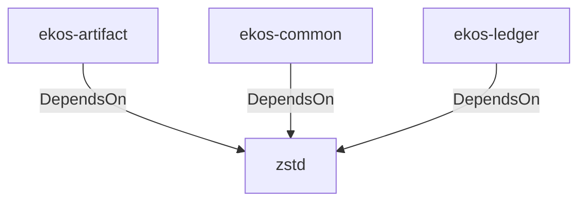

# zstd (Technology)

## Properties

_No compiled properties._

## Relationships

### DependsOn

- ← ekos-artifact (`8806bf54-6364-5052-b85a-cef4344e8f19`) — evidence: ekos-artifact depends on zstd 0.13
- ← ekos-common (`dc169f0a-98f1-5c7c-8dd0-1dbc8504e9c9`) — evidence: ekos-common depends on zstd 0.13
- ← ekos-ledger (`9c977335-c421-519c-a889-558f0487574e`) — evidence: ekos-ledger depends on zstd 0.13

## Diagram

## Evidence

- `423ea5d9-524a-4af9-87c1-c0bf00bcba9e` — ekos-artifact depends on zstd 0.13 (confidence: 1.00)
- `98b5ff6d-1008-447a-a65f-64d34bcd31fc` — ekos-common depends on zstd 0.13 (confidence: 1.00)
- `e3d654c8-8a95-4a58-bd03-909a30b5bc8a` — ekos-ledger depends on zstd 0.13 (confidence: 1.00)
