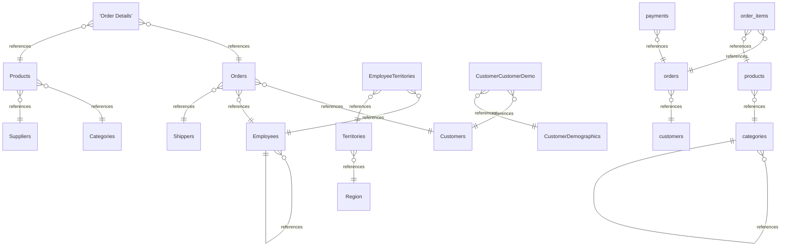
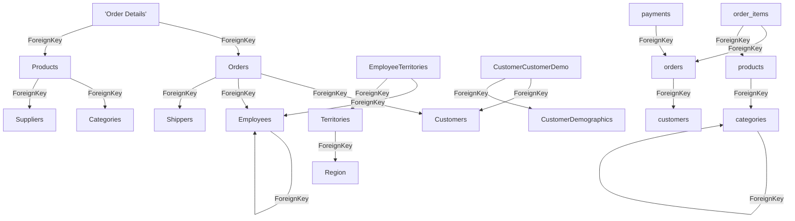

# Architecture

## Components

- **Document**: 13
- **File**: 751
- **Person**: 2
- **PythonModule**: 3
- **PythonSymbol**: 3
- **RustModule**: 441
- **RustSymbol**: 1301
- **Section**: 1518
- **Table**: 19
- **TransformNode**: 34

## Technologies

_No technology dependencies compiled._

## Entity Relationships

## Dependency Graph

### Calls

_733 `Calls` relationships compiled — diagram omitted, too large to render usefully. See `ekos docs generate --layout objects` for per-object detail._

### Contains

_2822 `Contains` relationships compiled — diagram omitted, too large to render usefully. See `ekos docs generate --layout objects` for per-object detail._

### CoupledWith

_372 `CoupledWith` relationships compiled — diagram omitted, too large to render usefully. See `ekos docs generate --layout objects` for per-object detail._

### DependsOn

_1287 `DependsOn` relationships compiled — diagram omitted, too large to render usefully. See `ekos docs generate --layout objects` for per-object detail._

### ForeignKey

### OwnedBy

_102 `OwnedBy` relationships compiled — diagram omitted, too large to render usefully. See `ekos docs generate --layout objects` for per-object detail._

