# ekos-artifact (Crate)

## Properties

| Key | Value |
|---|---|
| `description` | Content-addressable artifact types (Phase 2 — stub) |
| `path` | ekos/crates/artifact |

## Relationships

### DependsOn

- ← ekos-benchmark (`20c26e43-ee96-5ee7-a046-25740fbbd56b`) — evidence: ekos-benchmark depends on ekos-artifact (path dependency)
- ← ekos-semantic (`f82d9ce0-df2a-5af8-9f9a-2bd5f8484839`) — evidence: ekos-semantic depends on ekos-artifact (path dependency)
- ← ekos-compiler-core (`2690bc0d-0233-516f-b969-9e87432f623d`) — evidence: ekos-compiler-core depends on ekos-artifact (path dependency)
- ← ekos (`abd31cd9-b31d-54c5-87cd-8a4a5b9a30a0`) — evidence: ekos depends on ekos-artifact (path dependency)
- ← ekos-observation-sdk (`9a955a3a-55bc-587a-942d-fb81d6260052`) — evidence: ekos-observation-sdk depends on ekos-artifact (path dependency)
- → chrono (`0d184cc1-2483-516d-a0b5-0b6bfad54805`) — evidence: ekos-artifact depends on chrono 0.4
- → ekos-common (`dc169f0a-98f1-5c7c-8dd0-1dbc8504e9c9`) — evidence: ekos-artifact depends on ekos-common (path dependency)
- → ekos-kir (`7e3bc0de-d888-55cd-aa9a-f333f6e2cbb2`) — evidence: ekos-artifact depends on ekos-kir (path dependency)
- → hex (`fa785806-31c3-5308-ae4a-2898a2c181ca`) — evidence: ekos-artifact depends on hex 0.4
- → serde_json (`02548eee-6478-5324-851f-3a6329ccfeca`) — evidence: ekos-artifact depends on serde 1
- → sha2 (`64d6fba9-eea7-52e6-9b3a-b2e887a6944f`) — evidence: ekos-artifact depends on sha2 0.10
- → thiserror (`bbefe8a3-f76e-509f-910b-b439cd7eeff6`) — evidence: ekos-artifact depends on thiserror 2
- → tracing (`4282d266-2850-5d04-a992-0f0a204788aa`) — evidence: ekos-artifact depends on tracing 0.1
- → uuid (`ba61f6c0-d160-5eaf-a437-895cee5c72e9`) — evidence: ekos-artifact depends on uuid 1
- → zstd (`3d9eb6f7-8fd9-528a-948f-7ab0cab3e3c5`) — evidence: ekos-artifact depends on zstd 0.13
- ← ekos-recovery (`28244ebb-4e16-5e8d-a637-5e750d01f2b8`) — evidence: ekos-recovery depends on ekos-artifact (path dependency)
- ← ekos-ledger (`9c977335-c421-519c-a889-558f0487574e`) — evidence: ekos-ledger depends on ekos-artifact (path dependency)
- ← ekos-plugin-oracle (`66e4bdc1-07c6-5f6e-9150-d6db731cf29d`) — evidence: ekos-plugin-oracle depends on ekos-artifact (path dependency)
- ← ekos-plugin-confluence (`e8d1a3c9-e7b2-5084-bdfc-569e7b604054`) — evidence: ekos-plugin-confluence depends on ekos-artifact (path dependency)
- ← ekos-plugin-localdocs (`0659fbf3-d2f4-54ba-835f-a7f6f875a7d1`) — evidence: ekos-plugin-localdocs depends on ekos-artifact (path dependency)
- ← ekos-plugin-sap (`870bf8c4-5212-524c-a442-6fe561baf29d`) — evidence: ekos-plugin-sap depends on ekos-artifact (path dependency)
- ← ekos-plugin-github (`aff4d491-b33f-56d7-b0ba-e03e884983fd`) — evidence: ekos-plugin-github depends on ekos-artifact (path dependency)
- ← ekos-plugin-pentaho (`dac1d743-a50e-57a9-8acb-56e29a47ef5e`) — evidence: ekos-plugin-pentaho depends on ekos-artifact (path dependency)
- ← ekos-plugin-file (`06b65958-abb7-5fe1-a6ee-d35946d39062`) — evidence: ekos-plugin-file depends on ekos-artifact (path dependency)
- ← ekos-plugin-python (`020c78ca-f337-542f-b351-8b4201393bbb`) — evidence: ekos-plugin-python depends on ekos-artifact (path dependency)
- ← ekos-plugin-git (`df977fc8-e004-518e-b267-581520ccd448`) — evidence: ekos-plugin-git depends on ekos-artifact (path dependency)
- ← ekos-plugin-fabric (`aeb0688d-1d00-58a5-b6d6-245dfefa74cf`) — evidence: ekos-plugin-fabric depends on ekos-artifact (path dependency)
- ← ekos-plugin-snowflake (`0a005794-329c-5fc3-a395-a5c55cf9cfcb`) — evidence: ekos-plugin-snowflake depends on ekos-artifact (path dependency)
- ← ekos-plugin-salesforce (`a9e38433-d550-5523-8c13-4f5c31f4e742`) — evidence: ekos-plugin-salesforce depends on ekos-artifact (path dependency)
- ← ekos-plugin-crypto (`835d6e67-5bb0-53e7-9104-338881612548`) — evidence: ekos-plugin-crypto depends on ekos-artifact (path dependency)
- ← ekos-plugin-rust (`07179bab-d486-5b14-8c68-6e743e45b3f6`) — evidence: ekos-plugin-rust depends on ekos-artifact (path dependency)

## Diagram

```mermaid
graph TD
    n8806bf5463645052b85acef4344e8f19["ekos-artifact"]
    n20c26e43ee965ee7a04625740fbbd56b["ekos-benchmark"]
    n20c26e43ee965ee7a04625740fbbd56b -->|DependsOn| n8806bf5463645052b85acef4344e8f19
    nf82d9ce0df2a5af89f9a2bd5f8484839["ekos-semantic"]
    nf82d9ce0df2a5af89f9a2bd5f8484839 -->|DependsOn| n8806bf5463645052b85acef4344e8f19
    n2690bc0d0233516fb9699e87432f623d["ekos-compiler-core"]
    n2690bc0d0233516fb9699e87432f623d -->|DependsOn| n8806bf5463645052b85acef4344e8f19
    nabd31cd9b31d54c587cd8a4a5b9a30a0["ekos"]
    nabd31cd9b31d54c587cd8a4a5b9a30a0 -->|DependsOn| n8806bf5463645052b85acef4344e8f19
    n9a955a3a55bc587a942dfb81d6260052["ekos-observation-sdk"]
    n9a955a3a55bc587a942dfb81d6260052 -->|DependsOn| n8806bf5463645052b85acef4344e8f19
    n0d184cc12483516da0b50b6bfad54805["chrono"]
    n8806bf5463645052b85acef4344e8f19 -->|DependsOn| n0d184cc12483516da0b50b6bfad54805
    ndc169f0a98f15c7c8dd01dbc8504e9c9["ekos-common"]
    n8806bf5463645052b85acef4344e8f19 -->|DependsOn| ndc169f0a98f15c7c8dd01dbc8504e9c9
    n7e3bc0ded88855cdaa9af333f6e2cbb2["ekos-kir"]
    n8806bf5463645052b85acef4344e8f19 -->|DependsOn| n7e3bc0ded88855cdaa9af333f6e2cbb2
    nfa78580631c35308ae4a2898a2c181ca["hex"]
    n8806bf5463645052b85acef4344e8f19 -->|DependsOn| nfa78580631c35308ae4a2898a2c181ca
    n02548eee64785324851f3a6329ccfeca["serde_json"]
    n8806bf5463645052b85acef4344e8f19 -->|DependsOn| n02548eee64785324851f3a6329ccfeca
    n64d6fba9eea752e69b3ab2e887a6944f["sha2"]
    n8806bf5463645052b85acef4344e8f19 -->|DependsOn| n64d6fba9eea752e69b3ab2e887a6944f
    nbbefe8a3f76e509f910bb439cd7eeff6["thiserror"]
    n8806bf5463645052b85acef4344e8f19 -->|DependsOn| nbbefe8a3f76e509f910bb439cd7eeff6
    n4282d26628505d04a9920f0a204788aa["tracing"]
    n8806bf5463645052b85acef4344e8f19 -->|DependsOn| n4282d26628505d04a9920f0a204788aa
    nba61f6c0d1605eafa437895cee5c72e9["uuid"]
    n8806bf5463645052b85acef4344e8f19 -->|DependsOn| nba61f6c0d1605eafa437895cee5c72e9
    n3d9eb6f78fd9528a948f7ab0cab3e3c5["zstd"]
    n8806bf5463645052b85acef4344e8f19 -->|DependsOn| n3d9eb6f78fd9528a948f7ab0cab3e3c5
    n28244ebb4e165e8da6375e750d01f2b8["ekos-recovery"]
    n28244ebb4e165e8da6375e750d01f2b8 -->|DependsOn| n8806bf5463645052b85acef4344e8f19
    n9c977335c421519ca889558f0487574e["ekos-ledger"]
    n9c977335c421519ca889558f0487574e -->|DependsOn| n8806bf5463645052b85acef4344e8f19
    n66e4bdc107c65f6e9150d6db731cf29d["ekos-plugin-oracle"]
    n66e4bdc107c65f6e9150d6db731cf29d -->|DependsOn| n8806bf5463645052b85acef4344e8f19
    ne8d1a3c9e7b25084bdfc569e7b604054["ekos-plugin-confluence"]
    ne8d1a3c9e7b25084bdfc569e7b604054 -->|DependsOn| n8806bf5463645052b85acef4344e8f19
    n0659fbf3d2f454ba835fa7f6f875a7d1["ekos-plugin-localdocs"]
    n0659fbf3d2f454ba835fa7f6f875a7d1 -->|DependsOn| n8806bf5463645052b85acef4344e8f19
    n870bf8c45212524ca4426fe561baf29d["ekos-plugin-sap"]
    n870bf8c45212524ca4426fe561baf29d -->|DependsOn| n8806bf5463645052b85acef4344e8f19
    naff4d491b33f56d7b0bae03e884983fd["ekos-plugin-github"]
    naff4d491b33f56d7b0bae03e884983fd -->|DependsOn| n8806bf5463645052b85acef4344e8f19
    ndac1d743a50e57a98acb56e29a47ef5e["ekos-plugin-pentaho"]
    ndac1d743a50e57a98acb56e29a47ef5e -->|DependsOn| n8806bf5463645052b85acef4344e8f19
    n06b65958abb75fe1a6eed35946d39062["ekos-plugin-file"]
    n06b65958abb75fe1a6eed35946d39062 -->|DependsOn| n8806bf5463645052b85acef4344e8f19
    n020c78caf337542fb3518b4201393bbb["ekos-plugin-python"]
    n020c78caf337542fb3518b4201393bbb -->|DependsOn| n8806bf5463645052b85acef4344e8f19
    ndf977fc8e004518eb267581520ccd448["ekos-plugin-git"]
    ndf977fc8e004518eb267581520ccd448 -->|DependsOn| n8806bf5463645052b85acef4344e8f19
    naeb0688d1d0058a5b6d6245dfefa74cf["ekos-plugin-fabric"]
    naeb0688d1d0058a5b6d6245dfefa74cf -->|DependsOn| n8806bf5463645052b85acef4344e8f19
    n0a005794329c5fc3a395a5c55cf9cfcb["ekos-plugin-snowflake"]
    n0a005794329c5fc3a395a5c55cf9cfcb -->|DependsOn| n8806bf5463645052b85acef4344e8f19
    na9e38433d55055238c134f5c31f4e742["ekos-plugin-salesforce"]
    na9e38433d55055238c134f5c31f4e742 -->|DependsOn| n8806bf5463645052b85acef4344e8f19
    n835d6e675bb053e79104338881612548["ekos-plugin-crypto"]
    n835d6e675bb053e79104338881612548 -->|DependsOn| n8806bf5463645052b85acef4344e8f19
    n07179babd4865b148c686e743e45b3f6["ekos-plugin-rust"]
    n07179babd4865b148c686e743e45b3f6 -->|DependsOn| n8806bf5463645052b85acef4344e8f19
```

## Evidence

- `0c768bbb-6079-4e78-baa4-74eafc7e4aa7` — ekos-benchmark depends on ekos-artifact (path dependency) (confidence: 1.00)
- `737a018c-b2af-49ab-9f6a-fffe8b181438` — ekos-semantic depends on ekos-artifact (path dependency) (confidence: 1.00)
- `a429758e-d1a1-4565-976e-b8f57f3c0bf4` — ekos-compiler-core depends on ekos-artifact (path dependency) (confidence: 1.00)
- `46dd4def-4f85-40c5-93c5-c7bbe7998b84` — ekos depends on ekos-artifact (path dependency) (confidence: 1.00)
- `750b324d-5064-4a33-9930-1d36941c6861` — ekos-observation-sdk depends on ekos-artifact (path dependency) (confidence: 1.00)
- `c6ce42c7-563d-4fbf-8cb8-cf203016b793` — ekos-artifact depends on chrono 0.4 (confidence: 1.00)
- `2478ee74-0706-43e0-a3e5-dae108e00a8c` — ekos-artifact depends on ekos-common (path dependency) (confidence: 1.00)
- `1e5316e3-f942-4c25-9aa5-0a036d989808` — ekos-artifact depends on ekos-kir (path dependency) (confidence: 1.00)
- `7e0b7b23-8565-407a-8661-d467987b89a7` — ekos-artifact depends on hex 0.4 (confidence: 1.00)
- `0158bf62-5721-4ff4-a6fc-06d10039d306` — ekos-artifact depends on serde 1 (confidence: 1.00)
- `6460ce82-b563-4be5-87b7-cb0b6498f463` — ekos-artifact depends on serde_json 1 (confidence: 1.00)
- `749e8d09-7ef8-4b58-82cd-db743b97d285` — ekos-artifact depends on sha2 0.10 (confidence: 1.00)
- `5098c0d0-2476-4fbc-a95d-a024993635b0` — ekos-artifact depends on thiserror 2 (confidence: 1.00)
- `60efbb0a-764a-4211-bcf7-ebb1d78f5de3` — ekos-artifact depends on tracing 0.1 (confidence: 1.00)
- `a550c601-c678-4f88-b80e-c067e8a723b0` — ekos-artifact depends on uuid 1 (confidence: 1.00)
- `f3b19581-6d3b-41b2-8541-e6f9b802c3a9` — ekos-artifact depends on zstd 0.13 (confidence: 1.00)
- `e8bbb559-c545-4a0d-909a-ffbb99f2b60e` — ekos-recovery depends on ekos-artifact (path dependency) (confidence: 1.00)
- `ed419985-2b72-4a9c-a987-6ddaaed4783a` — ekos-ledger depends on ekos-artifact (path dependency) (confidence: 1.00)
- `a6109b2e-506d-4317-a915-1d4fe72cdc88` — ekos-plugin-oracle depends on ekos-artifact (path dependency) (confidence: 1.00)
- `6c5cb0f2-acaa-449f-b3ee-0f9afec981fc` — ekos-plugin-confluence depends on ekos-artifact (path dependency) (confidence: 1.00)
- `707a2ee4-c069-4efe-a38c-e49bd1db60dd` — ekos-plugin-localdocs depends on ekos-artifact (path dependency) (confidence: 1.00)
- `2f9f8ef0-2c36-478f-9dad-c4cf6ea4d188` — ekos-plugin-sap depends on ekos-artifact (path dependency) (confidence: 1.00)
- `e8bd3ffc-f19a-4bdf-84a8-e36c239ce373` — ekos-plugin-github depends on ekos-artifact (path dependency) (confidence: 1.00)
- `8df27bff-2537-4fa1-b4c1-a2bdfbe642ae` — ekos-plugin-pentaho depends on ekos-artifact (path dependency) (confidence: 1.00)
- `0fceb3c2-7500-4537-b0ef-975de7549c91` — ekos-plugin-file depends on ekos-artifact (path dependency) (confidence: 1.00)
- `c611b71c-ab96-4554-9591-d966da0289f7` — ekos-plugin-python depends on ekos-artifact (path dependency) (confidence: 1.00)
- `9070c15c-4eb8-46fa-8d2a-07aa9f04bc30` — ekos-plugin-git depends on ekos-artifact (path dependency) (confidence: 1.00)
- `c60068ed-3f43-4af4-b887-d7f49a35b30e` — ekos-plugin-fabric depends on ekos-artifact (path dependency) (confidence: 1.00)
- `a9d6f2ab-f5f1-484e-9173-be9ff5d66ff1` — ekos-plugin-snowflake depends on ekos-artifact (path dependency) (confidence: 1.00)
- `69b5aca9-f29d-4a20-8aa7-9c792db63faa` — ekos-plugin-salesforce depends on ekos-artifact (path dependency) (confidence: 1.00)
- `f9608eec-f46d-482a-ae5b-ead213744bc2` — ekos-plugin-crypto depends on ekos-artifact (path dependency) (confidence: 1.00)
- `ed8ffb10-c470-48e5-8b0e-6f179a81eb55` — ekos-plugin-rust depends on ekos-artifact (path dependency) (confidence: 1.00)
