# ekos-benchmark (Crate)

## Properties

| Key | Value |
|---|---|
| `description` |  |
| `path` | benchmark |
| `version` | 0.1.0 |

## Relationships

### DependsOn

- → ekos-artifact (`8806bf54-6364-5052-b85a-cef4344e8f19`) — evidence: ekos-benchmark depends on ekos-artifact (path dependency)
- → ekos-compiler-core (`2690bc0d-0233-516f-b969-9e87432f623d`) — evidence: ekos-benchmark depends on ekos-compiler-core (path dependency)
- → ekos-identity (`2c6b8d9a-83ed-510e-a5d8-a76f2e8685fe`) — evidence: ekos-benchmark depends on ekos-identity (path dependency)
- → ekos-kir (`7e3bc0de-d888-55cd-aa9a-f333f6e2cbb2`) — evidence: ekos-benchmark depends on ekos-kir (path dependency)
- → ekos-ledger (`9c977335-c421-519c-a889-558f0487574e`) — evidence: ekos-benchmark depends on ekos-ledger (path dependency)
- → ekos-observation-sdk (`9a955a3a-55bc-587a-942d-fb81d6260052`) — evidence: ekos-benchmark depends on ekos-observation-sdk (path dependency)
- → ekos-plugin-git (`df977fc8-e004-518e-b267-581520ccd448`) — evidence: ekos-benchmark depends on ekos-plugin-git (path dependency)
- → ekos-recovery (`28244ebb-4e16-5e8d-a637-5e750d01f2b8`) — evidence: ekos-benchmark depends on ekos-recovery (path dependency)
- → ekos-runtime (`f4cd2d3b-f0b0-5234-ab2b-39de3275d717`) — evidence: ekos-benchmark depends on ekos-runtime (path dependency)
- → ekos-semantic (`f82d9ce0-df2a-5af8-9f9a-2bd5f8484839`) — evidence: ekos-benchmark depends on ekos-semantic (path dependency)
- → serde_json (`02548eee-6478-5324-851f-3a6329ccfeca`) — evidence: ekos-benchmark depends on serde_json 1
- → sqlparser (`bb72fd94-a6bc-5672-84ef-bdeeb20ad78c`) — evidence: ekos-benchmark depends on sqlparser 0.53
- → tempfile (`5213e845-b54e-5710-9e19-bcdc640a0fb8`) — evidence: ekos-benchmark depends on tempfile 3
- → tokio (`4a4e8d5c-5102-5d1d-addd-d7fb0bc8d7b9`) — evidence: ekos-benchmark depends on tokio 1
- → uuid (`ba61f6c0-d160-5eaf-a437-895cee5c72e9`) — evidence: ekos-benchmark depends on uuid 1

## Diagram

```mermaid
graph TD
    n20c26e43ee965ee7a04625740fbbd56b["ekos-benchmark"]
    n8806bf5463645052b85acef4344e8f19["ekos-artifact"]
    n20c26e43ee965ee7a04625740fbbd56b -->|DependsOn| n8806bf5463645052b85acef4344e8f19
    n2690bc0d0233516fb9699e87432f623d["ekos-compiler-core"]
    n20c26e43ee965ee7a04625740fbbd56b -->|DependsOn| n2690bc0d0233516fb9699e87432f623d
    n2c6b8d9a83ed510ea5d8a76f2e8685fe["ekos-identity"]
    n20c26e43ee965ee7a04625740fbbd56b -->|DependsOn| n2c6b8d9a83ed510ea5d8a76f2e8685fe
    n7e3bc0ded88855cdaa9af333f6e2cbb2["ekos-kir"]
    n20c26e43ee965ee7a04625740fbbd56b -->|DependsOn| n7e3bc0ded88855cdaa9af333f6e2cbb2
    n9c977335c421519ca889558f0487574e["ekos-ledger"]
    n20c26e43ee965ee7a04625740fbbd56b -->|DependsOn| n9c977335c421519ca889558f0487574e
    n9a955a3a55bc587a942dfb81d6260052["ekos-observation-sdk"]
    n20c26e43ee965ee7a04625740fbbd56b -->|DependsOn| n9a955a3a55bc587a942dfb81d6260052
    ndf977fc8e004518eb267581520ccd448["ekos-plugin-git"]
    n20c26e43ee965ee7a04625740fbbd56b -->|DependsOn| ndf977fc8e004518eb267581520ccd448
    n28244ebb4e165e8da6375e750d01f2b8["ekos-recovery"]
    n20c26e43ee965ee7a04625740fbbd56b -->|DependsOn| n28244ebb4e165e8da6375e750d01f2b8
    nf4cd2d3bf0b05234ab2b39de3275d717["ekos-runtime"]
    n20c26e43ee965ee7a04625740fbbd56b -->|DependsOn| nf4cd2d3bf0b05234ab2b39de3275d717
    nf82d9ce0df2a5af89f9a2bd5f8484839["ekos-semantic"]
    n20c26e43ee965ee7a04625740fbbd56b -->|DependsOn| nf82d9ce0df2a5af89f9a2bd5f8484839
    n02548eee64785324851f3a6329ccfeca["serde_json"]
    n20c26e43ee965ee7a04625740fbbd56b -->|DependsOn| n02548eee64785324851f3a6329ccfeca
    nbb72fd94a6bc567284efbdeeb20ad78c["sqlparser"]
    n20c26e43ee965ee7a04625740fbbd56b -->|DependsOn| nbb72fd94a6bc567284efbdeeb20ad78c
    n5213e845b54e57109e19bcdc640a0fb8["tempfile"]
    n20c26e43ee965ee7a04625740fbbd56b -->|DependsOn| n5213e845b54e57109e19bcdc640a0fb8
    n4a4e8d5c51025d1dadddd7fb0bc8d7b9["tokio"]
    n20c26e43ee965ee7a04625740fbbd56b -->|DependsOn| n4a4e8d5c51025d1dadddd7fb0bc8d7b9
    nba61f6c0d1605eafa437895cee5c72e9["uuid"]
    n20c26e43ee965ee7a04625740fbbd56b -->|DependsOn| nba61f6c0d1605eafa437895cee5c72e9
```

## Evidence

- `0c768bbb-6079-4e78-baa4-74eafc7e4aa7` — ekos-benchmark depends on ekos-artifact (path dependency) (confidence: 1.00)
- `67596ba6-97ed-4ce7-ab5f-fa05a0fa236c` — ekos-benchmark depends on ekos-compiler-core (path dependency) (confidence: 1.00)
- `4dfcbcfd-d510-4982-b2fd-d67b0fd231ed` — ekos-benchmark depends on ekos-identity (path dependency) (confidence: 1.00)
- `1ae9cf1a-d95f-4365-a133-c982a6bdcf67` — ekos-benchmark depends on ekos-kir (path dependency) (confidence: 1.00)
- `041f6332-fe3a-4933-b5af-7b77e162a6a7` — ekos-benchmark depends on ekos-ledger (path dependency) (confidence: 1.00)
- `285e43ac-72e0-40ee-a18b-94700aee3ef5` — ekos-benchmark depends on ekos-observation-sdk (path dependency) (confidence: 1.00)
- `4c35bf63-e154-478e-aca8-7ea316d7aed0` — ekos-benchmark depends on ekos-plugin-git (path dependency) (confidence: 1.00)
- `06cdcc0f-9581-4725-89b6-1c4c9176899e` — ekos-benchmark depends on ekos-recovery (path dependency) (confidence: 1.00)
- `b438653f-2c8f-4bc7-91da-bc2a3aa8073e` — ekos-benchmark depends on ekos-runtime (path dependency) (confidence: 1.00)
- `bcfdb0ca-8e82-46b9-bf2b-9aced22e7760` — ekos-benchmark depends on ekos-semantic (path dependency) (confidence: 1.00)
- `8d7e428a-f86a-4b10-99fa-e9775639f3c1` — ekos-benchmark depends on serde_json 1 (confidence: 1.00)
- `69cb530d-c41b-49e1-acf8-a87221d16ffc` — ekos-benchmark depends on sqlparser 0.53 (confidence: 1.00)
- `dadb8182-10c7-4e77-9013-64d4c6888734` — ekos-benchmark depends on tempfile 3 (confidence: 1.00)
- `8cde4ba9-23b6-49f8-9336-e0ca12215d7a` — ekos-benchmark depends on tokio 1 (confidence: 1.00)
- `82a8e757-23b7-4187-9c3c-f87fa8fa0230` — ekos-benchmark depends on uuid 1 (confidence: 1.00)
