# ekos-common (Crate)

## Properties

| Key | Value |
|---|---|
| `description` | Shared types and utilities for EKOS |
| `path` | ekos/crates/common |

## Relationships

### DependsOn

- ← ekos-semantic (`f82d9ce0-df2a-5af8-9f9a-2bd5f8484839`) — evidence: ekos-semantic depends on ekos-common (path dependency)
- ← ekos-compiler-core (`2690bc0d-0233-516f-b969-9e87432f623d`) — evidence: ekos-compiler-core depends on ekos-common (path dependency)
- ← ekos-kir (`7e3bc0de-d888-55cd-aa9a-f333f6e2cbb2`) — evidence: ekos-kir depends on ekos-common (path dependency)
- ← ekos (`abd31cd9-b31d-54c5-87cd-8a4a5b9a30a0`) — evidence: ekos depends on ekos-common (path dependency)
- ← ekos-observation-sdk (`9a955a3a-55bc-587a-942d-fb81d6260052`) — evidence: ekos-observation-sdk depends on ekos-common (path dependency)
- ← ekos-artifact (`8806bf54-6364-5052-b85a-cef4344e8f19`) — evidence: ekos-artifact depends on ekos-common (path dependency)
- → chrono (`0d184cc1-2483-516d-a0b5-0b6bfad54805`) — evidence: ekos-common depends on chrono 0.4
- → hex (`fa785806-31c3-5308-ae4a-2898a2c181ca`) — evidence: ekos-common depends on hex 0.4
- → serde_json (`02548eee-6478-5324-851f-3a6329ccfeca`) — evidence: ekos-common depends on serde 1
- → sha2 (`64d6fba9-eea7-52e6-9b3a-b2e887a6944f`) — evidence: ekos-common depends on sha2 0.10
- → thiserror (`bbefe8a3-f76e-509f-910b-b439cd7eeff6`) — evidence: ekos-common depends on thiserror 2
- → uuid (`ba61f6c0-d160-5eaf-a437-895cee5c72e9`) — evidence: ekos-common depends on uuid 1
- → zstd (`3d9eb6f7-8fd9-528a-948f-7ab0cab3e3c5`) — evidence: ekos-common depends on zstd 0.13
- ← ekos-recovery (`28244ebb-4e16-5e8d-a637-5e750d01f2b8`) — evidence: ekos-recovery depends on ekos-common (path dependency)
- ← ekos-ledger (`9c977335-c421-519c-a889-558f0487574e`) — evidence: ekos-ledger depends on ekos-common (path dependency)
- ← ekos-plugin-oracle (`66e4bdc1-07c6-5f6e-9150-d6db731cf29d`) — evidence: ekos-plugin-oracle depends on ekos-common (path dependency)
- ← ekos-plugin-confluence (`e8d1a3c9-e7b2-5084-bdfc-569e7b604054`) — evidence: ekos-plugin-confluence depends on ekos-common (path dependency)
- ← ekos-plugin-localdocs (`0659fbf3-d2f4-54ba-835f-a7f6f875a7d1`) — evidence: ekos-plugin-localdocs depends on ekos-common (path dependency)
- ← ekos-plugin-sap (`870bf8c4-5212-524c-a442-6fe561baf29d`) — evidence: ekos-plugin-sap depends on ekos-common (path dependency)
- ← ekos-plugin-github (`aff4d491-b33f-56d7-b0ba-e03e884983fd`) — evidence: ekos-plugin-github depends on ekos-common (path dependency)
- ← ekos-plugin-pentaho (`dac1d743-a50e-57a9-8acb-56e29a47ef5e`) — evidence: ekos-plugin-pentaho depends on ekos-common (path dependency)
- ← ekos-plugin-file (`06b65958-abb7-5fe1-a6ee-d35946d39062`) — evidence: ekos-plugin-file depends on ekos-common (path dependency)
- ← ekos-plugin-python (`020c78ca-f337-542f-b351-8b4201393bbb`) — evidence: ekos-plugin-python depends on ekos-common (path dependency)
- ← ekos-plugin-git (`df977fc8-e004-518e-b267-581520ccd448`) — evidence: ekos-plugin-git depends on ekos-common (path dependency)
- ← ekos-plugin-fabric (`aeb0688d-1d00-58a5-b6d6-245dfefa74cf`) — evidence: ekos-plugin-fabric depends on ekos-common (path dependency)
- ← ekos-plugin-snowflake (`0a005794-329c-5fc3-a395-a5c55cf9cfcb`) — evidence: ekos-plugin-snowflake depends on ekos-common (path dependency)
- ← ekos-plugin-salesforce (`a9e38433-d550-5523-8c13-4f5c31f4e742`) — evidence: ekos-plugin-salesforce depends on ekos-common (path dependency)
- ← ekos-plugin-crypto (`835d6e67-5bb0-53e7-9104-338881612548`) — evidence: ekos-plugin-crypto depends on ekos-common (path dependency)
- ← ekos-plugin-rust (`07179bab-d486-5b14-8c68-6e743e45b3f6`) — evidence: ekos-plugin-rust depends on ekos-common (path dependency)

## Diagram

```mermaid
graph TD
    ndc169f0a98f15c7c8dd01dbc8504e9c9["ekos-common"]
    nf82d9ce0df2a5af89f9a2bd5f8484839["ekos-semantic"]
    nf82d9ce0df2a5af89f9a2bd5f8484839 -->|DependsOn| ndc169f0a98f15c7c8dd01dbc8504e9c9
    n2690bc0d0233516fb9699e87432f623d["ekos-compiler-core"]
    n2690bc0d0233516fb9699e87432f623d -->|DependsOn| ndc169f0a98f15c7c8dd01dbc8504e9c9
    n7e3bc0ded88855cdaa9af333f6e2cbb2["ekos-kir"]
    n7e3bc0ded88855cdaa9af333f6e2cbb2 -->|DependsOn| ndc169f0a98f15c7c8dd01dbc8504e9c9
    nabd31cd9b31d54c587cd8a4a5b9a30a0["ekos"]
    nabd31cd9b31d54c587cd8a4a5b9a30a0 -->|DependsOn| ndc169f0a98f15c7c8dd01dbc8504e9c9
    n9a955a3a55bc587a942dfb81d6260052["ekos-observation-sdk"]
    n9a955a3a55bc587a942dfb81d6260052 -->|DependsOn| ndc169f0a98f15c7c8dd01dbc8504e9c9
    n8806bf5463645052b85acef4344e8f19["ekos-artifact"]
    n8806bf5463645052b85acef4344e8f19 -->|DependsOn| ndc169f0a98f15c7c8dd01dbc8504e9c9
    n0d184cc12483516da0b50b6bfad54805["chrono"]
    ndc169f0a98f15c7c8dd01dbc8504e9c9 -->|DependsOn| n0d184cc12483516da0b50b6bfad54805
    nfa78580631c35308ae4a2898a2c181ca["hex"]
    ndc169f0a98f15c7c8dd01dbc8504e9c9 -->|DependsOn| nfa78580631c35308ae4a2898a2c181ca
    n02548eee64785324851f3a6329ccfeca["serde_json"]
    ndc169f0a98f15c7c8dd01dbc8504e9c9 -->|DependsOn| n02548eee64785324851f3a6329ccfeca
    n64d6fba9eea752e69b3ab2e887a6944f["sha2"]
    ndc169f0a98f15c7c8dd01dbc8504e9c9 -->|DependsOn| n64d6fba9eea752e69b3ab2e887a6944f
    nbbefe8a3f76e509f910bb439cd7eeff6["thiserror"]
    ndc169f0a98f15c7c8dd01dbc8504e9c9 -->|DependsOn| nbbefe8a3f76e509f910bb439cd7eeff6
    nba61f6c0d1605eafa437895cee5c72e9["uuid"]
    ndc169f0a98f15c7c8dd01dbc8504e9c9 -->|DependsOn| nba61f6c0d1605eafa437895cee5c72e9
    n3d9eb6f78fd9528a948f7ab0cab3e3c5["zstd"]
    ndc169f0a98f15c7c8dd01dbc8504e9c9 -->|DependsOn| n3d9eb6f78fd9528a948f7ab0cab3e3c5
    n28244ebb4e165e8da6375e750d01f2b8["ekos-recovery"]
    n28244ebb4e165e8da6375e750d01f2b8 -->|DependsOn| ndc169f0a98f15c7c8dd01dbc8504e9c9
    n9c977335c421519ca889558f0487574e["ekos-ledger"]
    n9c977335c421519ca889558f0487574e -->|DependsOn| ndc169f0a98f15c7c8dd01dbc8504e9c9
    n66e4bdc107c65f6e9150d6db731cf29d["ekos-plugin-oracle"]
    n66e4bdc107c65f6e9150d6db731cf29d -->|DependsOn| ndc169f0a98f15c7c8dd01dbc8504e9c9
    ne8d1a3c9e7b25084bdfc569e7b604054["ekos-plugin-confluence"]
    ne8d1a3c9e7b25084bdfc569e7b604054 -->|DependsOn| ndc169f0a98f15c7c8dd01dbc8504e9c9
    n0659fbf3d2f454ba835fa7f6f875a7d1["ekos-plugin-localdocs"]
    n0659fbf3d2f454ba835fa7f6f875a7d1 -->|DependsOn| ndc169f0a98f15c7c8dd01dbc8504e9c9
    n870bf8c45212524ca4426fe561baf29d["ekos-plugin-sap"]
    n870bf8c45212524ca4426fe561baf29d -->|DependsOn| ndc169f0a98f15c7c8dd01dbc8504e9c9
    naff4d491b33f56d7b0bae03e884983fd["ekos-plugin-github"]
    naff4d491b33f56d7b0bae03e884983fd -->|DependsOn| ndc169f0a98f15c7c8dd01dbc8504e9c9
    ndac1d743a50e57a98acb56e29a47ef5e["ekos-plugin-pentaho"]
    ndac1d743a50e57a98acb56e29a47ef5e -->|DependsOn| ndc169f0a98f15c7c8dd01dbc8504e9c9
    n06b65958abb75fe1a6eed35946d39062["ekos-plugin-file"]
    n06b65958abb75fe1a6eed35946d39062 -->|DependsOn| ndc169f0a98f15c7c8dd01dbc8504e9c9
    n020c78caf337542fb3518b4201393bbb["ekos-plugin-python"]
    n020c78caf337542fb3518b4201393bbb -->|DependsOn| ndc169f0a98f15c7c8dd01dbc8504e9c9
    ndf977fc8e004518eb267581520ccd448["ekos-plugin-git"]
    ndf977fc8e004518eb267581520ccd448 -->|DependsOn| ndc169f0a98f15c7c8dd01dbc8504e9c9
    naeb0688d1d0058a5b6d6245dfefa74cf["ekos-plugin-fabric"]
    naeb0688d1d0058a5b6d6245dfefa74cf -->|DependsOn| ndc169f0a98f15c7c8dd01dbc8504e9c9
    n0a005794329c5fc3a395a5c55cf9cfcb["ekos-plugin-snowflake"]
    n0a005794329c5fc3a395a5c55cf9cfcb -->|DependsOn| ndc169f0a98f15c7c8dd01dbc8504e9c9
    na9e38433d55055238c134f5c31f4e742["ekos-plugin-salesforce"]
    na9e38433d55055238c134f5c31f4e742 -->|DependsOn| ndc169f0a98f15c7c8dd01dbc8504e9c9
    n835d6e675bb053e79104338881612548["ekos-plugin-crypto"]
    n835d6e675bb053e79104338881612548 -->|DependsOn| ndc169f0a98f15c7c8dd01dbc8504e9c9
    n07179babd4865b148c686e743e45b3f6["ekos-plugin-rust"]
    n07179babd4865b148c686e743e45b3f6 -->|DependsOn| ndc169f0a98f15c7c8dd01dbc8504e9c9
```

## Evidence

- `ab1496d2-64d4-4d5f-a57a-2f7e0d5fbba1` — ekos-semantic depends on ekos-common (path dependency) (confidence: 1.00)
- `31f6c700-e3f8-4038-98c9-e1de594b4969` — ekos-compiler-core depends on ekos-common (path dependency) (confidence: 1.00)
- `4b8040a2-46bf-45a1-b158-616d330107e9` — ekos-kir depends on ekos-common (path dependency) (confidence: 1.00)
- `310d0395-fb1d-4507-b378-b8567247423f` — ekos depends on ekos-common (path dependency) (confidence: 1.00)
- `0e89cfac-1d1c-45ad-986b-ed855910284c` — ekos-observation-sdk depends on ekos-common (path dependency) (confidence: 1.00)
- `2478ee74-0706-43e0-a3e5-dae108e00a8c` — ekos-artifact depends on ekos-common (path dependency) (confidence: 1.00)
- `31d605a9-4715-45b9-abfd-8e031942ac12` — ekos-common depends on chrono 0.4 (confidence: 1.00)
- `d81a3836-dd6b-4256-920f-1dabe6c3978a` — ekos-common depends on hex 0.4 (confidence: 1.00)
- `e32b0e7d-6574-4006-8844-6421b90d21cb` — ekos-common depends on serde 1 (confidence: 1.00)
- `14d30cd4-1db9-4f45-b2f9-3b815df58f09` — ekos-common depends on serde_json 1 (confidence: 1.00)
- `bbd2a7c5-4c56-4250-8cb2-49c8afa4e4c6` — ekos-common depends on sha2 0.10 (confidence: 1.00)
- `2d030021-be96-4db7-862c-6db551f70b90` — ekos-common depends on thiserror 2 (confidence: 1.00)
- `28e032c8-71a1-4d12-ac2a-3553e2400a9a` — ekos-common depends on uuid 1 (confidence: 1.00)
- `f262b39f-d879-44d8-9460-615bc294c9d6` — ekos-common depends on zstd 0.13 (confidence: 1.00)
- `078714fe-42ab-4557-a4f4-cdc9b342664a` — ekos-recovery depends on ekos-common (path dependency) (confidence: 1.00)
- `c1801582-f256-4f3b-a1dd-d51e7a4a20f8` — ekos-ledger depends on ekos-common (path dependency) (confidence: 1.00)
- `bd27334b-c162-4bde-867e-a7d11cec45fe` — ekos-plugin-oracle depends on ekos-common (path dependency) (confidence: 1.00)
- `abc5e3da-90d7-4fa1-a1e3-99b11d75aedf` — ekos-plugin-confluence depends on ekos-common (path dependency) (confidence: 1.00)
- `b73e48b4-2e97-49b5-8f2b-710733f04728` — ekos-plugin-localdocs depends on ekos-common (path dependency) (confidence: 1.00)
- `61fb4bd6-c869-4fa2-a8b4-3f756b1885f1` — ekos-plugin-sap depends on ekos-common (path dependency) (confidence: 1.00)
- `c1bad037-a446-49c0-96c6-32512c869e98` — ekos-plugin-github depends on ekos-common (path dependency) (confidence: 1.00)
- `19d371be-116b-4b8f-abdd-fb4620611c13` — ekos-plugin-pentaho depends on ekos-common (path dependency) (confidence: 1.00)
- `9c34c87d-73c6-4262-8121-e157d08be4de` — ekos-plugin-file depends on ekos-common (path dependency) (confidence: 1.00)
- `4f96e885-0b97-4e42-a475-2426ca31ec5e` — ekos-plugin-python depends on ekos-common (path dependency) (confidence: 1.00)
- `6a31e3a4-f92d-490c-ab68-7ecc9aef029c` — ekos-plugin-git depends on ekos-common (path dependency) (confidence: 1.00)
- `77760696-fab5-4d5f-83c4-a4bdea82267b` — ekos-plugin-fabric depends on ekos-common (path dependency) (confidence: 1.00)
- `2c45bfca-d1f4-4692-b5f6-e7b52d57607b` — ekos-plugin-snowflake depends on ekos-common (path dependency) (confidence: 1.00)
- `8890248a-2e40-493b-821f-3a1b5e086c50` — ekos-plugin-salesforce depends on ekos-common (path dependency) (confidence: 1.00)
- `4d16da10-c2c5-4c02-b802-cf25888917f0` — ekos-plugin-crypto depends on ekos-common (path dependency) (confidence: 1.00)
- `67740261-23d9-4d01-ac8f-2d89ccee7c83` — ekos-plugin-rust depends on ekos-common (path dependency) (confidence: 1.00)
