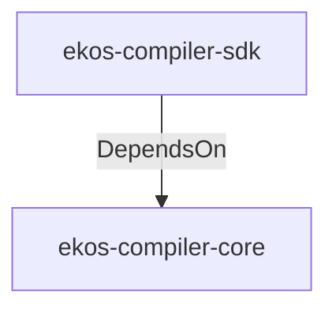

# ekos-compiler-sdk (Crate)

## Properties

| Key | Value |
|---|---|
| `description` | Public SDK for extending the compiler (Phase 1 — stub) |
| `path` | ekos/crates/compiler-sdk |

## Relationships

### DependsOn

- → ekos-compiler-core (`2690bc0d-0233-516f-b969-9e87432f623d`) — evidence: ekos-compiler-sdk depends on ekos-compiler-core (path dependency)

## Diagram

## Evidence

- `a9db6222-204a-45fd-9f43-418bf553b715` — ekos-compiler-sdk depends on ekos-compiler-core (path dependency) (confidence: 1.00)
