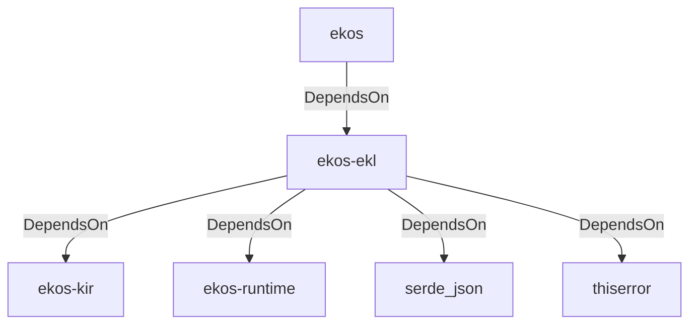

# ekos-ekl (Crate)

## Properties

| Key | Value |
|---|---|
| `description` | Enterprise Knowledge Language: parser + interpreter (RFC 0010) |
| `path` | ekos/crates/ekl |

## Relationships

### DependsOn

- ← ekos (`abd31cd9-b31d-54c5-87cd-8a4a5b9a30a0`) — evidence: ekos depends on ekos-ekl (path dependency)
- → ekos-kir (`7e3bc0de-d888-55cd-aa9a-f333f6e2cbb2`) — evidence: ekos-ekl depends on ekos-kir (path dependency)
- → ekos-runtime (`f4cd2d3b-f0b0-5234-ab2b-39de3275d717`) — evidence: ekos-ekl depends on ekos-runtime (path dependency)
- → serde_json (`02548eee-6478-5324-851f-3a6329ccfeca`) — evidence: ekos-ekl depends on serde_json 1
- → thiserror (`bbefe8a3-f76e-509f-910b-b439cd7eeff6`) — evidence: ekos-ekl depends on thiserror 2

## Diagram

## Evidence

- `58b7b673-2879-42cd-982b-515640fca9fb` — ekos depends on ekos-ekl (path dependency) (confidence: 1.00)
- `e6dc7a80-7f73-4ccb-b492-ac2cf5581535` — ekos-ekl depends on ekos-kir (path dependency) (confidence: 1.00)
- `5c248282-390f-4d16-84a9-529f826db691` — ekos-ekl depends on ekos-runtime (path dependency) (confidence: 1.00)
- `c7687e04-1fd2-4fbc-8b38-8267a386309d` — ekos-ekl depends on serde_json 1 (confidence: 1.00)
- `e9fae1a8-0d75-4078-a5f4-35bad47f37ec` — ekos-ekl depends on thiserror 2 (confidence: 1.00)
