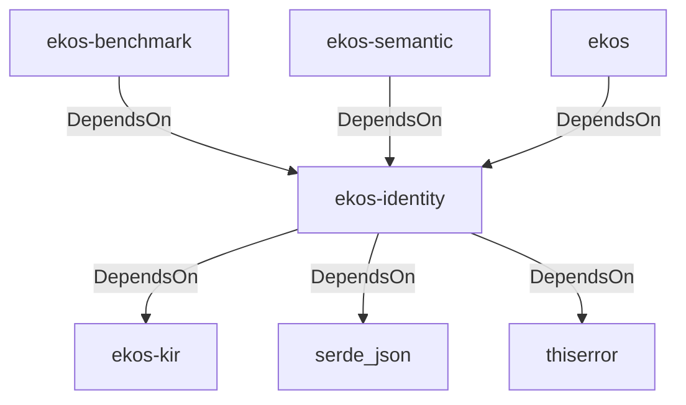

# ekos-identity (Crate)

## Properties

| Key | Value |
|---|---|
| `description` | Identity resolution — merges synonymous concepts (Phase 7) |
| `path` | ekos/crates/identity |

## Relationships

### DependsOn

- ← ekos-benchmark (`20c26e43-ee96-5ee7-a046-25740fbbd56b`) — evidence: ekos-benchmark depends on ekos-identity (path dependency)
- → ekos-kir (`7e3bc0de-d888-55cd-aa9a-f333f6e2cbb2`) — evidence: ekos-identity depends on ekos-kir (path dependency)
- → serde_json (`02548eee-6478-5324-851f-3a6329ccfeca`) — evidence: ekos-identity depends on serde 1
- → thiserror (`bbefe8a3-f76e-509f-910b-b439cd7eeff6`) — evidence: ekos-identity depends on thiserror 2
- ← ekos-semantic (`f82d9ce0-df2a-5af8-9f9a-2bd5f8484839`) — evidence: ekos-semantic depends on ekos-identity (path dependency)
- ← ekos (`abd31cd9-b31d-54c5-87cd-8a4a5b9a30a0`) — evidence: ekos depends on ekos-identity (path dependency)

## Diagram

## Evidence

- `4dfcbcfd-d510-4982-b2fd-d67b0fd231ed` — ekos-benchmark depends on ekos-identity (path dependency) (confidence: 1.00)
- `390bf8eb-12fa-448c-8161-07b9e7d0592e` — ekos-identity depends on ekos-kir (path dependency) (confidence: 1.00)
- `66c32c45-7d19-43f2-ac57-20b094c874fb` — ekos-identity depends on serde 1 (confidence: 1.00)
- `024f8b9d-4509-4454-b8bf-db0288c50287` — ekos-identity depends on serde_json 1 (confidence: 1.00)
- `ab774378-2d09-4bdd-9888-23e199b5107e` — ekos-identity depends on thiserror 2 (confidence: 1.00)
- `30155c8a-4f4c-41a8-b8b0-cc6ad659e3fe` — ekos-semantic depends on ekos-identity (path dependency) (confidence: 1.00)
- `1f7b7d48-0a50-41ec-8f41-51bf7993bb1d` — ekos depends on ekos-identity (path dependency) (confidence: 1.00)
