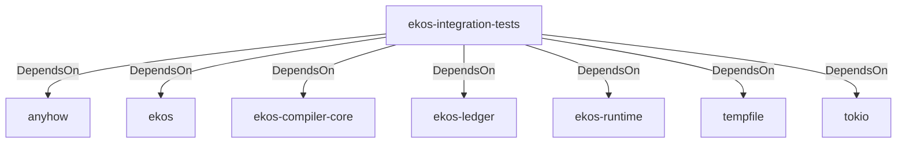

# ekos-integration-tests (Crate)

## Properties

| Key | Value |
|---|---|
| `description` |  |
| `path` | tests/integration |
| `version` | 0.1.0 |

## Relationships

### DependsOn

- → anyhow (`0cdec207-5b1a-5831-bd2a-8b57ddb8681c`) — evidence: ekos-integration-tests depends on anyhow 1
- → ekos (`abd31cd9-b31d-54c5-87cd-8a4a5b9a30a0`) — evidence: ekos-integration-tests depends on ekos (path dependency)
- → ekos-compiler-core (`2690bc0d-0233-516f-b969-9e87432f623d`) — evidence: ekos-integration-tests depends on ekos-compiler-core (path dependency)
- → ekos-ledger (`9c977335-c421-519c-a889-558f0487574e`) — evidence: ekos-integration-tests depends on ekos-ledger (path dependency)
- → ekos-runtime (`f4cd2d3b-f0b0-5234-ab2b-39de3275d717`) — evidence: ekos-integration-tests depends on ekos-runtime (path dependency)
- → tempfile (`5213e845-b54e-5710-9e19-bcdc640a0fb8`) — evidence: ekos-integration-tests depends on tempfile 3
- → tokio (`4a4e8d5c-5102-5d1d-addd-d7fb0bc8d7b9`) — evidence: ekos-integration-tests depends on tokio 1

## Diagram

## Evidence

- `bbbb8b39-1bde-4e77-92ce-9464d122efa7` — ekos-integration-tests depends on anyhow 1 (confidence: 1.00)
- `a2b1f78d-7aca-4352-9c52-527a842ce34b` — ekos-integration-tests depends on ekos (path dependency) (confidence: 1.00)
- `24b81e9d-6692-4eba-9f79-4423fe9dc54a` — ekos-integration-tests depends on ekos-compiler-core (path dependency) (confidence: 1.00)
- `66fc8e98-26e2-4f30-a930-ac8721112ef1` — ekos-integration-tests depends on ekos-ledger (path dependency) (confidence: 1.00)
- `c2dee997-f977-417e-8ae2-40f5d64eff89` — ekos-integration-tests depends on ekos-runtime (path dependency) (confidence: 1.00)
- `7101b326-3465-4bc8-be66-e0668a77e54c` — ekos-integration-tests depends on tempfile 3 (confidence: 1.00)
- `3ae14802-0e8d-4877-826d-c13fdb2b81f7` — ekos-integration-tests depends on tokio 1 (confidence: 1.00)
