# ekos-marketing (Crate)

## Properties

| Key | Value |
|---|---|
| `description` | RFC 0030 — Marketing Agent: devlog -> tweet draft -> human approval -> X publish |
| `path` | ekos/crates/marketing |

## Relationships

### DependsOn

- ← ekos (`abd31cd9-b31d-54c5-87cd-8a4a5b9a30a0`) — evidence: ekos depends on ekos-marketing (path dependency)
- → anyhow (`0cdec207-5b1a-5831-bd2a-8b57ddb8681c`) — evidence: ekos-marketing depends on anyhow 1
- → async-trait (`7c905290-824b-57e0-a559-15ff1499b4d6`) — evidence: ekos-marketing depends on async-trait 0.1
- → base64 (`6e544c5a-8e51-5891-8ad4-a0c2357d467c`) — evidence: ekos-marketing depends on base64 0.22
- → chrono (`0d184cc1-2483-516d-a0b5-0b6bfad54805`) — evidence: ekos-marketing depends on chrono 0.4
- → ekos-compiler-core (`2690bc0d-0233-516f-b969-9e87432f623d`) — evidence: ekos-marketing depends on ekos-compiler-core (path dependency)
- → ekos-recovery (`28244ebb-4e16-5e8d-a637-5e750d01f2b8`) — evidence: ekos-marketing depends on ekos-recovery (path dependency)
- → hmac (`e38f4f16-c4e3-5244-9923-0cad908a92da`) — evidence: ekos-marketing depends on hmac 0.12
- → percent-encoding (`6262e7da-dfcf-568f-ae68-d9b2bce125b5`) — evidence: ekos-marketing depends on percent-encoding 2
- → rand (`7bd53de0-e6e1-5537-8e89-09ac0bb2b547`) — evidence: ekos-marketing depends on rand 0.8
- → reqwest (`70acdf50-6295-5f0c-9157-cb9866d0ec23`) — evidence: ekos-marketing depends on reqwest 0.12
- → serde_json (`02548eee-6478-5324-851f-3a6329ccfeca`) — evidence: ekos-marketing depends on serde 1
- → sha2 (`64d6fba9-eea7-52e6-9b3a-b2e887a6944f`) — evidence: ekos-marketing depends on sha1 0.10
- → thiserror (`bbefe8a3-f76e-509f-910b-b439cd7eeff6`) — evidence: ekos-marketing depends on thiserror 2
- → tokio (`4a4e8d5c-5102-5d1d-addd-d7fb0bc8d7b9`) — evidence: ekos-marketing depends on tokio 1
- → tracing (`4282d266-2850-5d04-a992-0f0a204788aa`) — evidence: ekos-marketing depends on tracing 0.1
- → uuid (`ba61f6c0-d160-5eaf-a437-895cee5c72e9`) — evidence: ekos-marketing depends on uuid 1

## Diagram

```mermaid
graph TD
    n18dba45d95345035bd6fdf6b370079ac["ekos-marketing"]
    nabd31cd9b31d54c587cd8a4a5b9a30a0["ekos"]
    nabd31cd9b31d54c587cd8a4a5b9a30a0 -->|DependsOn| n18dba45d95345035bd6fdf6b370079ac
    n0cdec2075b1a5831bd2a8b57ddb8681c["anyhow"]
    n18dba45d95345035bd6fdf6b370079ac -->|DependsOn| n0cdec2075b1a5831bd2a8b57ddb8681c
    n7c905290824b57e0a55915ff1499b4d6["async-trait"]
    n18dba45d95345035bd6fdf6b370079ac -->|DependsOn| n7c905290824b57e0a55915ff1499b4d6
    n6e544c5a8e5158918ad4a0c2357d467c["base64"]
    n18dba45d95345035bd6fdf6b370079ac -->|DependsOn| n6e544c5a8e5158918ad4a0c2357d467c
    n0d184cc12483516da0b50b6bfad54805["chrono"]
    n18dba45d95345035bd6fdf6b370079ac -->|DependsOn| n0d184cc12483516da0b50b6bfad54805
    n2690bc0d0233516fb9699e87432f623d["ekos-compiler-core"]
    n18dba45d95345035bd6fdf6b370079ac -->|DependsOn| n2690bc0d0233516fb9699e87432f623d
    n28244ebb4e165e8da6375e750d01f2b8["ekos-recovery"]
    n18dba45d95345035bd6fdf6b370079ac -->|DependsOn| n28244ebb4e165e8da6375e750d01f2b8
    ne38f4f16c4e3524499230cad908a92da["hmac"]
    n18dba45d95345035bd6fdf6b370079ac -->|DependsOn| ne38f4f16c4e3524499230cad908a92da
    n6262e7dadfcf568fae68d9b2bce125b5["percent-encoding"]
    n18dba45d95345035bd6fdf6b370079ac -->|DependsOn| n6262e7dadfcf568fae68d9b2bce125b5
    n7bd53de0e6e155378e8909ac0bb2b547["rand"]
    n18dba45d95345035bd6fdf6b370079ac -->|DependsOn| n7bd53de0e6e155378e8909ac0bb2b547
    n70acdf5062955f0c9157cb9866d0ec23["reqwest"]
    n18dba45d95345035bd6fdf6b370079ac -->|DependsOn| n70acdf5062955f0c9157cb9866d0ec23
    n02548eee64785324851f3a6329ccfeca["serde_json"]
    n18dba45d95345035bd6fdf6b370079ac -->|DependsOn| n02548eee64785324851f3a6329ccfeca
    n64d6fba9eea752e69b3ab2e887a6944f["sha2"]
    n18dba45d95345035bd6fdf6b370079ac -->|DependsOn| n64d6fba9eea752e69b3ab2e887a6944f
    nbbefe8a3f76e509f910bb439cd7eeff6["thiserror"]
    n18dba45d95345035bd6fdf6b370079ac -->|DependsOn| nbbefe8a3f76e509f910bb439cd7eeff6
    n4a4e8d5c51025d1dadddd7fb0bc8d7b9["tokio"]
    n18dba45d95345035bd6fdf6b370079ac -->|DependsOn| n4a4e8d5c51025d1dadddd7fb0bc8d7b9
    n4282d26628505d04a9920f0a204788aa["tracing"]
    n18dba45d95345035bd6fdf6b370079ac -->|DependsOn| n4282d26628505d04a9920f0a204788aa
    nba61f6c0d1605eafa437895cee5c72e9["uuid"]
    n18dba45d95345035bd6fdf6b370079ac -->|DependsOn| nba61f6c0d1605eafa437895cee5c72e9
```

## Evidence

- `202b75c0-aa03-41d7-9ad0-3209790ddec8` — ekos depends on ekos-marketing (path dependency) (confidence: 1.00)
- `932a84b9-2ab6-481e-a3d2-03bbb253b1ec` — ekos-marketing depends on anyhow 1 (confidence: 1.00)
- `f7a50b19-e58f-4991-8912-d95128d24a01` — ekos-marketing depends on async-trait 0.1 (confidence: 1.00)
- `8e79b31a-c087-424c-824c-58d98f7c59a0` — ekos-marketing depends on base64 0.22 (confidence: 1.00)
- `3e6f94bf-cdb6-4b1f-a217-6ab17f5b9890` — ekos-marketing depends on chrono 0.4 (confidence: 1.00)
- `8b1259df-b245-48a4-95d9-2a7d20b7a170` — ekos-marketing depends on ekos-compiler-core (path dependency) (confidence: 1.00)
- `928eb548-6dc9-40ca-8962-0bade17dcb14` — ekos-marketing depends on ekos-recovery (path dependency) (confidence: 1.00)
- `c8fcb081-5e31-43d7-baf7-c288fb301f88` — ekos-marketing depends on hmac 0.12 (confidence: 1.00)
- `24fa1891-7f1e-48f7-96dd-bfee99644358` — ekos-marketing depends on percent-encoding 2 (confidence: 1.00)
- `c43add2b-8fc9-4bcf-9208-0947b75fd0a7` — ekos-marketing depends on rand 0.8 (confidence: 1.00)
- `89c44ae5-c279-4cf1-bb37-c00de88cdba9` — ekos-marketing depends on reqwest 0.12 (confidence: 1.00)
- `1de8e43f-a82d-4e4f-909a-3cbe3c193c6a` — ekos-marketing depends on serde 1 (confidence: 1.00)
- `dc4f52a7-3670-41b7-a0a3-500e276c71b5` — ekos-marketing depends on serde_json 1 (confidence: 1.00)
- `b651b944-7be4-4450-91b7-e2953f689d71` — ekos-marketing depends on sha1 0.10 (confidence: 1.00)
- `f25ff774-79bb-4230-ae5a-d026359eaed8` — ekos-marketing depends on thiserror 2 (confidence: 1.00)
- `e7991f1c-54bf-42d5-8981-d43f5b17fb9f` — ekos-marketing depends on tokio 1 (confidence: 1.00)
- `cd236de1-2485-4f7e-b898-a19956db2f2b` — ekos-marketing depends on tracing 0.1 (confidence: 1.00)
- `2fd67137-88ff-4cda-a773-2a0380952361` — ekos-marketing depends on uuid 1 (confidence: 1.00)
