# ekos-observation-sdk (Crate)

## Properties

| Key | Value |
|---|---|
| `description` | Observer trait and connector contract (Phase 3) |
| `path` | ekos/crates/observation-sdk |

## Relationships

### DependsOn

- ← ekos-benchmark (`20c26e43-ee96-5ee7-a046-25740fbbd56b`) — evidence: ekos-benchmark depends on ekos-observation-sdk (path dependency)
- ← ekos (`abd31cd9-b31d-54c5-87cd-8a4a5b9a30a0`) — evidence: ekos depends on ekos-observation-sdk (path dependency)
- → async-trait (`7c905290-824b-57e0-a559-15ff1499b4d6`) — evidence: ekos-observation-sdk depends on async-trait 0.1
- → chrono (`0d184cc1-2483-516d-a0b5-0b6bfad54805`) — evidence: ekos-observation-sdk depends on chrono 0.4
- → ekos-artifact (`8806bf54-6364-5052-b85a-cef4344e8f19`) — evidence: ekos-observation-sdk depends on ekos-artifact (path dependency)
- → ekos-common (`dc169f0a-98f1-5c7c-8dd0-1dbc8504e9c9`) — evidence: ekos-observation-sdk depends on ekos-common (path dependency)
- → hex (`fa785806-31c3-5308-ae4a-2898a2c181ca`) — evidence: ekos-observation-sdk depends on hex 0.4
- → serde_json (`02548eee-6478-5324-851f-3a6329ccfeca`) — evidence: ekos-observation-sdk depends on serde 1
- → sha2 (`64d6fba9-eea7-52e6-9b3a-b2e887a6944f`) — evidence: ekos-observation-sdk depends on sha2 0.10
- → thiserror (`bbefe8a3-f76e-509f-910b-b439cd7eeff6`) — evidence: ekos-observation-sdk depends on thiserror 2
- → tokio (`4a4e8d5c-5102-5d1d-addd-d7fb0bc8d7b9`) — evidence: ekos-observation-sdk depends on tokio 1
- → walkdir (`40b5029d-b6e8-55ee-bc22-14411e3d0fb2`) — evidence: ekos-observation-sdk depends on walkdir 2
- ← ekos-plugin-oracle (`66e4bdc1-07c6-5f6e-9150-d6db731cf29d`) — evidence: ekos-plugin-oracle depends on ekos-observation-sdk (path dependency)
- ← ekos-plugin-confluence (`e8d1a3c9-e7b2-5084-bdfc-569e7b604054`) — evidence: ekos-plugin-confluence depends on ekos-observation-sdk (path dependency)
- ← ekos-plugin-localdocs (`0659fbf3-d2f4-54ba-835f-a7f6f875a7d1`) — evidence: ekos-plugin-localdocs depends on ekos-observation-sdk (path dependency)
- ← ekos-plugin-sap (`870bf8c4-5212-524c-a442-6fe561baf29d`) — evidence: ekos-plugin-sap depends on ekos-observation-sdk (path dependency)
- ← ekos-plugin-github (`aff4d491-b33f-56d7-b0ba-e03e884983fd`) — evidence: ekos-plugin-github depends on ekos-observation-sdk (path dependency)
- ← ekos-plugin-pentaho (`dac1d743-a50e-57a9-8acb-56e29a47ef5e`) — evidence: ekos-plugin-pentaho depends on ekos-observation-sdk (path dependency)
- ← ekos-plugin-file (`06b65958-abb7-5fe1-a6ee-d35946d39062`) — evidence: ekos-plugin-file depends on ekos-observation-sdk (path dependency)
- ← ekos-plugin-python (`020c78ca-f337-542f-b351-8b4201393bbb`) — evidence: ekos-plugin-python depends on ekos-observation-sdk (path dependency)
- ← ekos-plugin-git (`df977fc8-e004-518e-b267-581520ccd448`) — evidence: ekos-plugin-git depends on ekos-observation-sdk (path dependency)
- ← ekos-plugin-fabric (`aeb0688d-1d00-58a5-b6d6-245dfefa74cf`) — evidence: ekos-plugin-fabric depends on ekos-observation-sdk (path dependency)
- ← ekos-plugin-snowflake (`0a005794-329c-5fc3-a395-a5c55cf9cfcb`) — evidence: ekos-plugin-snowflake depends on ekos-observation-sdk (path dependency)
- ← ekos-plugin-salesforce (`a9e38433-d550-5523-8c13-4f5c31f4e742`) — evidence: ekos-plugin-salesforce depends on ekos-observation-sdk (path dependency)
- ← ekos-plugin-crypto (`835d6e67-5bb0-53e7-9104-338881612548`) — evidence: ekos-plugin-crypto depends on ekos-observation-sdk (path dependency)
- ← ekos-plugin-rust (`07179bab-d486-5b14-8c68-6e743e45b3f6`) — evidence: ekos-plugin-rust depends on ekos-observation-sdk (path dependency)

## Diagram

```mermaid
graph TD
    n9a955a3a55bc587a942dfb81d6260052["ekos-observation-sdk"]
    n20c26e43ee965ee7a04625740fbbd56b["ekos-benchmark"]
    n20c26e43ee965ee7a04625740fbbd56b -->|DependsOn| n9a955a3a55bc587a942dfb81d6260052
    nabd31cd9b31d54c587cd8a4a5b9a30a0["ekos"]
    nabd31cd9b31d54c587cd8a4a5b9a30a0 -->|DependsOn| n9a955a3a55bc587a942dfb81d6260052
    n7c905290824b57e0a55915ff1499b4d6["async-trait"]
    n9a955a3a55bc587a942dfb81d6260052 -->|DependsOn| n7c905290824b57e0a55915ff1499b4d6
    n0d184cc12483516da0b50b6bfad54805["chrono"]
    n9a955a3a55bc587a942dfb81d6260052 -->|DependsOn| n0d184cc12483516da0b50b6bfad54805
    n8806bf5463645052b85acef4344e8f19["ekos-artifact"]
    n9a955a3a55bc587a942dfb81d6260052 -->|DependsOn| n8806bf5463645052b85acef4344e8f19
    ndc169f0a98f15c7c8dd01dbc8504e9c9["ekos-common"]
    n9a955a3a55bc587a942dfb81d6260052 -->|DependsOn| ndc169f0a98f15c7c8dd01dbc8504e9c9
    nfa78580631c35308ae4a2898a2c181ca["hex"]
    n9a955a3a55bc587a942dfb81d6260052 -->|DependsOn| nfa78580631c35308ae4a2898a2c181ca
    n02548eee64785324851f3a6329ccfeca["serde_json"]
    n9a955a3a55bc587a942dfb81d6260052 -->|DependsOn| n02548eee64785324851f3a6329ccfeca
    n64d6fba9eea752e69b3ab2e887a6944f["sha2"]
    n9a955a3a55bc587a942dfb81d6260052 -->|DependsOn| n64d6fba9eea752e69b3ab2e887a6944f
    nbbefe8a3f76e509f910bb439cd7eeff6["thiserror"]
    n9a955a3a55bc587a942dfb81d6260052 -->|DependsOn| nbbefe8a3f76e509f910bb439cd7eeff6
    n4a4e8d5c51025d1dadddd7fb0bc8d7b9["tokio"]
    n9a955a3a55bc587a942dfb81d6260052 -->|DependsOn| n4a4e8d5c51025d1dadddd7fb0bc8d7b9
    n40b5029db6e855eebc2214411e3d0fb2["walkdir"]
    n9a955a3a55bc587a942dfb81d6260052 -->|DependsOn| n40b5029db6e855eebc2214411e3d0fb2
    n66e4bdc107c65f6e9150d6db731cf29d["ekos-plugin-oracle"]
    n66e4bdc107c65f6e9150d6db731cf29d -->|DependsOn| n9a955a3a55bc587a942dfb81d6260052
    ne8d1a3c9e7b25084bdfc569e7b604054["ekos-plugin-confluence"]
    ne8d1a3c9e7b25084bdfc569e7b604054 -->|DependsOn| n9a955a3a55bc587a942dfb81d6260052
    n0659fbf3d2f454ba835fa7f6f875a7d1["ekos-plugin-localdocs"]
    n0659fbf3d2f454ba835fa7f6f875a7d1 -->|DependsOn| n9a955a3a55bc587a942dfb81d6260052
    n870bf8c45212524ca4426fe561baf29d["ekos-plugin-sap"]
    n870bf8c45212524ca4426fe561baf29d -->|DependsOn| n9a955a3a55bc587a942dfb81d6260052
    naff4d491b33f56d7b0bae03e884983fd["ekos-plugin-github"]
    naff4d491b33f56d7b0bae03e884983fd -->|DependsOn| n9a955a3a55bc587a942dfb81d6260052
    ndac1d743a50e57a98acb56e29a47ef5e["ekos-plugin-pentaho"]
    ndac1d743a50e57a98acb56e29a47ef5e -->|DependsOn| n9a955a3a55bc587a942dfb81d6260052
    n06b65958abb75fe1a6eed35946d39062["ekos-plugin-file"]
    n06b65958abb75fe1a6eed35946d39062 -->|DependsOn| n9a955a3a55bc587a942dfb81d6260052
    n020c78caf337542fb3518b4201393bbb["ekos-plugin-python"]
    n020c78caf337542fb3518b4201393bbb -->|DependsOn| n9a955a3a55bc587a942dfb81d6260052
    ndf977fc8e004518eb267581520ccd448["ekos-plugin-git"]
    ndf977fc8e004518eb267581520ccd448 -->|DependsOn| n9a955a3a55bc587a942dfb81d6260052
    naeb0688d1d0058a5b6d6245dfefa74cf["ekos-plugin-fabric"]
    naeb0688d1d0058a5b6d6245dfefa74cf -->|DependsOn| n9a955a3a55bc587a942dfb81d6260052
    n0a005794329c5fc3a395a5c55cf9cfcb["ekos-plugin-snowflake"]
    n0a005794329c5fc3a395a5c55cf9cfcb -->|DependsOn| n9a955a3a55bc587a942dfb81d6260052
    na9e38433d55055238c134f5c31f4e742["ekos-plugin-salesforce"]
    na9e38433d55055238c134f5c31f4e742 -->|DependsOn| n9a955a3a55bc587a942dfb81d6260052
    n835d6e675bb053e79104338881612548["ekos-plugin-crypto"]
    n835d6e675bb053e79104338881612548 -->|DependsOn| n9a955a3a55bc587a942dfb81d6260052
    n07179babd4865b148c686e743e45b3f6["ekos-plugin-rust"]
    n07179babd4865b148c686e743e45b3f6 -->|DependsOn| n9a955a3a55bc587a942dfb81d6260052
```

## Evidence

- `285e43ac-72e0-40ee-a18b-94700aee3ef5` — ekos-benchmark depends on ekos-observation-sdk (path dependency) (confidence: 1.00)
- `665f15bf-f22d-422d-99b4-6df8f6120bce` — ekos depends on ekos-observation-sdk (path dependency) (confidence: 1.00)
- `bf8fcffe-7465-460b-99b1-a453b6f94e52` — ekos-observation-sdk depends on async-trait 0.1 (confidence: 1.00)
- `159a2b78-11a2-4b29-8f2d-8a55f7aa30b3` — ekos-observation-sdk depends on chrono 0.4 (confidence: 1.00)
- `750b324d-5064-4a33-9930-1d36941c6861` — ekos-observation-sdk depends on ekos-artifact (path dependency) (confidence: 1.00)
- `0e89cfac-1d1c-45ad-986b-ed855910284c` — ekos-observation-sdk depends on ekos-common (path dependency) (confidence: 1.00)
- `696bab7b-dad5-4afa-abb4-9b31e5ec0afb` — ekos-observation-sdk depends on hex 0.4 (confidence: 1.00)
- `1d205e59-e34a-430d-8aac-3d77e3149ee5` — ekos-observation-sdk depends on serde 1 (confidence: 1.00)
- `e33a4ee1-05f1-4cd1-b4a8-aa6240cbe59a` — ekos-observation-sdk depends on serde_json 1 (confidence: 1.00)
- `92f33283-5cd8-4301-92bf-d3c522f3f64e` — ekos-observation-sdk depends on sha2 0.10 (confidence: 1.00)
- `cddb5c07-2f9a-45de-9880-3eae2f7f7c57` — ekos-observation-sdk depends on thiserror 2 (confidence: 1.00)
- `94fa5fe8-522e-4e4f-8b37-8f3bb4daf023` — ekos-observation-sdk depends on tokio 1 (confidence: 1.00)
- `3eea4366-0aff-4fbd-b425-d82b516ae1b7` — ekos-observation-sdk depends on walkdir 2 (confidence: 1.00)
- `df4f3c1c-fa35-47d2-a735-6b0125d939fc` — ekos-plugin-oracle depends on ekos-observation-sdk (path dependency) (confidence: 1.00)
- `a5c71b71-e32b-48f4-b823-bc9ba20a4d00` — ekos-plugin-confluence depends on ekos-observation-sdk (path dependency) (confidence: 1.00)
- `2f449ec3-3ce6-48fd-8355-647a5beca059` — ekos-plugin-localdocs depends on ekos-observation-sdk (path dependency) (confidence: 1.00)
- `66fce81a-13c4-41ee-9529-dee1ed4b98dc` — ekos-plugin-sap depends on ekos-observation-sdk (path dependency) (confidence: 1.00)
- `9403d4c6-6c0e-4410-9c55-e15b70d27f4c` — ekos-plugin-github depends on ekos-observation-sdk (path dependency) (confidence: 1.00)
- `f1a8629e-45d6-4be0-8fbe-a3a28417d711` — ekos-plugin-pentaho depends on ekos-observation-sdk (path dependency) (confidence: 1.00)
- `7d22b4ec-245c-4d48-a2c0-8694c4cfa066` — ekos-plugin-file depends on ekos-observation-sdk (path dependency) (confidence: 1.00)
- `57814ec3-b783-4676-add8-1f47f1a2b881` — ekos-plugin-python depends on ekos-observation-sdk (path dependency) (confidence: 1.00)
- `d31572a6-388a-45fa-ae9f-128de4470253` — ekos-plugin-git depends on ekos-observation-sdk (path dependency) (confidence: 1.00)
- `400ef1d1-9b60-442e-aac1-3df84bf22508` — ekos-plugin-fabric depends on ekos-observation-sdk (path dependency) (confidence: 1.00)
- `0798f7d8-ee91-42fa-a38c-832c11b7f567` — ekos-plugin-snowflake depends on ekos-observation-sdk (path dependency) (confidence: 1.00)
- `e0bed9cc-719f-491f-866a-930faac69058` — ekos-plugin-salesforce depends on ekos-observation-sdk (path dependency) (confidence: 1.00)
- `e1bdcd1f-685b-4ea8-bef1-733a0c50b34f` — ekos-plugin-crypto depends on ekos-observation-sdk (path dependency) (confidence: 1.00)
- `0c2372b1-798f-41bf-9f58-3c50fcbcb1d1` — ekos-plugin-rust depends on ekos-observation-sdk (path dependency) (confidence: 1.00)
