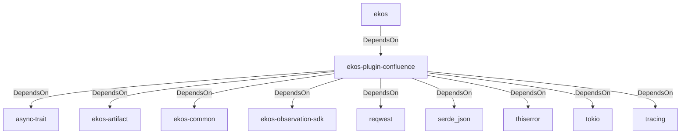

# ekos-plugin-confluence (Crate)

## Properties

| Key | Value |
|---|---|
| `description` | Confluence page observer plugin (proof-of-concept — see RFC 0022) |
| `path` | ekos/plugins/confluence |

## Relationships

### DependsOn

- ← ekos (`abd31cd9-b31d-54c5-87cd-8a4a5b9a30a0`) — evidence: ekos depends on ekos-plugin-confluence (path dependency)
- → async-trait (`7c905290-824b-57e0-a559-15ff1499b4d6`) — evidence: ekos-plugin-confluence depends on async-trait 0.1
- → ekos-artifact (`8806bf54-6364-5052-b85a-cef4344e8f19`) — evidence: ekos-plugin-confluence depends on ekos-artifact (path dependency)
- → ekos-common (`dc169f0a-98f1-5c7c-8dd0-1dbc8504e9c9`) — evidence: ekos-plugin-confluence depends on ekos-common (path dependency)
- → ekos-observation-sdk (`9a955a3a-55bc-587a-942d-fb81d6260052`) — evidence: ekos-plugin-confluence depends on ekos-observation-sdk (path dependency)
- → reqwest (`70acdf50-6295-5f0c-9157-cb9866d0ec23`) — evidence: ekos-plugin-confluence depends on reqwest 0.12
- → serde_json (`02548eee-6478-5324-851f-3a6329ccfeca`) — evidence: ekos-plugin-confluence depends on serde 1
- → thiserror (`bbefe8a3-f76e-509f-910b-b439cd7eeff6`) — evidence: ekos-plugin-confluence depends on thiserror 2
- → tokio (`4a4e8d5c-5102-5d1d-addd-d7fb0bc8d7b9`) — evidence: ekos-plugin-confluence depends on tokio 1
- → tracing (`4282d266-2850-5d04-a992-0f0a204788aa`) — evidence: ekos-plugin-confluence depends on tracing 0.1

## Diagram

## Evidence

- `8c03991c-c092-4d78-9de6-907b3e0f13dd` — ekos depends on ekos-plugin-confluence (path dependency) (confidence: 1.00)
- `07996fba-3646-413d-b48e-e69e64c04602` — ekos-plugin-confluence depends on async-trait 0.1 (confidence: 1.00)
- `6c5cb0f2-acaa-449f-b3ee-0f9afec981fc` — ekos-plugin-confluence depends on ekos-artifact (path dependency) (confidence: 1.00)
- `abc5e3da-90d7-4fa1-a1e3-99b11d75aedf` — ekos-plugin-confluence depends on ekos-common (path dependency) (confidence: 1.00)
- `a5c71b71-e32b-48f4-b823-bc9ba20a4d00` — ekos-plugin-confluence depends on ekos-observation-sdk (path dependency) (confidence: 1.00)
- `4876f5a7-d44a-4117-9047-9f24d780fdcc` — ekos-plugin-confluence depends on reqwest 0.12 (confidence: 1.00)
- `a34508d1-56f4-42ab-b546-6002dc7d247e` — ekos-plugin-confluence depends on serde 1 (confidence: 1.00)
- `cdaffc50-3d5e-4629-bde8-342c1be8a7e0` — ekos-plugin-confluence depends on serde_json 1 (confidence: 1.00)
- `b87db043-49b2-4c35-9bc3-584494d66e58` — ekos-plugin-confluence depends on thiserror 2 (confidence: 1.00)
- `c2962c3b-e15a-4b01-8350-758c05e97bae` — ekos-plugin-confluence depends on tokio 1 (confidence: 1.00)
- `ca38d654-3b59-4534-9825-cb37d6455812` — ekos-plugin-confluence depends on tracing 0.1 (confidence: 1.00)
