# ekos-plugin-fabric (Crate)

## Properties

| Key | Value |
|---|---|
| `description` | Microsoft Fabric workspace observer plugin (Phase 14, scaffold — see RFC 0012) |
| `path` | ekos/plugins/fabric |

## Relationships

### DependsOn

- → async-trait (`7c905290-824b-57e0-a559-15ff1499b4d6`) — evidence: ekos-plugin-fabric depends on async-trait 0.1
- → ekos-artifact (`8806bf54-6364-5052-b85a-cef4344e8f19`) — evidence: ekos-plugin-fabric depends on ekos-artifact (path dependency)
- → ekos-common (`dc169f0a-98f1-5c7c-8dd0-1dbc8504e9c9`) — evidence: ekos-plugin-fabric depends on ekos-common (path dependency)
- → ekos-observation-sdk (`9a955a3a-55bc-587a-942d-fb81d6260052`) — evidence: ekos-plugin-fabric depends on ekos-observation-sdk (path dependency)
- → reqwest (`70acdf50-6295-5f0c-9157-cb9866d0ec23`) — evidence: ekos-plugin-fabric depends on reqwest 0.12
- → serde_json (`02548eee-6478-5324-851f-3a6329ccfeca`) — evidence: ekos-plugin-fabric depends on serde 1
- → thiserror (`bbefe8a3-f76e-509f-910b-b439cd7eeff6`) — evidence: ekos-plugin-fabric depends on thiserror 2
- → tokio (`4a4e8d5c-5102-5d1d-addd-d7fb0bc8d7b9`) — evidence: ekos-plugin-fabric depends on tokio 1
- → tracing (`4282d266-2850-5d04-a992-0f0a204788aa`) — evidence: ekos-plugin-fabric depends on tracing 0.1

## Diagram

```mermaid
graph TD
    naeb0688d1d0058a5b6d6245dfefa74cf["ekos-plugin-fabric"]
    n7c905290824b57e0a55915ff1499b4d6["async-trait"]
    naeb0688d1d0058a5b6d6245dfefa74cf -->|DependsOn| n7c905290824b57e0a55915ff1499b4d6
    n8806bf5463645052b85acef4344e8f19["ekos-artifact"]
    naeb0688d1d0058a5b6d6245dfefa74cf -->|DependsOn| n8806bf5463645052b85acef4344e8f19
    ndc169f0a98f15c7c8dd01dbc8504e9c9["ekos-common"]
    naeb0688d1d0058a5b6d6245dfefa74cf -->|DependsOn| ndc169f0a98f15c7c8dd01dbc8504e9c9
    n9a955a3a55bc587a942dfb81d6260052["ekos-observation-sdk"]
    naeb0688d1d0058a5b6d6245dfefa74cf -->|DependsOn| n9a955a3a55bc587a942dfb81d6260052
    n70acdf5062955f0c9157cb9866d0ec23["reqwest"]
    naeb0688d1d0058a5b6d6245dfefa74cf -->|DependsOn| n70acdf5062955f0c9157cb9866d0ec23
    n02548eee64785324851f3a6329ccfeca["serde_json"]
    naeb0688d1d0058a5b6d6245dfefa74cf -->|DependsOn| n02548eee64785324851f3a6329ccfeca
    nbbefe8a3f76e509f910bb439cd7eeff6["thiserror"]
    naeb0688d1d0058a5b6d6245dfefa74cf -->|DependsOn| nbbefe8a3f76e509f910bb439cd7eeff6
    n4a4e8d5c51025d1dadddd7fb0bc8d7b9["tokio"]
    naeb0688d1d0058a5b6d6245dfefa74cf -->|DependsOn| n4a4e8d5c51025d1dadddd7fb0bc8d7b9
    n4282d26628505d04a9920f0a204788aa["tracing"]
    naeb0688d1d0058a5b6d6245dfefa74cf -->|DependsOn| n4282d26628505d04a9920f0a204788aa
```

## Evidence

- `725818f1-cda7-437c-9c6b-3eefcdb9d0f9` — ekos-plugin-fabric depends on async-trait 0.1 (confidence: 1.00)
- `c60068ed-3f43-4af4-b887-d7f49a35b30e` — ekos-plugin-fabric depends on ekos-artifact (path dependency) (confidence: 1.00)
- `77760696-fab5-4d5f-83c4-a4bdea82267b` — ekos-plugin-fabric depends on ekos-common (path dependency) (confidence: 1.00)
- `400ef1d1-9b60-442e-aac1-3df84bf22508` — ekos-plugin-fabric depends on ekos-observation-sdk (path dependency) (confidence: 1.00)
- `d77d4418-5c44-498a-b74d-811f5b0b8ac8` — ekos-plugin-fabric depends on reqwest 0.12 (confidence: 1.00)
- `6de3c2d2-c349-402d-a7df-56a83ce41daa` — ekos-plugin-fabric depends on serde 1 (confidence: 1.00)
- `e52346cd-c208-4f69-b3a0-168c38375dd3` — ekos-plugin-fabric depends on serde_json 1 (confidence: 1.00)
- `af6e9d46-2bce-4f9e-af61-0a429249cd36` — ekos-plugin-fabric depends on thiserror 2 (confidence: 1.00)
- `55de6671-d7c1-4785-b2fe-4f716411a38b` — ekos-plugin-fabric depends on tokio 1 (confidence: 1.00)
- `0d2aec66-bbb2-4d3d-bb91-6fcf3daa1fe7` — ekos-plugin-fabric depends on tracing 0.1 (confidence: 1.00)
