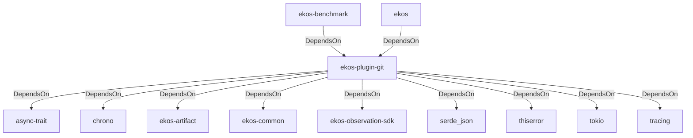

# ekos-plugin-git (Crate)

## Properties

| Key | Value |
|---|---|
| `description` | Git repository observer plugin (Phase 4) |
| `path` | ekos/plugins/git |

## Relationships

### DependsOn

- ← ekos-benchmark (`20c26e43-ee96-5ee7-a046-25740fbbd56b`) — evidence: ekos-benchmark depends on ekos-plugin-git (path dependency)
- ← ekos (`abd31cd9-b31d-54c5-87cd-8a4a5b9a30a0`) — evidence: ekos depends on ekos-plugin-git (path dependency)
- → async-trait (`7c905290-824b-57e0-a559-15ff1499b4d6`) — evidence: ekos-plugin-git depends on async-trait 0.1
- → chrono (`0d184cc1-2483-516d-a0b5-0b6bfad54805`) — evidence: ekos-plugin-git depends on chrono 0.4
- → ekos-artifact (`8806bf54-6364-5052-b85a-cef4344e8f19`) — evidence: ekos-plugin-git depends on ekos-artifact (path dependency)
- → ekos-common (`dc169f0a-98f1-5c7c-8dd0-1dbc8504e9c9`) — evidence: ekos-plugin-git depends on ekos-common (path dependency)
- → ekos-observation-sdk (`9a955a3a-55bc-587a-942d-fb81d6260052`) — evidence: ekos-plugin-git depends on ekos-observation-sdk (path dependency)
- → serde_json (`02548eee-6478-5324-851f-3a6329ccfeca`) — evidence: ekos-plugin-git depends on serde_json 1
- → thiserror (`bbefe8a3-f76e-509f-910b-b439cd7eeff6`) — evidence: ekos-plugin-git depends on thiserror 2
- → tokio (`4a4e8d5c-5102-5d1d-addd-d7fb0bc8d7b9`) — evidence: ekos-plugin-git depends on tokio 1
- → tracing (`4282d266-2850-5d04-a992-0f0a204788aa`) — evidence: ekos-plugin-git depends on tracing 0.1

## Diagram

## Evidence

- `4c35bf63-e154-478e-aca8-7ea316d7aed0` — ekos-benchmark depends on ekos-plugin-git (path dependency) (confidence: 1.00)
- `1e4aef55-97d8-46f1-adbe-7a753a2a8bd4` — ekos depends on ekos-plugin-git (path dependency) (confidence: 1.00)
- `9b057a08-3de0-4aca-be40-c02066b5caeb` — ekos-plugin-git depends on async-trait 0.1 (confidence: 1.00)
- `85211083-18ac-41ce-9abb-9c6d6f543f7e` — ekos-plugin-git depends on chrono 0.4 (confidence: 1.00)
- `9070c15c-4eb8-46fa-8d2a-07aa9f04bc30` — ekos-plugin-git depends on ekos-artifact (path dependency) (confidence: 1.00)
- `6a31e3a4-f92d-490c-ab68-7ecc9aef029c` — ekos-plugin-git depends on ekos-common (path dependency) (confidence: 1.00)
- `d31572a6-388a-45fa-ae9f-128de4470253` — ekos-plugin-git depends on ekos-observation-sdk (path dependency) (confidence: 1.00)
- `f7dacf21-66f6-41e1-8127-bf595e2450d2` — ekos-plugin-git depends on serde_json 1 (confidence: 1.00)
- `4516cbca-7e37-48bb-b574-2de63ce3493c` — ekos-plugin-git depends on thiserror 2 (confidence: 1.00)
- `0055db0f-0a8b-4379-984d-b3df5a2b583c` — ekos-plugin-git depends on tokio 1 (confidence: 1.00)
- `e696713e-cdc7-4130-8616-42c1df2c1734` — ekos-plugin-git depends on tracing 0.1 (confidence: 1.00)
