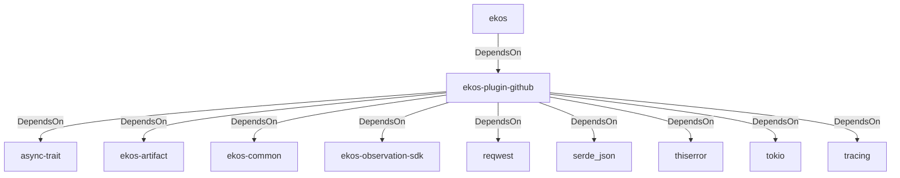

# ekos-plugin-github (Crate)

## Properties

| Key | Value |
|---|---|
| `description` | GitHub issues/PRs observer plugin (proof-of-concept — see RFC 0020) |
| `path` | ekos/plugins/github |

## Relationships

### DependsOn

- ← ekos (`abd31cd9-b31d-54c5-87cd-8a4a5b9a30a0`) — evidence: ekos depends on ekos-plugin-github (path dependency)
- → async-trait (`7c905290-824b-57e0-a559-15ff1499b4d6`) — evidence: ekos-plugin-github depends on async-trait 0.1
- → ekos-artifact (`8806bf54-6364-5052-b85a-cef4344e8f19`) — evidence: ekos-plugin-github depends on ekos-artifact (path dependency)
- → ekos-common (`dc169f0a-98f1-5c7c-8dd0-1dbc8504e9c9`) — evidence: ekos-plugin-github depends on ekos-common (path dependency)
- → ekos-observation-sdk (`9a955a3a-55bc-587a-942d-fb81d6260052`) — evidence: ekos-plugin-github depends on ekos-observation-sdk (path dependency)
- → reqwest (`70acdf50-6295-5f0c-9157-cb9866d0ec23`) — evidence: ekos-plugin-github depends on reqwest 0.12
- → serde_json (`02548eee-6478-5324-851f-3a6329ccfeca`) — evidence: ekos-plugin-github depends on serde 1
- → thiserror (`bbefe8a3-f76e-509f-910b-b439cd7eeff6`) — evidence: ekos-plugin-github depends on thiserror 2
- → tokio (`4a4e8d5c-5102-5d1d-addd-d7fb0bc8d7b9`) — evidence: ekos-plugin-github depends on tokio 1
- → tracing (`4282d266-2850-5d04-a992-0f0a204788aa`) — evidence: ekos-plugin-github depends on tracing 0.1

## Diagram

## Evidence

- `64c34eb3-142d-4790-88f3-8c4150ee8020` — ekos depends on ekos-plugin-github (path dependency) (confidence: 1.00)
- `2b2bc79a-804c-4fde-bec4-a5b61a65992c` — ekos-plugin-github depends on async-trait 0.1 (confidence: 1.00)
- `e8bd3ffc-f19a-4bdf-84a8-e36c239ce373` — ekos-plugin-github depends on ekos-artifact (path dependency) (confidence: 1.00)
- `c1bad037-a446-49c0-96c6-32512c869e98` — ekos-plugin-github depends on ekos-common (path dependency) (confidence: 1.00)
- `9403d4c6-6c0e-4410-9c55-e15b70d27f4c` — ekos-plugin-github depends on ekos-observation-sdk (path dependency) (confidence: 1.00)
- `5beb9d35-b629-4748-b24b-e23b8f96f3ae` — ekos-plugin-github depends on reqwest 0.12 (confidence: 1.00)
- `3edb0760-b2e6-4cf0-acca-0ca7e4998f29` — ekos-plugin-github depends on serde 1 (confidence: 1.00)
- `8e45450e-0a89-4c15-b707-683abd15be37` — ekos-plugin-github depends on serde_json 1 (confidence: 1.00)
- `b4734db2-ffb6-4e36-b1a5-f4f13bf2907a` — ekos-plugin-github depends on thiserror 2 (confidence: 1.00)
- `06ad179b-aea5-48a2-b8fc-ee8e48894860` — ekos-plugin-github depends on tokio 1 (confidence: 1.00)
- `678563f4-8cfc-408c-bc1b-e42ec434a5a6` — ekos-plugin-github depends on tracing 0.1 (confidence: 1.00)
