# ekos-plugin-localdocs (Crate)

## Properties

| Key | Value |
|---|---|
| `description` | Local document observer plugin — PDF/DOCX text, tables, and image OCR (RFC 0023) |
| `path` | ekos/plugins/localdocs |

## Relationships

### DependsOn

- ← ekos (`abd31cd9-b31d-54c5-87cd-8a4a5b9a30a0`) — evidence: ekos depends on ekos-plugin-localdocs (path dependency)
- → async-trait (`7c905290-824b-57e0-a559-15ff1499b4d6`) — evidence: ekos-plugin-localdocs depends on async-trait 0.1
- → docx-rs (`10406331-ea31-57e1-8988-393232d990f7`) — evidence: ekos-plugin-localdocs depends on docx-rs 0.4
- → ekos-artifact (`8806bf54-6364-5052-b85a-cef4344e8f19`) — evidence: ekos-plugin-localdocs depends on ekos-artifact (path dependency)
- → ekos-common (`dc169f0a-98f1-5c7c-8dd0-1dbc8504e9c9`) — evidence: ekos-plugin-localdocs depends on ekos-common (path dependency)
- → ekos-observation-sdk (`9a955a3a-55bc-587a-942d-fb81d6260052`) — evidence: ekos-plugin-localdocs depends on ekos-observation-sdk (path dependency)
- → hex (`fa785806-31c3-5308-ae4a-2898a2c181ca`) — evidence: ekos-plugin-localdocs depends on hex 0.4
- → html2text (`10689105-123a-5acb-a565-506be367126a`) — evidence: ekos-plugin-localdocs depends on html2text 0.17
- → lopdf (`ff7a64b4-80b4-5045-8e4c-5e3ec24f2a20`) — evidence: ekos-plugin-localdocs depends on lopdf 0.44
- → mail-parser (`b20a0f9e-2d90-5b05-8d8e-5f41f4929ff7`) — evidence: ekos-plugin-localdocs depends on mail-parser 0.11
- → pdf-extract (`387538c4-94fb-5571-8e4a-96d5ddaf26eb`) — evidence: ekos-plugin-localdocs depends on pdf-extract 0.12
- → serde_json (`02548eee-6478-5324-851f-3a6329ccfeca`) — evidence: ekos-plugin-localdocs depends on serde_json 1
- → sha2 (`64d6fba9-eea7-52e6-9b3a-b2e887a6944f`) — evidence: ekos-plugin-localdocs depends on sha2 0.10
- → tempfile (`5213e845-b54e-5710-9e19-bcdc640a0fb8`) — evidence: ekos-plugin-localdocs depends on tempfile 3
- → thiserror (`bbefe8a3-f76e-509f-910b-b439cd7eeff6`) — evidence: ekos-plugin-localdocs depends on thiserror 2
- → tokio (`4a4e8d5c-5102-5d1d-addd-d7fb0bc8d7b9`) — evidence: ekos-plugin-localdocs depends on tokio 1
- → tracing (`4282d266-2850-5d04-a992-0f0a204788aa`) — evidence: ekos-plugin-localdocs depends on tracing 0.1
- → walkdir (`40b5029d-b6e8-55ee-bc22-14411e3d0fb2`) — evidence: ekos-plugin-localdocs depends on walkdir 2
- → zip (`1e0b7fd3-1c93-5599-82d9-e2e1cc98c39b`) — evidence: ekos-plugin-localdocs depends on zip 2

## Diagram

```mermaid
graph TD
    n0659fbf3d2f454ba835fa7f6f875a7d1["ekos-plugin-localdocs"]
    nabd31cd9b31d54c587cd8a4a5b9a30a0["ekos"]
    nabd31cd9b31d54c587cd8a4a5b9a30a0 -->|DependsOn| n0659fbf3d2f454ba835fa7f6f875a7d1
    n7c905290824b57e0a55915ff1499b4d6["async-trait"]
    n0659fbf3d2f454ba835fa7f6f875a7d1 -->|DependsOn| n7c905290824b57e0a55915ff1499b4d6
    n10406331ea3157e18988393232d990f7["docx-rs"]
    n0659fbf3d2f454ba835fa7f6f875a7d1 -->|DependsOn| n10406331ea3157e18988393232d990f7
    n8806bf5463645052b85acef4344e8f19["ekos-artifact"]
    n0659fbf3d2f454ba835fa7f6f875a7d1 -->|DependsOn| n8806bf5463645052b85acef4344e8f19
    ndc169f0a98f15c7c8dd01dbc8504e9c9["ekos-common"]
    n0659fbf3d2f454ba835fa7f6f875a7d1 -->|DependsOn| ndc169f0a98f15c7c8dd01dbc8504e9c9
    n9a955a3a55bc587a942dfb81d6260052["ekos-observation-sdk"]
    n0659fbf3d2f454ba835fa7f6f875a7d1 -->|DependsOn| n9a955a3a55bc587a942dfb81d6260052
    nfa78580631c35308ae4a2898a2c181ca["hex"]
    n0659fbf3d2f454ba835fa7f6f875a7d1 -->|DependsOn| nfa78580631c35308ae4a2898a2c181ca
    n10689105123a5acba565506be367126a["html2text"]
    n0659fbf3d2f454ba835fa7f6f875a7d1 -->|DependsOn| n10689105123a5acba565506be367126a
    nff7a64b480b450458e4c5e3ec24f2a20["lopdf"]
    n0659fbf3d2f454ba835fa7f6f875a7d1 -->|DependsOn| nff7a64b480b450458e4c5e3ec24f2a20
    nb20a0f9e2d905b058d8e5f41f4929ff7["mail-parser"]
    n0659fbf3d2f454ba835fa7f6f875a7d1 -->|DependsOn| nb20a0f9e2d905b058d8e5f41f4929ff7
    n387538c494fb55718e4a96d5ddaf26eb["pdf-extract"]
    n0659fbf3d2f454ba835fa7f6f875a7d1 -->|DependsOn| n387538c494fb55718e4a96d5ddaf26eb
    n02548eee64785324851f3a6329ccfeca["serde_json"]
    n0659fbf3d2f454ba835fa7f6f875a7d1 -->|DependsOn| n02548eee64785324851f3a6329ccfeca
    n64d6fba9eea752e69b3ab2e887a6944f["sha2"]
    n0659fbf3d2f454ba835fa7f6f875a7d1 -->|DependsOn| n64d6fba9eea752e69b3ab2e887a6944f
    n5213e845b54e57109e19bcdc640a0fb8["tempfile"]
    n0659fbf3d2f454ba835fa7f6f875a7d1 -->|DependsOn| n5213e845b54e57109e19bcdc640a0fb8
    nbbefe8a3f76e509f910bb439cd7eeff6["thiserror"]
    n0659fbf3d2f454ba835fa7f6f875a7d1 -->|DependsOn| nbbefe8a3f76e509f910bb439cd7eeff6
    n4a4e8d5c51025d1dadddd7fb0bc8d7b9["tokio"]
    n0659fbf3d2f454ba835fa7f6f875a7d1 -->|DependsOn| n4a4e8d5c51025d1dadddd7fb0bc8d7b9
    n4282d26628505d04a9920f0a204788aa["tracing"]
    n0659fbf3d2f454ba835fa7f6f875a7d1 -->|DependsOn| n4282d26628505d04a9920f0a204788aa
    n40b5029db6e855eebc2214411e3d0fb2["walkdir"]
    n0659fbf3d2f454ba835fa7f6f875a7d1 -->|DependsOn| n40b5029db6e855eebc2214411e3d0fb2
    n1e0b7fd31c93559982d9e2e1cc98c39b["zip"]
    n0659fbf3d2f454ba835fa7f6f875a7d1 -->|DependsOn| n1e0b7fd31c93559982d9e2e1cc98c39b
```

## Evidence

- `ec64dccd-166c-4831-b454-ad8e56d80d95` — ekos depends on ekos-plugin-localdocs (path dependency) (confidence: 1.00)
- `6e612cf5-fc11-4815-8d7b-6d062842bf34` — ekos-plugin-localdocs depends on async-trait 0.1 (confidence: 1.00)
- `50bf7077-93d2-4525-9f5d-b41409c4ca72` — ekos-plugin-localdocs depends on docx-rs 0.4 (confidence: 1.00)
- `707a2ee4-c069-4efe-a38c-e49bd1db60dd` — ekos-plugin-localdocs depends on ekos-artifact (path dependency) (confidence: 1.00)
- `b73e48b4-2e97-49b5-8f2b-710733f04728` — ekos-plugin-localdocs depends on ekos-common (path dependency) (confidence: 1.00)
- `2f449ec3-3ce6-48fd-8355-647a5beca059` — ekos-plugin-localdocs depends on ekos-observation-sdk (path dependency) (confidence: 1.00)
- `c73c6b03-335f-4059-ad77-a15aad068743` — ekos-plugin-localdocs depends on hex 0.4 (confidence: 1.00)
- `5929212b-8edf-46f7-a193-83995df9eb51` — ekos-plugin-localdocs depends on html2text 0.17 (confidence: 1.00)
- `85085573-10de-46f3-8559-6226792ee481` — ekos-plugin-localdocs depends on lopdf 0.44 (confidence: 1.00)
- `d256cffb-54ce-427a-84f8-af6d7508bebb` — ekos-plugin-localdocs depends on mail-parser 0.11 (confidence: 1.00)
- `272875c7-0295-4263-814d-5c0137b6c226` — ekos-plugin-localdocs depends on pdf-extract 0.12 (confidence: 1.00)
- `562ae663-48b3-4443-9cb0-a269a5714883` — ekos-plugin-localdocs depends on serde_json 1 (confidence: 1.00)
- `a21523a5-12e3-4274-ad88-2c952fdb58d4` — ekos-plugin-localdocs depends on sha2 0.10 (confidence: 1.00)
- `d6d089fa-5c32-4927-b395-814c4fc02834` — ekos-plugin-localdocs depends on tempfile 3 (confidence: 1.00)
- `4f8b8598-c1f1-4908-b8d8-3fa0b4232fb1` — ekos-plugin-localdocs depends on thiserror 2 (confidence: 1.00)
- `cb1218f1-8e8b-4e50-b10d-e0886fac261d` — ekos-plugin-localdocs depends on tokio 1 (confidence: 1.00)
- `383b0bdb-80b4-4d8f-a95b-5d800641aceb` — ekos-plugin-localdocs depends on tracing 0.1 (confidence: 1.00)
- `e7e8d618-d095-41c5-bb1e-0eab85568d9a` — ekos-plugin-localdocs depends on walkdir 2 (confidence: 1.00)
- `14e3cba4-d5f9-4fa5-bd72-6b2a5b66ac51` — ekos-plugin-localdocs depends on zip 2 (confidence: 1.00)
