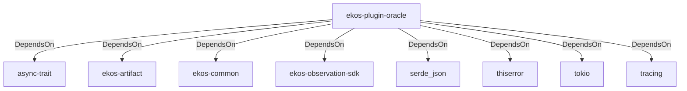

# ekos-plugin-oracle (Crate)

## Properties

| Key | Value |
|---|---|
| `description` | Oracle schema observer plugin (Phase 14, scaffold — see RFC 0012) |
| `path` | ekos/plugins/oracle |

## Relationships

### DependsOn

- → async-trait (`7c905290-824b-57e0-a559-15ff1499b4d6`) — evidence: ekos-plugin-oracle depends on async-trait 0.1
- → ekos-artifact (`8806bf54-6364-5052-b85a-cef4344e8f19`) — evidence: ekos-plugin-oracle depends on ekos-artifact (path dependency)
- → ekos-common (`dc169f0a-98f1-5c7c-8dd0-1dbc8504e9c9`) — evidence: ekos-plugin-oracle depends on ekos-common (path dependency)
- → ekos-observation-sdk (`9a955a3a-55bc-587a-942d-fb81d6260052`) — evidence: ekos-plugin-oracle depends on ekos-observation-sdk (path dependency)
- → serde_json (`02548eee-6478-5324-851f-3a6329ccfeca`) — evidence: ekos-plugin-oracle depends on serde 1
- → thiserror (`bbefe8a3-f76e-509f-910b-b439cd7eeff6`) — evidence: ekos-plugin-oracle depends on thiserror 2
- → tokio (`4a4e8d5c-5102-5d1d-addd-d7fb0bc8d7b9`) — evidence: ekos-plugin-oracle depends on tokio 1
- → tracing (`4282d266-2850-5d04-a992-0f0a204788aa`) — evidence: ekos-plugin-oracle depends on tracing 0.1

## Diagram

## Evidence

- `68bf8cde-67ad-4d38-a4d1-6be8d6bd2ae9` — ekos-plugin-oracle depends on async-trait 0.1 (confidence: 1.00)
- `a6109b2e-506d-4317-a915-1d4fe72cdc88` — ekos-plugin-oracle depends on ekos-artifact (path dependency) (confidence: 1.00)
- `bd27334b-c162-4bde-867e-a7d11cec45fe` — ekos-plugin-oracle depends on ekos-common (path dependency) (confidence: 1.00)
- `df4f3c1c-fa35-47d2-a735-6b0125d939fc` — ekos-plugin-oracle depends on ekos-observation-sdk (path dependency) (confidence: 1.00)
- `1087b570-c614-49d4-a6ef-a7d13ed43535` — ekos-plugin-oracle depends on serde 1 (confidence: 1.00)
- `ba15c31f-76ae-4d97-93bd-233d42cd3705` — ekos-plugin-oracle depends on serde_json 1 (confidence: 1.00)
- `1b71385b-5b37-4704-9d43-5b77813b8110` — ekos-plugin-oracle depends on thiserror 2 (confidence: 1.00)
- `4c3e95f9-9b26-4032-abc5-6fa75c1715e5` — ekos-plugin-oracle depends on tokio 1 (confidence: 1.00)
- `97f260b1-bab3-4b83-93f4-837064202095` — ekos-plugin-oracle depends on tracing 0.1 (confidence: 1.00)
