# ekos-plugin-pentaho (Crate)

## Properties

| Key | Value |
|---|---|
| `description` | Pentaho Kettle (.ktr/.kjb) observer plugin (RFC 0027 Phase 3) |
| `path` | ekos/plugins/pentaho |

## Relationships

### DependsOn

- ← ekos (`abd31cd9-b31d-54c5-87cd-8a4a5b9a30a0`) — evidence: ekos depends on ekos-plugin-pentaho (path dependency)
- → async-trait (`7c905290-824b-57e0-a559-15ff1499b4d6`) — evidence: ekos-plugin-pentaho depends on async-trait 0.1
- → ekos-artifact (`8806bf54-6364-5052-b85a-cef4344e8f19`) — evidence: ekos-plugin-pentaho depends on ekos-artifact (path dependency)
- → ekos-common (`dc169f0a-98f1-5c7c-8dd0-1dbc8504e9c9`) — evidence: ekos-plugin-pentaho depends on ekos-common (path dependency)
- → ekos-observation-sdk (`9a955a3a-55bc-587a-942d-fb81d6260052`) — evidence: ekos-plugin-pentaho depends on ekos-observation-sdk (path dependency)
- → hex (`fa785806-31c3-5308-ae4a-2898a2c181ca`) — evidence: ekos-plugin-pentaho depends on hex 0.4
- → serde_json (`02548eee-6478-5324-851f-3a6329ccfeca`) — evidence: ekos-plugin-pentaho depends on serde_json 1
- → sha2 (`64d6fba9-eea7-52e6-9b3a-b2e887a6944f`) — evidence: ekos-plugin-pentaho depends on sha2 0.10
- → thiserror (`bbefe8a3-f76e-509f-910b-b439cd7eeff6`) — evidence: ekos-plugin-pentaho depends on thiserror 2
- → tokio (`4a4e8d5c-5102-5d1d-addd-d7fb0bc8d7b9`) — evidence: ekos-plugin-pentaho depends on tokio 1
- → tracing (`4282d266-2850-5d04-a992-0f0a204788aa`) — evidence: ekos-plugin-pentaho depends on tracing 0.1
- → walkdir (`40b5029d-b6e8-55ee-bc22-14411e3d0fb2`) — evidence: ekos-plugin-pentaho depends on walkdir 2

## Diagram

```mermaid
graph TD
    ndac1d743a50e57a98acb56e29a47ef5e["ekos-plugin-pentaho"]
    nabd31cd9b31d54c587cd8a4a5b9a30a0["ekos"]
    nabd31cd9b31d54c587cd8a4a5b9a30a0 -->|DependsOn| ndac1d743a50e57a98acb56e29a47ef5e
    n7c905290824b57e0a55915ff1499b4d6["async-trait"]
    ndac1d743a50e57a98acb56e29a47ef5e -->|DependsOn| n7c905290824b57e0a55915ff1499b4d6
    n8806bf5463645052b85acef4344e8f19["ekos-artifact"]
    ndac1d743a50e57a98acb56e29a47ef5e -->|DependsOn| n8806bf5463645052b85acef4344e8f19
    ndc169f0a98f15c7c8dd01dbc8504e9c9["ekos-common"]
    ndac1d743a50e57a98acb56e29a47ef5e -->|DependsOn| ndc169f0a98f15c7c8dd01dbc8504e9c9
    n9a955a3a55bc587a942dfb81d6260052["ekos-observation-sdk"]
    ndac1d743a50e57a98acb56e29a47ef5e -->|DependsOn| n9a955a3a55bc587a942dfb81d6260052
    nfa78580631c35308ae4a2898a2c181ca["hex"]
    ndac1d743a50e57a98acb56e29a47ef5e -->|DependsOn| nfa78580631c35308ae4a2898a2c181ca
    n02548eee64785324851f3a6329ccfeca["serde_json"]
    ndac1d743a50e57a98acb56e29a47ef5e -->|DependsOn| n02548eee64785324851f3a6329ccfeca
    n64d6fba9eea752e69b3ab2e887a6944f["sha2"]
    ndac1d743a50e57a98acb56e29a47ef5e -->|DependsOn| n64d6fba9eea752e69b3ab2e887a6944f
    nbbefe8a3f76e509f910bb439cd7eeff6["thiserror"]
    ndac1d743a50e57a98acb56e29a47ef5e -->|DependsOn| nbbefe8a3f76e509f910bb439cd7eeff6
    n4a4e8d5c51025d1dadddd7fb0bc8d7b9["tokio"]
    ndac1d743a50e57a98acb56e29a47ef5e -->|DependsOn| n4a4e8d5c51025d1dadddd7fb0bc8d7b9
    n4282d26628505d04a9920f0a204788aa["tracing"]
    ndac1d743a50e57a98acb56e29a47ef5e -->|DependsOn| n4282d26628505d04a9920f0a204788aa
    n40b5029db6e855eebc2214411e3d0fb2["walkdir"]
    ndac1d743a50e57a98acb56e29a47ef5e -->|DependsOn| n40b5029db6e855eebc2214411e3d0fb2
```

## Evidence

- `aab350b8-701e-4a60-8203-e09299dc15c0` — ekos depends on ekos-plugin-pentaho (path dependency) (confidence: 1.00)
- `a6eae1bc-74f4-4f14-80cd-ebf00dc2c08f` — ekos-plugin-pentaho depends on async-trait 0.1 (confidence: 1.00)
- `8df27bff-2537-4fa1-b4c1-a2bdfbe642ae` — ekos-plugin-pentaho depends on ekos-artifact (path dependency) (confidence: 1.00)
- `19d371be-116b-4b8f-abdd-fb4620611c13` — ekos-plugin-pentaho depends on ekos-common (path dependency) (confidence: 1.00)
- `f1a8629e-45d6-4be0-8fbe-a3a28417d711` — ekos-plugin-pentaho depends on ekos-observation-sdk (path dependency) (confidence: 1.00)
- `7b20b361-25c5-4c87-ac42-5cdac8b49586` — ekos-plugin-pentaho depends on hex 0.4 (confidence: 1.00)
- `c87f7759-b768-40f4-8472-6dc2de42cdea` — ekos-plugin-pentaho depends on serde_json 1 (confidence: 1.00)
- `ef4695ac-b5be-4b38-ae3e-db64939a624d` — ekos-plugin-pentaho depends on sha2 0.10 (confidence: 1.00)
- `bb548312-8732-480b-b2f1-16d5a8b53ffa` — ekos-plugin-pentaho depends on thiserror 2 (confidence: 1.00)
- `7905a3c5-a042-4815-83e0-92dc013338a6` — ekos-plugin-pentaho depends on tokio 1 (confidence: 1.00)
- `b50508a8-3d8a-4aca-8eda-3271e1b52944` — ekos-plugin-pentaho depends on tracing 0.1 (confidence: 1.00)
- `2cf4fe86-c1ad-4f92-9f5a-101301cb6f27` — ekos-plugin-pentaho depends on walkdir 2 (confidence: 1.00)
