# ekos-plugin-python (Crate)

## Properties

| Key | Value |
|---|---|
| `description` | Python (.py) observer plugin (RFC 0038/0040 Phase 2) |
| `path` | ekos/plugins/python |

## Relationships

### DependsOn

- ← ekos (`abd31cd9-b31d-54c5-87cd-8a4a5b9a30a0`) — evidence: ekos depends on ekos-plugin-python (path dependency)
- → async-trait (`7c905290-824b-57e0-a559-15ff1499b4d6`) — evidence: ekos-plugin-python depends on async-trait 0.1
- → ekos-artifact (`8806bf54-6364-5052-b85a-cef4344e8f19`) — evidence: ekos-plugin-python depends on ekos-artifact (path dependency)
- → ekos-common (`dc169f0a-98f1-5c7c-8dd0-1dbc8504e9c9`) — evidence: ekos-plugin-python depends on ekos-common (path dependency)
- → ekos-observation-sdk (`9a955a3a-55bc-587a-942d-fb81d6260052`) — evidence: ekos-plugin-python depends on ekos-observation-sdk (path dependency)
- → hex (`fa785806-31c3-5308-ae4a-2898a2c181ca`) — evidence: ekos-plugin-python depends on hex 0.4
- → serde_json (`02548eee-6478-5324-851f-3a6329ccfeca`) — evidence: ekos-plugin-python depends on serde_json 1
- → sha2 (`64d6fba9-eea7-52e6-9b3a-b2e887a6944f`) — evidence: ekos-plugin-python depends on sha2 0.10
- → thiserror (`bbefe8a3-f76e-509f-910b-b439cd7eeff6`) — evidence: ekos-plugin-python depends on thiserror 2
- → tokio (`4a4e8d5c-5102-5d1d-addd-d7fb0bc8d7b9`) — evidence: ekos-plugin-python depends on tokio 1
- → tracing (`4282d266-2850-5d04-a992-0f0a204788aa`) — evidence: ekos-plugin-python depends on tracing 0.1
- → walkdir (`40b5029d-b6e8-55ee-bc22-14411e3d0fb2`) — evidence: ekos-plugin-python depends on walkdir 2

## Diagram

```mermaid
graph TD
    n020c78caf337542fb3518b4201393bbb["ekos-plugin-python"]
    nabd31cd9b31d54c587cd8a4a5b9a30a0["ekos"]
    nabd31cd9b31d54c587cd8a4a5b9a30a0 -->|DependsOn| n020c78caf337542fb3518b4201393bbb
    n7c905290824b57e0a55915ff1499b4d6["async-trait"]
    n020c78caf337542fb3518b4201393bbb -->|DependsOn| n7c905290824b57e0a55915ff1499b4d6
    n8806bf5463645052b85acef4344e8f19["ekos-artifact"]
    n020c78caf337542fb3518b4201393bbb -->|DependsOn| n8806bf5463645052b85acef4344e8f19
    ndc169f0a98f15c7c8dd01dbc8504e9c9["ekos-common"]
    n020c78caf337542fb3518b4201393bbb -->|DependsOn| ndc169f0a98f15c7c8dd01dbc8504e9c9
    n9a955a3a55bc587a942dfb81d6260052["ekos-observation-sdk"]
    n020c78caf337542fb3518b4201393bbb -->|DependsOn| n9a955a3a55bc587a942dfb81d6260052
    nfa78580631c35308ae4a2898a2c181ca["hex"]
    n020c78caf337542fb3518b4201393bbb -->|DependsOn| nfa78580631c35308ae4a2898a2c181ca
    n02548eee64785324851f3a6329ccfeca["serde_json"]
    n020c78caf337542fb3518b4201393bbb -->|DependsOn| n02548eee64785324851f3a6329ccfeca
    n64d6fba9eea752e69b3ab2e887a6944f["sha2"]
    n020c78caf337542fb3518b4201393bbb -->|DependsOn| n64d6fba9eea752e69b3ab2e887a6944f
    nbbefe8a3f76e509f910bb439cd7eeff6["thiserror"]
    n020c78caf337542fb3518b4201393bbb -->|DependsOn| nbbefe8a3f76e509f910bb439cd7eeff6
    n4a4e8d5c51025d1dadddd7fb0bc8d7b9["tokio"]
    n020c78caf337542fb3518b4201393bbb -->|DependsOn| n4a4e8d5c51025d1dadddd7fb0bc8d7b9
    n4282d26628505d04a9920f0a204788aa["tracing"]
    n020c78caf337542fb3518b4201393bbb -->|DependsOn| n4282d26628505d04a9920f0a204788aa
    n40b5029db6e855eebc2214411e3d0fb2["walkdir"]
    n020c78caf337542fb3518b4201393bbb -->|DependsOn| n40b5029db6e855eebc2214411e3d0fb2
```

## Evidence

- `de0989d7-0183-465b-9d54-0c3602dbbd60` — ekos depends on ekos-plugin-python (path dependency) (confidence: 1.00)
- `9bcbb523-a4fb-4b10-a97a-9da7d1e9c978` — ekos-plugin-python depends on async-trait 0.1 (confidence: 1.00)
- `c611b71c-ab96-4554-9591-d966da0289f7` — ekos-plugin-python depends on ekos-artifact (path dependency) (confidence: 1.00)
- `4f96e885-0b97-4e42-a475-2426ca31ec5e` — ekos-plugin-python depends on ekos-common (path dependency) (confidence: 1.00)
- `57814ec3-b783-4676-add8-1f47f1a2b881` — ekos-plugin-python depends on ekos-observation-sdk (path dependency) (confidence: 1.00)
- `6f9c47ab-379c-488b-b4cd-d48ecadf0104` — ekos-plugin-python depends on hex 0.4 (confidence: 1.00)
- `340a16b9-ff76-4c00-bed6-763c3bf68dac` — ekos-plugin-python depends on serde_json 1 (confidence: 1.00)
- `0c6c814d-e99f-4507-a728-23b94981540b` — ekos-plugin-python depends on sha2 0.10 (confidence: 1.00)
- `816c87bd-4b53-44c9-9301-c44d242ef54d` — ekos-plugin-python depends on thiserror 2 (confidence: 1.00)
- `b2bb383b-7fb5-4de8-87e7-ad000e4eee4e` — ekos-plugin-python depends on tokio 1 (confidence: 1.00)
- `9072a211-0804-4200-a7d1-2a5ef10e2d4c` — ekos-plugin-python depends on tracing 0.1 (confidence: 1.00)
- `83c91723-cc3e-4ff6-ae6d-7a0176c48a9f` — ekos-plugin-python depends on walkdir 2 (confidence: 1.00)
