# ekos-plugin-salesforce (Crate)

## Properties

| Key | Value |
|---|---|
| `description` | Salesforce sObject schema observer plugin (Phase 14, scaffold — see RFC 0012) |
| `path` | ekos/plugins/salesforce |

## Relationships

### DependsOn

- → async-trait (`7c905290-824b-57e0-a559-15ff1499b4d6`) — evidence: ekos-plugin-salesforce depends on async-trait 0.1
- → ekos-artifact (`8806bf54-6364-5052-b85a-cef4344e8f19`) — evidence: ekos-plugin-salesforce depends on ekos-artifact (path dependency)
- → ekos-common (`dc169f0a-98f1-5c7c-8dd0-1dbc8504e9c9`) — evidence: ekos-plugin-salesforce depends on ekos-common (path dependency)
- → ekos-observation-sdk (`9a955a3a-55bc-587a-942d-fb81d6260052`) — evidence: ekos-plugin-salesforce depends on ekos-observation-sdk (path dependency)
- → reqwest (`70acdf50-6295-5f0c-9157-cb9866d0ec23`) — evidence: ekos-plugin-salesforce depends on reqwest 0.12
- → serde_json (`02548eee-6478-5324-851f-3a6329ccfeca`) — evidence: ekos-plugin-salesforce depends on serde 1
- → thiserror (`bbefe8a3-f76e-509f-910b-b439cd7eeff6`) — evidence: ekos-plugin-salesforce depends on thiserror 2
- → tokio (`4a4e8d5c-5102-5d1d-addd-d7fb0bc8d7b9`) — evidence: ekos-plugin-salesforce depends on tokio 1
- → tracing (`4282d266-2850-5d04-a992-0f0a204788aa`) — evidence: ekos-plugin-salesforce depends on tracing 0.1

## Diagram

```mermaid
graph TD
    na9e38433d55055238c134f5c31f4e742["ekos-plugin-salesforce"]
    n7c905290824b57e0a55915ff1499b4d6["async-trait"]
    na9e38433d55055238c134f5c31f4e742 -->|DependsOn| n7c905290824b57e0a55915ff1499b4d6
    n8806bf5463645052b85acef4344e8f19["ekos-artifact"]
    na9e38433d55055238c134f5c31f4e742 -->|DependsOn| n8806bf5463645052b85acef4344e8f19
    ndc169f0a98f15c7c8dd01dbc8504e9c9["ekos-common"]
    na9e38433d55055238c134f5c31f4e742 -->|DependsOn| ndc169f0a98f15c7c8dd01dbc8504e9c9
    n9a955a3a55bc587a942dfb81d6260052["ekos-observation-sdk"]
    na9e38433d55055238c134f5c31f4e742 -->|DependsOn| n9a955a3a55bc587a942dfb81d6260052
    n70acdf5062955f0c9157cb9866d0ec23["reqwest"]
    na9e38433d55055238c134f5c31f4e742 -->|DependsOn| n70acdf5062955f0c9157cb9866d0ec23
    n02548eee64785324851f3a6329ccfeca["serde_json"]
    na9e38433d55055238c134f5c31f4e742 -->|DependsOn| n02548eee64785324851f3a6329ccfeca
    nbbefe8a3f76e509f910bb439cd7eeff6["thiserror"]
    na9e38433d55055238c134f5c31f4e742 -->|DependsOn| nbbefe8a3f76e509f910bb439cd7eeff6
    n4a4e8d5c51025d1dadddd7fb0bc8d7b9["tokio"]
    na9e38433d55055238c134f5c31f4e742 -->|DependsOn| n4a4e8d5c51025d1dadddd7fb0bc8d7b9
    n4282d26628505d04a9920f0a204788aa["tracing"]
    na9e38433d55055238c134f5c31f4e742 -->|DependsOn| n4282d26628505d04a9920f0a204788aa
```

## Evidence

- `33d21471-ea05-4166-9dac-ca9bbcb82f78` — ekos-plugin-salesforce depends on async-trait 0.1 (confidence: 1.00)
- `69b5aca9-f29d-4a20-8aa7-9c792db63faa` — ekos-plugin-salesforce depends on ekos-artifact (path dependency) (confidence: 1.00)
- `8890248a-2e40-493b-821f-3a1b5e086c50` — ekos-plugin-salesforce depends on ekos-common (path dependency) (confidence: 1.00)
- `e0bed9cc-719f-491f-866a-930faac69058` — ekos-plugin-salesforce depends on ekos-observation-sdk (path dependency) (confidence: 1.00)
- `1fca7b4d-c867-40c1-8d8e-f57d66497e90` — ekos-plugin-salesforce depends on reqwest 0.12 (confidence: 1.00)
- `f2ae2ba6-2170-467b-892e-412f201947d8` — ekos-plugin-salesforce depends on serde 1 (confidence: 1.00)
- `ce3ff127-41cd-44f4-a786-47692d6250ea` — ekos-plugin-salesforce depends on serde_json 1 (confidence: 1.00)
- `e5b9c527-afa3-44e6-b449-e42ea7fe2f40` — ekos-plugin-salesforce depends on thiserror 2 (confidence: 1.00)
- `baf559cf-1c73-4951-9d4a-464c7c6bc407` — ekos-plugin-salesforce depends on tokio 1 (confidence: 1.00)
- `782f5391-86db-407a-80eb-d13b0241cc9b` — ekos-plugin-salesforce depends on tracing 0.1 (confidence: 1.00)
