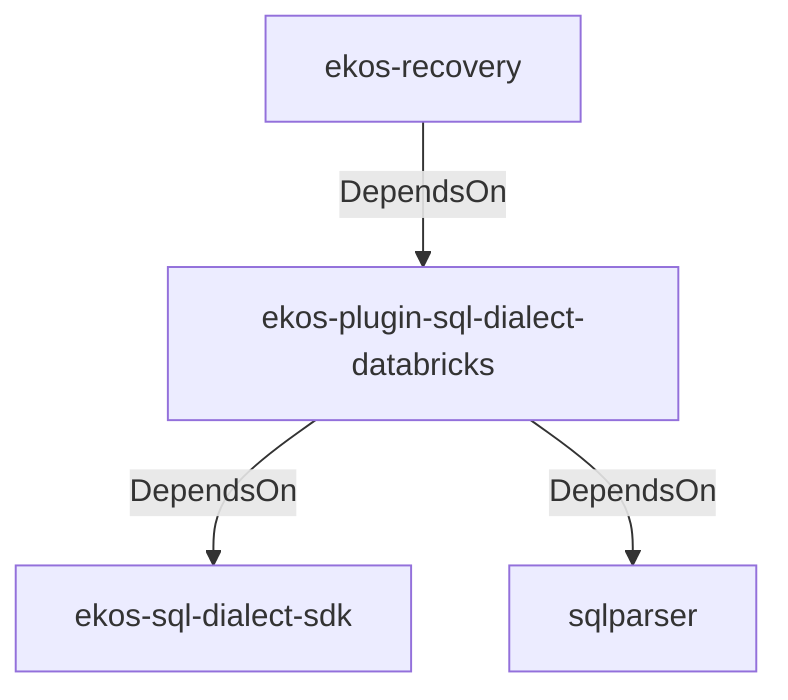

# ekos-plugin-sql-dialect-databricks (Crate)

## Properties

| Key | Value |
|---|---|
| `description` | Databricks (Spark SQL) SqlDialectParser plugin (RFC 0039) |
| `path` | ekos/plugins/sql-dialect-databricks |

## Relationships

### DependsOn

- ← ekos-recovery (`28244ebb-4e16-5e8d-a637-5e750d01f2b8`) — evidence: ekos-recovery depends on ekos-plugin-sql-dialect-databricks (path dependency)
- → ekos-sql-dialect-sdk (`bf4371bd-7cee-54d1-9457-06a1079a38cf`) — evidence: ekos-plugin-sql-dialect-databricks depends on ekos-sql-dialect-sdk (path dependency)
- → sqlparser (`bb72fd94-a6bc-5672-84ef-bdeeb20ad78c`) — evidence: ekos-plugin-sql-dialect-databricks depends on sqlparser 0.53

## Diagram

## Evidence

- `6015710b-5f0a-46d8-86a7-5005fd6df6b6` — ekos-recovery depends on ekos-plugin-sql-dialect-databricks (path dependency) (confidence: 1.00)
- `ae41ad0e-b874-4502-b208-daa8bbb40f1c` — ekos-plugin-sql-dialect-databricks depends on ekos-sql-dialect-sdk (path dependency) (confidence: 1.00)
- `3c107eb4-6c22-4b6c-bcae-065367852530` — ekos-plugin-sql-dialect-databricks depends on sqlparser 0.53 (confidence: 1.00)
