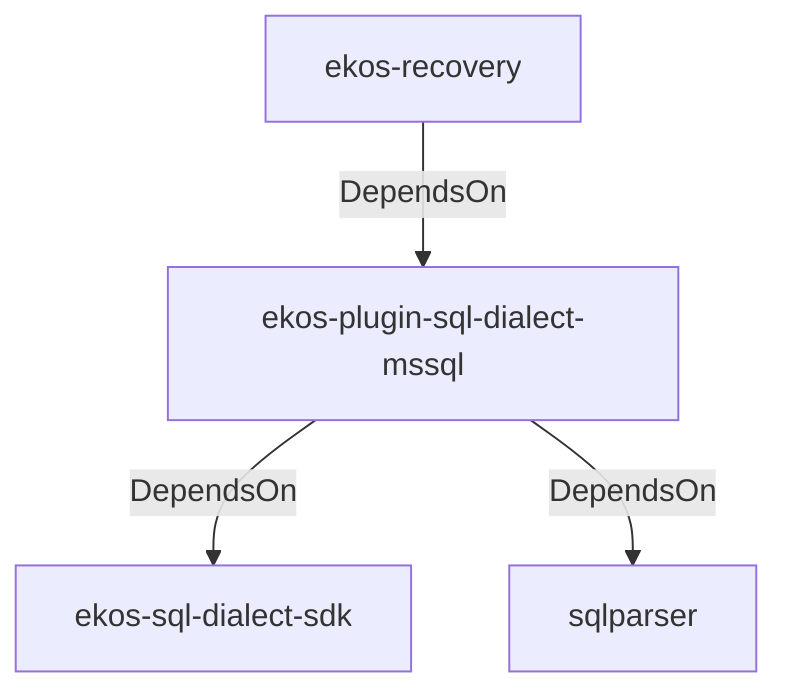

# ekos-plugin-sql-dialect-mssql (Crate)

## Properties

| Key | Value |
|---|---|
| `description` | MSSQL (T-SQL) SqlDialectParser plugin (RFC 0039) |
| `path` | ekos/plugins/sql-dialect-mssql |

## Relationships

### DependsOn

- ← ekos-recovery (`28244ebb-4e16-5e8d-a637-5e750d01f2b8`) — evidence: ekos-recovery depends on ekos-plugin-sql-dialect-mssql (path dependency)
- → ekos-sql-dialect-sdk (`bf4371bd-7cee-54d1-9457-06a1079a38cf`) — evidence: ekos-plugin-sql-dialect-mssql depends on ekos-sql-dialect-sdk (path dependency)
- → sqlparser (`bb72fd94-a6bc-5672-84ef-bdeeb20ad78c`) — evidence: ekos-plugin-sql-dialect-mssql depends on sqlparser 0.53

## Diagram

## Evidence

- `ec66ef4c-5e4d-4866-b99b-18c56cbd0891` — ekos-recovery depends on ekos-plugin-sql-dialect-mssql (path dependency) (confidence: 1.00)
- `72ab73b1-7288-4551-a812-fb4d3cde32f6` — ekos-plugin-sql-dialect-mssql depends on ekos-sql-dialect-sdk (path dependency) (confidence: 1.00)
- `4b0385d2-27b5-4fd6-9bfb-804f15a24974` — ekos-plugin-sql-dialect-mssql depends on sqlparser 0.53 (confidence: 1.00)
