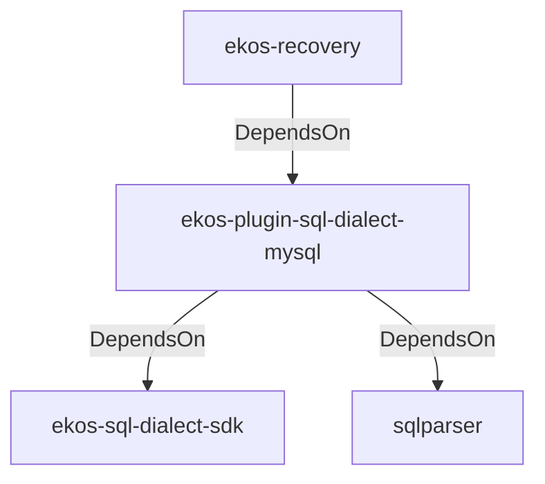

# ekos-plugin-sql-dialect-mysql (Crate)

## Properties

| Key | Value |
|---|---|
| `description` | MySQL SqlDialectParser plugin (RFC 0031) |
| `path` | ekos/plugins/sql-dialect-mysql |

## Relationships

### DependsOn

- ← ekos-recovery (`28244ebb-4e16-5e8d-a637-5e750d01f2b8`) — evidence: ekos-recovery depends on ekos-plugin-sql-dialect-mysql (path dependency)
- → ekos-sql-dialect-sdk (`bf4371bd-7cee-54d1-9457-06a1079a38cf`) — evidence: ekos-plugin-sql-dialect-mysql depends on ekos-sql-dialect-sdk (path dependency)
- → sqlparser (`bb72fd94-a6bc-5672-84ef-bdeeb20ad78c`) — evidence: ekos-plugin-sql-dialect-mysql depends on sqlparser 0.53

## Diagram

## Evidence

- `3a8d4e93-53cd-4657-a5c3-13f1ad242519` — ekos-recovery depends on ekos-plugin-sql-dialect-mysql (path dependency) (confidence: 1.00)
- `c0c1933b-4eca-474f-9d9f-700402b7123a` — ekos-plugin-sql-dialect-mysql depends on ekos-sql-dialect-sdk (path dependency) (confidence: 1.00)
- `ffee3073-6877-4fec-a8a2-4891ddd1c30d` — ekos-plugin-sql-dialect-mysql depends on sqlparser 0.53 (confidence: 1.00)
