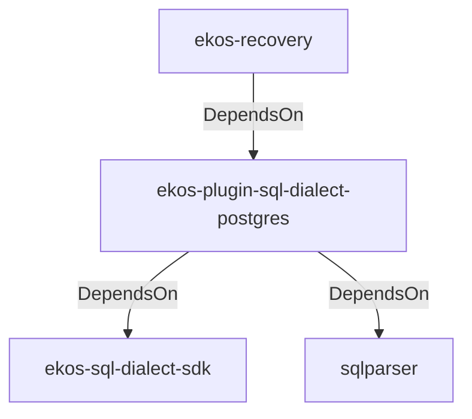

# ekos-plugin-sql-dialect-postgres (Crate)

## Properties

| Key | Value |
|---|---|
| `description` | PostgreSQL SqlDialectParser plugin (RFC 0031) |
| `path` | ekos/plugins/sql-dialect-postgres |

## Relationships

### DependsOn

- ← ekos-recovery (`28244ebb-4e16-5e8d-a637-5e750d01f2b8`) — evidence: ekos-recovery depends on ekos-plugin-sql-dialect-postgres (path dependency)
- → ekos-sql-dialect-sdk (`bf4371bd-7cee-54d1-9457-06a1079a38cf`) — evidence: ekos-plugin-sql-dialect-postgres depends on ekos-sql-dialect-sdk (path dependency)
- → sqlparser (`bb72fd94-a6bc-5672-84ef-bdeeb20ad78c`) — evidence: ekos-plugin-sql-dialect-postgres depends on sqlparser 0.53

## Diagram

## Evidence

- `a7423868-cc23-4adc-bbf3-4038b9e79821` — ekos-recovery depends on ekos-plugin-sql-dialect-postgres (path dependency) (confidence: 1.00)
- `d86874ba-1706-4ef3-84ac-d8e9334eaf84` — ekos-plugin-sql-dialect-postgres depends on ekos-sql-dialect-sdk (path dependency) (confidence: 1.00)
- `910625ff-6132-4bf4-8ab0-2ac9f7b2f6d7` — ekos-plugin-sql-dialect-postgres depends on sqlparser 0.53 (confidence: 1.00)
