# ekos-recovery (Crate)

## Properties

| Key | Value |
|---|---|
| `description` | Knowledge Recovery compiler passes: SqlAnalyzer, GitAnalyzer, LLM integration |
| `path` | ekos/crates/recovery |

## Relationships

### DependsOn

- ← ekos-benchmark (`20c26e43-ee96-5ee7-a046-25740fbbd56b`) — evidence: ekos-benchmark depends on ekos-recovery (path dependency)
- ← ekos-runtime (`f4cd2d3b-f0b0-5234-ab2b-39de3275d717`) — evidence: ekos-runtime depends on ekos-recovery (path dependency)
- ← ekos (`abd31cd9-b31d-54c5-87cd-8a4a5b9a30a0`) — evidence: ekos depends on ekos-recovery (path dependency)
- ← ekos-marketing (`18dba45d-9534-5035-bd6f-df6b370079ac`) — evidence: ekos-marketing depends on ekos-recovery (path dependency)
- → anyhow (`0cdec207-5b1a-5831-bd2a-8b57ddb8681c`) — evidence: ekos-recovery depends on anyhow 1
- → async-trait (`7c905290-824b-57e0-a559-15ff1499b4d6`) — evidence: ekos-recovery depends on async-trait 0.1
- → chrono (`0d184cc1-2483-516d-a0b5-0b6bfad54805`) — evidence: ekos-recovery depends on chrono 0.4
- → ekos-artifact (`8806bf54-6364-5052-b85a-cef4344e8f19`) — evidence: ekos-recovery depends on ekos-artifact (path dependency)
- → ekos-common (`dc169f0a-98f1-5c7c-8dd0-1dbc8504e9c9`) — evidence: ekos-recovery depends on ekos-common (path dependency)
- → ekos-compiler-core (`2690bc0d-0233-516f-b969-9e87432f623d`) — evidence: ekos-recovery depends on ekos-compiler-core (path dependency)
- → ekos-kir (`7e3bc0de-d888-55cd-aa9a-f333f6e2cbb2`) — evidence: ekos-recovery depends on ekos-kir (path dependency)
- → ekos-plugin-sql-dialect-databricks (`920f4203-48d4-5079-a5ee-41b212c4858c`) — evidence: ekos-recovery depends on ekos-plugin-sql-dialect-databricks (path dependency)
- → ekos-plugin-sql-dialect-mssql (`05ad9d89-d39c-5316-b413-2903b6b557db`) — evidence: ekos-recovery depends on ekos-plugin-sql-dialect-mssql (path dependency)
- → ekos-plugin-sql-dialect-mysql (`001696e1-9479-5c36-ae53-08898760049d`) — evidence: ekos-recovery depends on ekos-plugin-sql-dialect-mysql (path dependency)
- → ekos-plugin-sql-dialect-postgres (`ff9a3a7c-0610-5442-ac0b-210e45700aad`) — evidence: ekos-recovery depends on ekos-plugin-sql-dialect-postgres (path dependency)
- → ekos-plugin-sql-dialect-snowflake (`15989d49-59f8-564e-a77d-c90d2d87c80b`) — evidence: ekos-recovery depends on ekos-plugin-sql-dialect-snowflake (path dependency)
- → ekos-semantic (`f82d9ce0-df2a-5af8-9f9a-2bd5f8484839`) — evidence: ekos-recovery depends on ekos-semantic (path dependency)
- → ekos-sql-dialect-sdk (`bf4371bd-7cee-54d1-9457-06a1079a38cf`) — evidence: ekos-recovery depends on ekos-sql-dialect-sdk (path dependency)
- → glob (`40efe7e9-ffab-572f-8719-2b126d08d101`) — evidence: ekos-recovery depends on glob 0.3
- → hex (`fa785806-31c3-5308-ae4a-2898a2c181ca`) — evidence: ekos-recovery depends on hex 0.4
- → reqwest (`70acdf50-6295-5f0c-9157-cb9866d0ec23`) — evidence: ekos-recovery depends on reqwest 0.12
- → roxmltree (`2c49c3ee-d872-58b0-90ba-db9d36ad07f5`) — evidence: ekos-recovery depends on roxmltree 0.20
- → rustpython-ast (`9f937ef9-ce54-5794-b264-e087394732af`) — evidence: ekos-recovery depends on rustpython-ast 0.4
- → serde_json (`02548eee-6478-5324-851f-3a6329ccfeca`) — evidence: ekos-recovery depends on serde 1
- → sha2 (`64d6fba9-eea7-52e6-9b3a-b2e887a6944f`) — evidence: ekos-recovery depends on sha2 0.10
- → sqlparser (`bb72fd94-a6bc-5672-84ef-bdeeb20ad78c`) — evidence: ekos-recovery depends on sqlparser 0.53
- → syn (`0c065456-4b3b-5fdd-a8b3-4b83de26d33e`) — evidence: ekos-recovery depends on syn 3.0
- → thiserror (`bbefe8a3-f76e-509f-910b-b439cd7eeff6`) — evidence: ekos-recovery depends on thiserror 2
- → tokio (`4a4e8d5c-5102-5d1d-addd-d7fb0bc8d7b9`) — evidence: ekos-recovery depends on tokio 1
- → toml (`b2678e73-f1ed-50db-8272-d18217301a2a`) — evidence: ekos-recovery depends on toml 0.8
- → tracing (`4282d266-2850-5d04-a992-0f0a204788aa`) — evidence: ekos-recovery depends on tracing 0.1
- → uuid (`ba61f6c0-d160-5eaf-a437-895cee5c72e9`) — evidence: ekos-recovery depends on uuid 1

## Diagram

```mermaid
graph TD
    n28244ebb4e165e8da6375e750d01f2b8["ekos-recovery"]
    n20c26e43ee965ee7a04625740fbbd56b["ekos-benchmark"]
    n20c26e43ee965ee7a04625740fbbd56b -->|DependsOn| n28244ebb4e165e8da6375e750d01f2b8
    nf4cd2d3bf0b05234ab2b39de3275d717["ekos-runtime"]
    nf4cd2d3bf0b05234ab2b39de3275d717 -->|DependsOn| n28244ebb4e165e8da6375e750d01f2b8
    nabd31cd9b31d54c587cd8a4a5b9a30a0["ekos"]
    nabd31cd9b31d54c587cd8a4a5b9a30a0 -->|DependsOn| n28244ebb4e165e8da6375e750d01f2b8
    n18dba45d95345035bd6fdf6b370079ac["ekos-marketing"]
    n18dba45d95345035bd6fdf6b370079ac -->|DependsOn| n28244ebb4e165e8da6375e750d01f2b8
    n0cdec2075b1a5831bd2a8b57ddb8681c["anyhow"]
    n28244ebb4e165e8da6375e750d01f2b8 -->|DependsOn| n0cdec2075b1a5831bd2a8b57ddb8681c
    n7c905290824b57e0a55915ff1499b4d6["async-trait"]
    n28244ebb4e165e8da6375e750d01f2b8 -->|DependsOn| n7c905290824b57e0a55915ff1499b4d6
    n0d184cc12483516da0b50b6bfad54805["chrono"]
    n28244ebb4e165e8da6375e750d01f2b8 -->|DependsOn| n0d184cc12483516da0b50b6bfad54805
    n8806bf5463645052b85acef4344e8f19["ekos-artifact"]
    n28244ebb4e165e8da6375e750d01f2b8 -->|DependsOn| n8806bf5463645052b85acef4344e8f19
    ndc169f0a98f15c7c8dd01dbc8504e9c9["ekos-common"]
    n28244ebb4e165e8da6375e750d01f2b8 -->|DependsOn| ndc169f0a98f15c7c8dd01dbc8504e9c9
    n2690bc0d0233516fb9699e87432f623d["ekos-compiler-core"]
    n28244ebb4e165e8da6375e750d01f2b8 -->|DependsOn| n2690bc0d0233516fb9699e87432f623d
    n7e3bc0ded88855cdaa9af333f6e2cbb2["ekos-kir"]
    n28244ebb4e165e8da6375e750d01f2b8 -->|DependsOn| n7e3bc0ded88855cdaa9af333f6e2cbb2
    n920f420348d45079a5ee41b212c4858c["ekos-plugin-sql-dialect-databricks"]
    n28244ebb4e165e8da6375e750d01f2b8 -->|DependsOn| n920f420348d45079a5ee41b212c4858c
    n05ad9d89d39c5316b4132903b6b557db["ekos-plugin-sql-dialect-mssql"]
    n28244ebb4e165e8da6375e750d01f2b8 -->|DependsOn| n05ad9d89d39c5316b4132903b6b557db
    n001696e194795c36ae5308898760049d["ekos-plugin-sql-dialect-mysql"]
    n28244ebb4e165e8da6375e750d01f2b8 -->|DependsOn| n001696e194795c36ae5308898760049d
    nff9a3a7c06105442ac0b210e45700aad["ekos-plugin-sql-dialect-postgres"]
    n28244ebb4e165e8da6375e750d01f2b8 -->|DependsOn| nff9a3a7c06105442ac0b210e45700aad
    n15989d4959f8564ea77dc90d2d87c80b["ekos-plugin-sql-dialect-snowflake"]
    n28244ebb4e165e8da6375e750d01f2b8 -->|DependsOn| n15989d4959f8564ea77dc90d2d87c80b
    nf82d9ce0df2a5af89f9a2bd5f8484839["ekos-semantic"]
    n28244ebb4e165e8da6375e750d01f2b8 -->|DependsOn| nf82d9ce0df2a5af89f9a2bd5f8484839
    nbf4371bd7cee54d1945706a1079a38cf["ekos-sql-dialect-sdk"]
    n28244ebb4e165e8da6375e750d01f2b8 -->|DependsOn| nbf4371bd7cee54d1945706a1079a38cf
    n40efe7e9ffab572f87192b126d08d101["glob"]
    n28244ebb4e165e8da6375e750d01f2b8 -->|DependsOn| n40efe7e9ffab572f87192b126d08d101
    nfa78580631c35308ae4a2898a2c181ca["hex"]
    n28244ebb4e165e8da6375e750d01f2b8 -->|DependsOn| nfa78580631c35308ae4a2898a2c181ca
    n70acdf5062955f0c9157cb9866d0ec23["reqwest"]
    n28244ebb4e165e8da6375e750d01f2b8 -->|DependsOn| n70acdf5062955f0c9157cb9866d0ec23
    n2c49c3eed87258b090badb9d36ad07f5["roxmltree"]
    n28244ebb4e165e8da6375e750d01f2b8 -->|DependsOn| n2c49c3eed87258b090badb9d36ad07f5
    n9f937ef9ce545794b264e087394732af["rustpython-ast"]
    n28244ebb4e165e8da6375e750d01f2b8 -->|DependsOn| n9f937ef9ce545794b264e087394732af
    n02548eee64785324851f3a6329ccfeca["serde_json"]
    n28244ebb4e165e8da6375e750d01f2b8 -->|DependsOn| n02548eee64785324851f3a6329ccfeca
    n64d6fba9eea752e69b3ab2e887a6944f["sha2"]
    n28244ebb4e165e8da6375e750d01f2b8 -->|DependsOn| n64d6fba9eea752e69b3ab2e887a6944f
    nbb72fd94a6bc567284efbdeeb20ad78c["sqlparser"]
    n28244ebb4e165e8da6375e750d01f2b8 -->|DependsOn| nbb72fd94a6bc567284efbdeeb20ad78c
    n0c0654564b3b5fdda8b34b83de26d33e["syn"]
    n28244ebb4e165e8da6375e750d01f2b8 -->|DependsOn| n0c0654564b3b5fdda8b34b83de26d33e
    nbbefe8a3f76e509f910bb439cd7eeff6["thiserror"]
    n28244ebb4e165e8da6375e750d01f2b8 -->|DependsOn| nbbefe8a3f76e509f910bb439cd7eeff6
    n4a4e8d5c51025d1dadddd7fb0bc8d7b9["tokio"]
    n28244ebb4e165e8da6375e750d01f2b8 -->|DependsOn| n4a4e8d5c51025d1dadddd7fb0bc8d7b9
    nb2678e73f1ed50db8272d18217301a2a["toml"]
    n28244ebb4e165e8da6375e750d01f2b8 -->|DependsOn| nb2678e73f1ed50db8272d18217301a2a
    n4282d26628505d04a9920f0a204788aa["tracing"]
    n28244ebb4e165e8da6375e750d01f2b8 -->|DependsOn| n4282d26628505d04a9920f0a204788aa
    nba61f6c0d1605eafa437895cee5c72e9["uuid"]
    n28244ebb4e165e8da6375e750d01f2b8 -->|DependsOn| nba61f6c0d1605eafa437895cee5c72e9
```

## Evidence

- `06cdcc0f-9581-4725-89b6-1c4c9176899e` — ekos-benchmark depends on ekos-recovery (path dependency) (confidence: 1.00)
- `a69b9d1b-1538-4ab9-a941-d2989e2431db` — ekos-runtime depends on ekos-recovery (path dependency) (confidence: 1.00)
- `258fc9b9-1804-4c3c-9160-508378b84b77` — ekos depends on ekos-recovery (path dependency) (confidence: 1.00)
- `928eb548-6dc9-40ca-8962-0bade17dcb14` — ekos-marketing depends on ekos-recovery (path dependency) (confidence: 1.00)
- `a385979e-0d58-4849-a2cd-12472252944a` — ekos-recovery depends on anyhow 1 (confidence: 1.00)
- `8952ac64-9e88-45fa-905e-6f674837f5e7` — ekos-recovery depends on async-trait 0.1 (confidence: 1.00)
- `aa655833-eab3-4e3d-aa50-c91f1ab67b84` — ekos-recovery depends on chrono 0.4 (confidence: 1.00)
- `e8bbb559-c545-4a0d-909a-ffbb99f2b60e` — ekos-recovery depends on ekos-artifact (path dependency) (confidence: 1.00)
- `078714fe-42ab-4557-a4f4-cdc9b342664a` — ekos-recovery depends on ekos-common (path dependency) (confidence: 1.00)
- `874eb613-987a-45ef-a8e3-2bfd508ddf2d` — ekos-recovery depends on ekos-compiler-core (path dependency) (confidence: 1.00)
- `4f5dd7bd-d97d-4fee-9324-abf3bb7af636` — ekos-recovery depends on ekos-kir (path dependency) (confidence: 1.00)
- `6015710b-5f0a-46d8-86a7-5005fd6df6b6` — ekos-recovery depends on ekos-plugin-sql-dialect-databricks (path dependency) (confidence: 1.00)
- `ec66ef4c-5e4d-4866-b99b-18c56cbd0891` — ekos-recovery depends on ekos-plugin-sql-dialect-mssql (path dependency) (confidence: 1.00)
- `3a8d4e93-53cd-4657-a5c3-13f1ad242519` — ekos-recovery depends on ekos-plugin-sql-dialect-mysql (path dependency) (confidence: 1.00)
- `a7423868-cc23-4adc-bbf3-4038b9e79821` — ekos-recovery depends on ekos-plugin-sql-dialect-postgres (path dependency) (confidence: 1.00)
- `30ba465f-398b-435c-bb04-c2e060d7e9e0` — ekos-recovery depends on ekos-plugin-sql-dialect-snowflake (path dependency) (confidence: 1.00)
- `537c38fe-35b1-4a0c-b445-fb1d71496375` — ekos-recovery depends on ekos-semantic (path dependency) (confidence: 1.00)
- `12e13c40-f18b-4ba2-bb10-bd1dceb2b12e` — ekos-recovery depends on ekos-sql-dialect-sdk (path dependency) (confidence: 1.00)
- `140396ed-0ebc-4233-a166-85dc30b16322` — ekos-recovery depends on glob 0.3 (confidence: 1.00)
- `c60c556e-38a4-4f8d-86ab-de99ff131661` — ekos-recovery depends on hex 0.4 (confidence: 1.00)
- `c60f0ed3-aa03-4c4a-b8a3-656b4c6073fa` — ekos-recovery depends on reqwest 0.12 (confidence: 1.00)
- `76da8259-78f8-43b3-bb89-1c893eadf7b6` — ekos-recovery depends on roxmltree 0.20 (confidence: 1.00)
- `c246ffc7-aa18-493a-91cf-d39743115965` — ekos-recovery depends on rustpython-ast 0.4 (confidence: 1.00)
- `6be41aec-edad-4107-9eaa-9ec903f49833` — ekos-recovery depends on rustpython-parser 0.4 (confidence: 1.00)
- `5beaec59-925b-4c35-8e23-b66eadecfe0f` — ekos-recovery depends on serde 1 (confidence: 1.00)
- `7c9443a1-bddd-4767-bae6-9dfec1bc4c2c` — ekos-recovery depends on serde_json 1 (confidence: 1.00)
- `fcf51135-5a99-4799-8983-18077f8cade5` — ekos-recovery depends on serde_yaml 0.9 (confidence: 1.00)
- `96fce6d8-947b-4b16-9069-6622c86187f2` — ekos-recovery depends on sha2 0.10 (confidence: 1.00)
- `5fb7afb3-5c7b-41a1-86c7-9fad96a53f97` — ekos-recovery depends on sqlparser 0.53 (confidence: 1.00)
- `781be6d6-6490-43bb-8027-18162262a4d0` — ekos-recovery depends on syn 3.0 (confidence: 1.00)
- `322a13e5-080e-44b1-b7c9-205bb228b5d8` — ekos-recovery depends on thiserror 2 (confidence: 1.00)
- `d4c26b53-db6f-4c03-b676-d60dab88cddf` — ekos-recovery depends on tokio 1 (confidence: 1.00)
- `e13cfe61-a3e4-4af9-b473-445e2c372d88` — ekos-recovery depends on toml 0.8 (confidence: 1.00)
- `6524f7ac-8628-469d-818e-de972fac623c` — ekos-recovery depends on tracing 0.1 (confidence: 1.00)
- `0115baec-4ac9-4278-bf05-45522250d9b0` — ekos-recovery depends on uuid 1 (confidence: 1.00)
