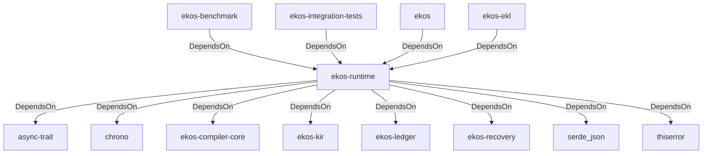

# ekos-runtime (Crate)

## Properties

| Key | Value |
|---|---|
| `description` | Read-only state reconstruction from the ledger |
| `path` | ekos/crates/runtime |

## Relationships

### DependsOn

- ← ekos-benchmark (`20c26e43-ee96-5ee7-a046-25740fbbd56b`) — evidence: ekos-benchmark depends on ekos-runtime (path dependency)
- ← ekos-integration-tests (`063808f9-5f19-5d62-b3dd-69eaa93d44cb`) — evidence: ekos-integration-tests depends on ekos-runtime (path dependency)
- → async-trait (`7c905290-824b-57e0-a559-15ff1499b4d6`) — evidence: ekos-runtime depends on async-trait 0.1
- → chrono (`0d184cc1-2483-516d-a0b5-0b6bfad54805`) — evidence: ekos-runtime depends on chrono 0.4
- → ekos-compiler-core (`2690bc0d-0233-516f-b969-9e87432f623d`) — evidence: ekos-runtime depends on ekos-compiler-core (path dependency)
- → ekos-kir (`7e3bc0de-d888-55cd-aa9a-f333f6e2cbb2`) — evidence: ekos-runtime depends on ekos-kir (path dependency)
- → ekos-ledger (`9c977335-c421-519c-a889-558f0487574e`) — evidence: ekos-runtime depends on ekos-ledger (path dependency)
- → ekos-recovery (`28244ebb-4e16-5e8d-a637-5e750d01f2b8`) — evidence: ekos-runtime depends on ekos-recovery (path dependency)
- → serde_json (`02548eee-6478-5324-851f-3a6329ccfeca`) — evidence: ekos-runtime depends on serde 1
- → thiserror (`bbefe8a3-f76e-509f-910b-b439cd7eeff6`) — evidence: ekos-runtime depends on thiserror 2
- ← ekos (`abd31cd9-b31d-54c5-87cd-8a4a5b9a30a0`) — evidence: ekos depends on ekos-runtime (path dependency)
- ← ekos-ekl (`d932eaf4-7069-5419-a00c-fa4b7b374c86`) — evidence: ekos-ekl depends on ekos-runtime (path dependency)

## Diagram

## Evidence

- `b438653f-2c8f-4bc7-91da-bc2a3aa8073e` — ekos-benchmark depends on ekos-runtime (path dependency) (confidence: 1.00)
- `c2dee997-f977-417e-8ae2-40f5d64eff89` — ekos-integration-tests depends on ekos-runtime (path dependency) (confidence: 1.00)
- `97ab7f18-d046-4249-83e6-f3e50adb744b` — ekos-runtime depends on async-trait 0.1 (confidence: 1.00)
- `53a6b85f-8f62-483d-a47d-7ce52b2d63a2` — ekos-runtime depends on chrono 0.4 (confidence: 1.00)
- `1e30ed89-179c-42c7-b5d8-09b3cd02d086` — ekos-runtime depends on ekos-compiler-core (path dependency) (confidence: 1.00)
- `b6ba7cc3-b147-4e2c-ad79-7482556b4c65` — ekos-runtime depends on ekos-kir (path dependency) (confidence: 1.00)
- `56a9b3b3-9d74-44b0-af02-450bccd52e8e` — ekos-runtime depends on ekos-ledger (path dependency) (confidence: 1.00)
- `a69b9d1b-1538-4ab9-a941-d2989e2431db` — ekos-runtime depends on ekos-recovery (path dependency) (confidence: 1.00)
- `d55018f7-0a4f-4b44-a218-30d5e836bece` — ekos-runtime depends on serde 1 (confidence: 1.00)
- `780f5930-f527-4f67-a976-9c30f63d7833` — ekos-runtime depends on serde_json 1 (confidence: 1.00)
- `9b95acd5-11ac-4996-bd12-2565b2d2f814` — ekos-runtime depends on thiserror 2 (confidence: 1.00)
- `3a3b007a-0bb4-41fa-b542-b47a6a326af6` — ekos depends on ekos-runtime (path dependency) (confidence: 1.00)
- `5c248282-390f-4d16-84a9-529f826db691` — ekos-ekl depends on ekos-runtime (path dependency) (confidence: 1.00)
