# ekos-semantic (Crate)

## Properties

| Key | Value |
|---|---|
| `description` | Semantic compiler pass: KIR → Canonical Knowledge Model (Phase 8) |
| `path` | ekos/crates/semantic |

## Relationships

### DependsOn

- ← ekos-benchmark (`20c26e43-ee96-5ee7-a046-25740fbbd56b`) — evidence: ekos-benchmark depends on ekos-semantic (path dependency)
- → async-trait (`7c905290-824b-57e0-a559-15ff1499b4d6`) — evidence: ekos-semantic depends on async-trait 0.1
- → chrono (`0d184cc1-2483-516d-a0b5-0b6bfad54805`) — evidence: ekos-semantic depends on chrono 0.4
- → ekos-artifact (`8806bf54-6364-5052-b85a-cef4344e8f19`) — evidence: ekos-semantic depends on ekos-artifact (path dependency)
- → ekos-common (`dc169f0a-98f1-5c7c-8dd0-1dbc8504e9c9`) — evidence: ekos-semantic depends on ekos-common (path dependency)
- → ekos-compiler-core (`2690bc0d-0233-516f-b969-9e87432f623d`) — evidence: ekos-semantic depends on ekos-compiler-core (path dependency)
- → ekos-identity (`2c6b8d9a-83ed-510e-a5d8-a76f2e8685fe`) — evidence: ekos-semantic depends on ekos-identity (path dependency)
- → ekos-kir (`7e3bc0de-d888-55cd-aa9a-f333f6e2cbb2`) — evidence: ekos-semantic depends on ekos-kir (path dependency)
- → serde_json (`02548eee-6478-5324-851f-3a6329ccfeca`) — evidence: ekos-semantic depends on serde 1
- → thiserror (`bbefe8a3-f76e-509f-910b-b439cd7eeff6`) — evidence: ekos-semantic depends on thiserror 2
- → tracing (`4282d266-2850-5d04-a992-0f0a204788aa`) — evidence: ekos-semantic depends on tracing 0.1
- → uuid (`ba61f6c0-d160-5eaf-a437-895cee5c72e9`) — evidence: ekos-semantic depends on uuid 1
- ← ekos (`abd31cd9-b31d-54c5-87cd-8a4a5b9a30a0`) — evidence: ekos depends on ekos-semantic (path dependency)
- ← ekos-recovery (`28244ebb-4e16-5e8d-a637-5e750d01f2b8`) — evidence: ekos-recovery depends on ekos-semantic (path dependency)

## Diagram

```mermaid
graph TD
    nf82d9ce0df2a5af89f9a2bd5f8484839["ekos-semantic"]
    n20c26e43ee965ee7a04625740fbbd56b["ekos-benchmark"]
    n20c26e43ee965ee7a04625740fbbd56b -->|DependsOn| nf82d9ce0df2a5af89f9a2bd5f8484839
    n7c905290824b57e0a55915ff1499b4d6["async-trait"]
    nf82d9ce0df2a5af89f9a2bd5f8484839 -->|DependsOn| n7c905290824b57e0a55915ff1499b4d6
    n0d184cc12483516da0b50b6bfad54805["chrono"]
    nf82d9ce0df2a5af89f9a2bd5f8484839 -->|DependsOn| n0d184cc12483516da0b50b6bfad54805
    n8806bf5463645052b85acef4344e8f19["ekos-artifact"]
    nf82d9ce0df2a5af89f9a2bd5f8484839 -->|DependsOn| n8806bf5463645052b85acef4344e8f19
    ndc169f0a98f15c7c8dd01dbc8504e9c9["ekos-common"]
    nf82d9ce0df2a5af89f9a2bd5f8484839 -->|DependsOn| ndc169f0a98f15c7c8dd01dbc8504e9c9
    n2690bc0d0233516fb9699e87432f623d["ekos-compiler-core"]
    nf82d9ce0df2a5af89f9a2bd5f8484839 -->|DependsOn| n2690bc0d0233516fb9699e87432f623d
    n2c6b8d9a83ed510ea5d8a76f2e8685fe["ekos-identity"]
    nf82d9ce0df2a5af89f9a2bd5f8484839 -->|DependsOn| n2c6b8d9a83ed510ea5d8a76f2e8685fe
    n7e3bc0ded88855cdaa9af333f6e2cbb2["ekos-kir"]
    nf82d9ce0df2a5af89f9a2bd5f8484839 -->|DependsOn| n7e3bc0ded88855cdaa9af333f6e2cbb2
    n02548eee64785324851f3a6329ccfeca["serde_json"]
    nf82d9ce0df2a5af89f9a2bd5f8484839 -->|DependsOn| n02548eee64785324851f3a6329ccfeca
    nbbefe8a3f76e509f910bb439cd7eeff6["thiserror"]
    nf82d9ce0df2a5af89f9a2bd5f8484839 -->|DependsOn| nbbefe8a3f76e509f910bb439cd7eeff6
    n4282d26628505d04a9920f0a204788aa["tracing"]
    nf82d9ce0df2a5af89f9a2bd5f8484839 -->|DependsOn| n4282d26628505d04a9920f0a204788aa
    nba61f6c0d1605eafa437895cee5c72e9["uuid"]
    nf82d9ce0df2a5af89f9a2bd5f8484839 -->|DependsOn| nba61f6c0d1605eafa437895cee5c72e9
    nabd31cd9b31d54c587cd8a4a5b9a30a0["ekos"]
    nabd31cd9b31d54c587cd8a4a5b9a30a0 -->|DependsOn| nf82d9ce0df2a5af89f9a2bd5f8484839
    n28244ebb4e165e8da6375e750d01f2b8["ekos-recovery"]
    n28244ebb4e165e8da6375e750d01f2b8 -->|DependsOn| nf82d9ce0df2a5af89f9a2bd5f8484839
```

## Evidence

- `bcfdb0ca-8e82-46b9-bf2b-9aced22e7760` — ekos-benchmark depends on ekos-semantic (path dependency) (confidence: 1.00)
- `03d4782b-1314-499a-8678-c0aa5d231f48` — ekos-semantic depends on async-trait 0.1 (confidence: 1.00)
- `f2bd0cb8-5256-4ae4-bf3a-089c782cc095` — ekos-semantic depends on chrono 0.4 (confidence: 1.00)
- `737a018c-b2af-49ab-9f6a-fffe8b181438` — ekos-semantic depends on ekos-artifact (path dependency) (confidence: 1.00)
- `ab1496d2-64d4-4d5f-a57a-2f7e0d5fbba1` — ekos-semantic depends on ekos-common (path dependency) (confidence: 1.00)
- `2e014955-5e41-452c-b10b-2cfc40147fb9` — ekos-semantic depends on ekos-compiler-core (path dependency) (confidence: 1.00)
- `30155c8a-4f4c-41a8-b8b0-cc6ad659e3fe` — ekos-semantic depends on ekos-identity (path dependency) (confidence: 1.00)
- `3b3494cf-bf78-449a-8eca-90840b43f858` — ekos-semantic depends on ekos-kir (path dependency) (confidence: 1.00)
- `f8c79b6a-f07c-4a4c-b44f-88b2a037e64a` — ekos-semantic depends on serde 1 (confidence: 1.00)
- `00a01ff2-6728-4c57-8900-7202644b4b05` — ekos-semantic depends on serde_json 1 (confidence: 1.00)
- `cf65e522-810c-46fb-b6f0-b0849eb2f282` — ekos-semantic depends on thiserror 2 (confidence: 1.00)
- `448d2764-a430-4048-9909-a6e853732f9b` — ekos-semantic depends on tracing 0.1 (confidence: 1.00)
- `119c9177-a2eb-40d5-bc1b-0ee1bc36593a` — ekos-semantic depends on uuid 1 (confidence: 1.00)
- `c7512501-04d0-47d6-aa6d-22c6f3735e9e` — ekos depends on ekos-semantic (path dependency) (confidence: 1.00)
- `537c38fe-35b1-4a0c-b445-fb1d71496375` — ekos-recovery depends on ekos-semantic (path dependency) (confidence: 1.00)
