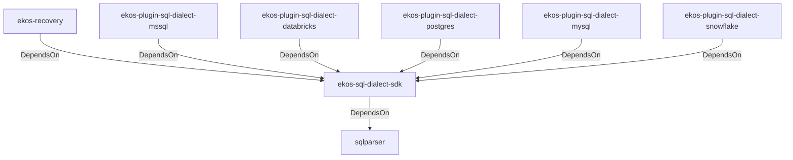

# ekos-sql-dialect-sdk (Crate)

## Properties

| Key | Value |
|---|---|
| `description` | SqlDialectParser trait — the contract a pluggable SQL dialect crate implements (RFC 0031) |
| `path` | ekos/crates/sql-dialect-sdk |

## Relationships

### DependsOn

- → sqlparser (`bb72fd94-a6bc-5672-84ef-bdeeb20ad78c`) — evidence: ekos-sql-dialect-sdk depends on sqlparser 0.53
- ← ekos-recovery (`28244ebb-4e16-5e8d-a637-5e750d01f2b8`) — evidence: ekos-recovery depends on ekos-sql-dialect-sdk (path dependency)
- ← ekos-plugin-sql-dialect-mssql (`05ad9d89-d39c-5316-b413-2903b6b557db`) — evidence: ekos-plugin-sql-dialect-mssql depends on ekos-sql-dialect-sdk (path dependency)
- ← ekos-plugin-sql-dialect-databricks (`920f4203-48d4-5079-a5ee-41b212c4858c`) — evidence: ekos-plugin-sql-dialect-databricks depends on ekos-sql-dialect-sdk (path dependency)
- ← ekos-plugin-sql-dialect-postgres (`ff9a3a7c-0610-5442-ac0b-210e45700aad`) — evidence: ekos-plugin-sql-dialect-postgres depends on ekos-sql-dialect-sdk (path dependency)
- ← ekos-plugin-sql-dialect-mysql (`001696e1-9479-5c36-ae53-08898760049d`) — evidence: ekos-plugin-sql-dialect-mysql depends on ekos-sql-dialect-sdk (path dependency)
- ← ekos-plugin-sql-dialect-snowflake (`15989d49-59f8-564e-a77d-c90d2d87c80b`) — evidence: ekos-plugin-sql-dialect-snowflake depends on ekos-sql-dialect-sdk (path dependency)

## Diagram

## Evidence

- `472b70e1-187d-4369-917d-2558396f0378` — ekos-sql-dialect-sdk depends on sqlparser 0.53 (confidence: 1.00)
- `12e13c40-f18b-4ba2-bb10-bd1dceb2b12e` — ekos-recovery depends on ekos-sql-dialect-sdk (path dependency) (confidence: 1.00)
- `72ab73b1-7288-4551-a812-fb4d3cde32f6` — ekos-plugin-sql-dialect-mssql depends on ekos-sql-dialect-sdk (path dependency) (confidence: 1.00)
- `ae41ad0e-b874-4502-b208-daa8bbb40f1c` — ekos-plugin-sql-dialect-databricks depends on ekos-sql-dialect-sdk (path dependency) (confidence: 1.00)
- `d86874ba-1706-4ef3-84ac-d8e9334eaf84` — ekos-plugin-sql-dialect-postgres depends on ekos-sql-dialect-sdk (path dependency) (confidence: 1.00)
- `c0c1933b-4eca-474f-9d9f-700402b7123a` — ekos-plugin-sql-dialect-mysql depends on ekos-sql-dialect-sdk (path dependency) (confidence: 1.00)
- `a9e942e1-28dd-4e53-90ec-19954e1a04e7` — ekos-plugin-sql-dialect-snowflake depends on ekos-sql-dialect-sdk (path dependency) (confidence: 1.00)
