# Sequence Diagrams

_Rendered from Transformation IR `FeedsInto` edges — a data-flow sequence between compiled pipeline steps, not a code call sequence. EKOS does not compile call-graph data today._

## /home/legion/PycharmProjects/azure-databricks-project/dbt/macros/generate_schema_name.sql#0

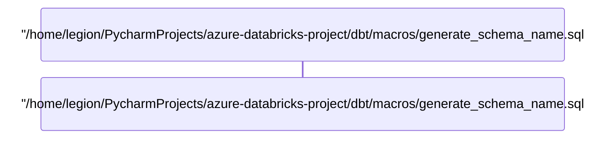

_(1 step — no `FeedsInto` edges compiled for this pipeline)_

## /home/legion/PycharmProjects/azure-databricks-project/dbt/models/gold/gold_customer_lifetime_value.sql#0

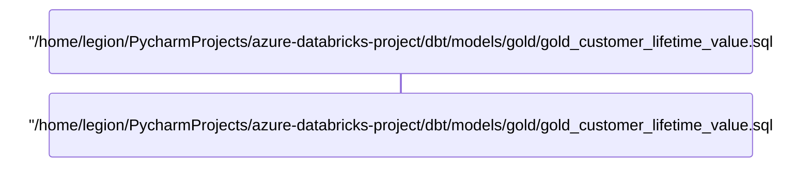

_(1 step — no `FeedsInto` edges compiled for this pipeline)_

## /home/legion/PycharmProjects/azure-databricks-project/dbt/models/gold/gold_film_performance.sql#0

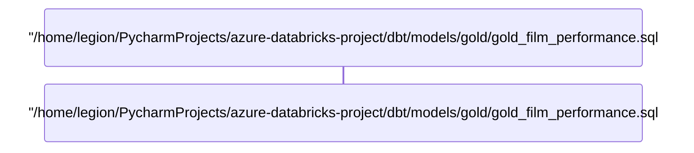

_(1 step — no `FeedsInto` edges compiled for this pipeline)_

## /home/legion/PycharmProjects/azure-databricks-project/dbt/models/gold/gold_inventory_availability.sql#0

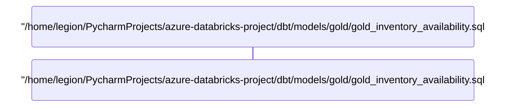

_(1 step — no `FeedsInto` edges compiled for this pipeline)_

## /home/legion/PycharmProjects/azure-databricks-project/dbt/models/gold/gold_store_revenue.sql#0

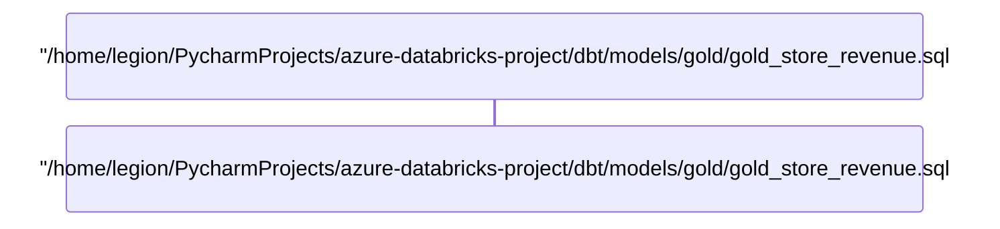

_(1 step — no `FeedsInto` edges compiled for this pipeline)_

## /home/legion/PycharmProjects/azure-databricks-project/dbt/models/quarantine/quarantine_customer_no_payments.sql#0

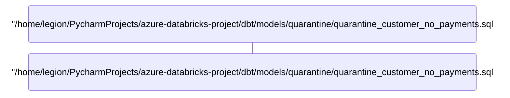

_(1 step — no `FeedsInto` edges compiled for this pipeline)_

## /home/legion/PycharmProjects/azure-databricks-project/dbt/models/quarantine/quarantine_rental_duplicate_open.sql#0

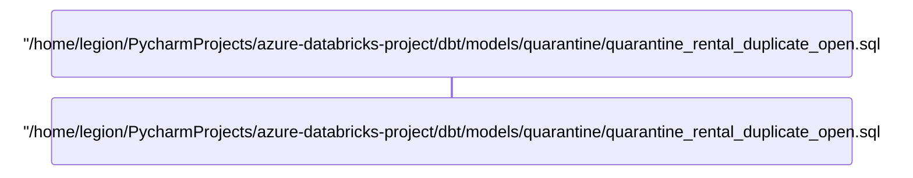

_(1 step — no `FeedsInto` edges compiled for this pipeline)_

## /home/legion/PycharmProjects/azure-databricks-project/dbt/models/quarantine/quarantine_rental_duplicate_open.sql#1


_(1 step — no `FeedsInto` edges compiled for this pipeline)_

## /home/legion/PycharmProjects/azure-databricks-project/dbt/models/semantic/entity_v.sql#0

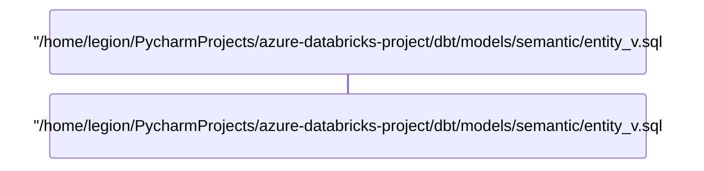

_(1 step — no `FeedsInto` edges compiled for this pipeline)_

## /home/legion/PycharmProjects/azure-databricks-project/dbt/models/semantic/relationship_v.sql#0

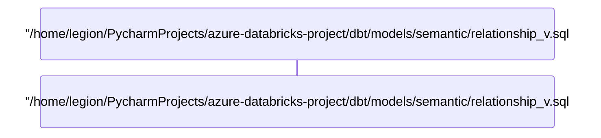

_(1 step — no `FeedsInto` edges compiled for this pipeline)_

## /home/legion/PycharmProjects/azure-databricks-project/dbt/models/semantic/sem_actor_entity.sql#0

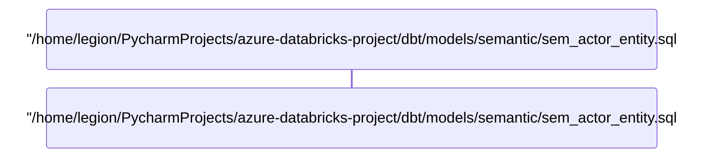

_(1 step — no `FeedsInto` edges compiled for this pipeline)_

## /home/legion/PycharmProjects/azure-databricks-project/dbt/models/semantic/sem_address_entity.sql#0

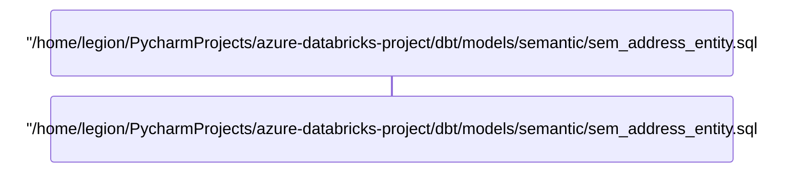

_(1 step — no `FeedsInto` edges compiled for this pipeline)_

## /home/legion/PycharmProjects/azure-databricks-project/dbt/models/semantic/sem_category_entity.sql#0

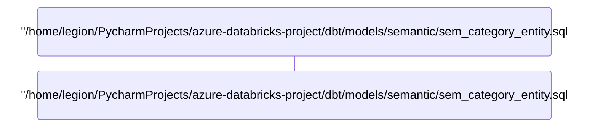

_(1 step — no `FeedsInto` edges compiled for this pipeline)_

## /home/legion/PycharmProjects/azure-databricks-project/dbt/models/semantic/sem_customer_context.sql#0

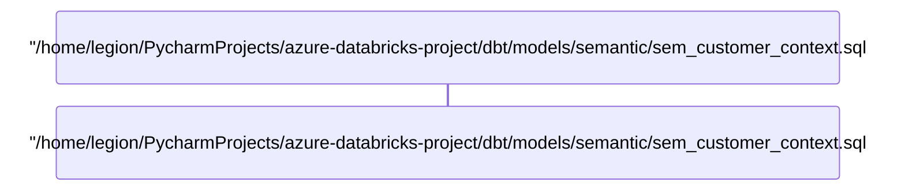

_(1 step — no `FeedsInto` edges compiled for this pipeline)_

## /home/legion/PycharmProjects/azure-databricks-project/dbt/models/semantic/sem_customer_entity.sql#0

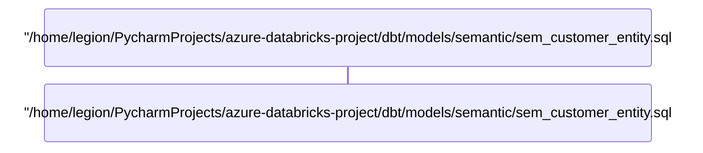

_(1 step — no `FeedsInto` edges compiled for this pipeline)_

## /home/legion/PycharmProjects/azure-databricks-project/dbt/models/semantic/sem_document_chunk.sql#0

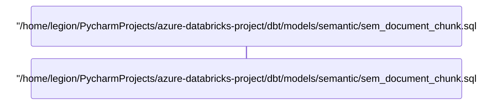

_(1 step — no `FeedsInto` edges compiled for this pipeline)_

## /home/legion/PycharmProjects/azure-databricks-project/dbt/models/semantic/sem_document_chunk.sql#1


_(1 step — no `FeedsInto` edges compiled for this pipeline)_

## /home/legion/PycharmProjects/azure-databricks-project/dbt/models/semantic/sem_film_actor_rel.sql#0

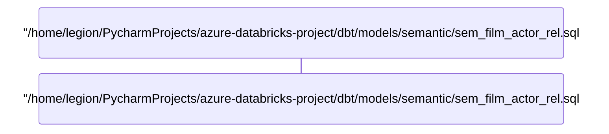

_(1 step — no `FeedsInto` edges compiled for this pipeline)_

## /home/legion/PycharmProjects/azure-databricks-project/dbt/models/semantic/sem_film_category_rel.sql#0

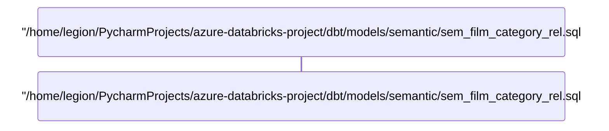

_(1 step — no `FeedsInto` edges compiled for this pipeline)_

## /home/legion/PycharmProjects/azure-databricks-project/dbt/models/semantic/sem_film_context.sql#0

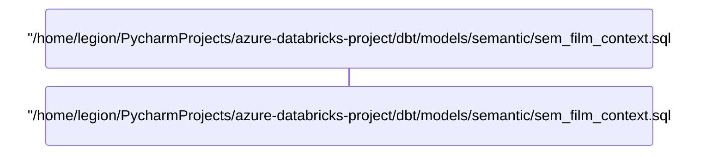

_(1 step — no `FeedsInto` edges compiled for this pipeline)_

## /home/legion/PycharmProjects/azure-databricks-project/dbt/models/semantic/sem_film_entity.sql#0

```mermaid
sequenceDiagram
    participant ndb42ad9d8eb75cd7b20bd30765e21e4d as "/home/legion/PycharmProjects/azure-databricks-project/dbt/models/semantic/sem_film_entity.sql#0:0"
```

_(1 step — no `FeedsInto` edges compiled for this pipeline)_

## /home/legion/PycharmProjects/azure-databricks-project/dbt/models/semantic/sem_graph_metrics.sql#0

```mermaid
sequenceDiagram
    participant n181354e598f752a1af12f11f281d6277 as "/home/legion/PycharmProjects/azure-databricks-project/dbt/models/semantic/sem_graph_metrics.sql#0:0"
```

_(1 step — no `FeedsInto` edges compiled for this pipeline)_

## /home/legion/PycharmProjects/azure-databricks-project/dbt/models/semantic/sem_inventory_entity.sql#0

```mermaid
sequenceDiagram
    participant nb82097b225485f27990210283a54f53d as "/home/legion/PycharmProjects/azure-databricks-project/dbt/models/semantic/sem_inventory_entity.sql#0:0"
```

_(1 step — no `FeedsInto` edges compiled for this pipeline)_

## /home/legion/PycharmProjects/azure-databricks-project/dbt/models/semantic/sem_language_entity.sql#0

```mermaid
sequenceDiagram
    participant ncfef2e1c431d559bb83f8bd5afadffa3 as "/home/legion/PycharmProjects/azure-databricks-project/dbt/models/semantic/sem_language_entity.sql#0:0"
```

_(1 step — no `FeedsInto` edges compiled for this pipeline)_

## /home/legion/PycharmProjects/azure-databricks-project/dbt/models/semantic/sem_payment_fact.sql#0

```mermaid
sequenceDiagram
    participant n1bc1e3ccb7705d18877c730a14b6b84a as "/home/legion/PycharmProjects/azure-databricks-project/dbt/models/semantic/sem_payment_fact.sql#0:0"
```

_(1 step — no `FeedsInto` edges compiled for this pipeline)_

## /home/legion/PycharmProjects/azure-databricks-project/dbt/models/semantic/sem_rental_fact.sql#0

```mermaid
sequenceDiagram
    participant n88104cb74f3c551d9c777a3897a5ae87 as "/home/legion/PycharmProjects/azure-databricks-project/dbt/models/semantic/sem_rental_fact.sql#0:0"
```

_(1 step — no `FeedsInto` edges compiled for this pipeline)_

## /home/legion/PycharmProjects/azure-databricks-project/dbt/models/semantic/sem_rental_inventory_rel.sql#0

```mermaid
sequenceDiagram
    participant n8d07f97d5f055169aa52334e9c553d61 as "/home/legion/PycharmProjects/azure-databricks-project/dbt/models/semantic/sem_rental_inventory_rel.sql#0:0"
```

_(1 step — no `FeedsInto` edges compiled for this pipeline)_

## /home/legion/PycharmProjects/azure-databricks-project/dbt/models/semantic/sem_staff_entity.sql#0

```mermaid
sequenceDiagram
    participant n8f43644bd16e5de786e1201341198bbd as "/home/legion/PycharmProjects/azure-databricks-project/dbt/models/semantic/sem_staff_entity.sql#0:0"
```

_(1 step — no `FeedsInto` edges compiled for this pipeline)_

## /home/legion/PycharmProjects/azure-databricks-project/dbt/models/semantic/sem_store_context.sql#0

```mermaid
sequenceDiagram
    participant n32cd8034412050448aa08da257ddb8c8 as "/home/legion/PycharmProjects/azure-databricks-project/dbt/models/semantic/sem_store_context.sql#0:0"
```

_(1 step — no `FeedsInto` edges compiled for this pipeline)_

## /home/legion/PycharmProjects/azure-databricks-project/dbt/models/semantic/sem_store_entity.sql#0

```mermaid
sequenceDiagram
    participant na499282b41e05f1794b1201eea0575de as "/home/legion/PycharmProjects/azure-databricks-project/dbt/models/semantic/sem_store_entity.sql#0:0"
```

_(1 step — no `FeedsInto` edges compiled for this pipeline)_

## /home/legion/PycharmProjects/azure-databricks-project/dbt/models/silver/silver_actor.sql#0

```mermaid
sequenceDiagram
    participant n8b09cbbac32850e499bb6e32861f633c as "/home/legion/PycharmProjects/azure-databricks-project/dbt/models/silver/silver_actor.sql#0:0"
```

_(1 step — no `FeedsInto` edges compiled for this pipeline)_

## /home/legion/PycharmProjects/azure-databricks-project/dbt/models/silver/silver_address.sql#0

```mermaid
sequenceDiagram
    participant na490efdec7e0584392e6c8e33ee25f62 as "/home/legion/PycharmProjects/azure-databricks-project/dbt/models/silver/silver_address.sql#0:0"
```

_(1 step — no `FeedsInto` edges compiled for this pipeline)_

## /home/legion/PycharmProjects/azure-databricks-project/dbt/models/silver/silver_category.sql#0

```mermaid
sequenceDiagram
    participant n3774ea89843151dc8e4ebc1c6953d01f as "/home/legion/PycharmProjects/azure-databricks-project/dbt/models/silver/silver_category.sql#0:0"
```

_(1 step — no `FeedsInto` edges compiled for this pipeline)_

## /home/legion/PycharmProjects/azure-databricks-project/dbt/models/silver/silver_city.sql#0

```mermaid
sequenceDiagram
    participant n4c7dce8b82d45f61bf0c6fd4422c631c as "/home/legion/PycharmProjects/azure-databricks-project/dbt/models/silver/silver_city.sql#0:0"
```

_(1 step — no `FeedsInto` edges compiled for this pipeline)_

## /home/legion/PycharmProjects/azure-databricks-project/dbt/models/silver/silver_country.sql#0

```mermaid
sequenceDiagram
    participant n73dc5905724e5982b84b10643ddba9b9 as "/home/legion/PycharmProjects/azure-databricks-project/dbt/models/silver/silver_country.sql#0:0"
```

_(1 step — no `FeedsInto` edges compiled for this pipeline)_

## /home/legion/PycharmProjects/azure-databricks-project/dbt/models/silver/silver_customer.sql#0

```mermaid
sequenceDiagram
    participant n08fa4446cfa2524f87dd49561dda7d4d as "/home/legion/PycharmProjects/azure-databricks-project/dbt/models/silver/silver_customer.sql#0:0"
```

_(1 step — no `FeedsInto` edges compiled for this pipeline)_

## /home/legion/PycharmProjects/azure-databricks-project/dbt/models/silver/silver_customer.sql#1

```mermaid
sequenceDiagram
    participant n4df03069521b53aabbdcb3e6703aa93f as "/home/legion/PycharmProjects/azure-databricks-project/dbt/models/silver/silver_customer.sql#1:0"
```

_(1 step — no `FeedsInto` edges compiled for this pipeline)_

## /home/legion/PycharmProjects/azure-databricks-project/dbt/models/silver/silver_film.sql#0

```mermaid
sequenceDiagram
    participant n0e60f5e733ea59edb8eda6800e54f673 as "/home/legion/PycharmProjects/azure-databricks-project/dbt/models/silver/silver_film.sql#0:0"
```

_(1 step — no `FeedsInto` edges compiled for this pipeline)_

## /home/legion/PycharmProjects/azure-databricks-project/dbt/models/silver/silver_film.sql#1

```mermaid
sequenceDiagram
    participant n189342df792856d4a3eb6eba3f3e318e as "/home/legion/PycharmProjects/azure-databricks-project/dbt/models/silver/silver_film.sql#1:0"
```

_(1 step — no `FeedsInto` edges compiled for this pipeline)_

## /home/legion/PycharmProjects/azure-databricks-project/dbt/models/silver/silver_film_actor.sql#0

```mermaid
sequenceDiagram
    participant n9158f650e8e158f1a11d3dd19a9bb1c3 as "/home/legion/PycharmProjects/azure-databricks-project/dbt/models/silver/silver_film_actor.sql#0:0"
```

_(1 step — no `FeedsInto` edges compiled for this pipeline)_

## /home/legion/PycharmProjects/azure-databricks-project/dbt/models/silver/silver_film_category.sql#0

```mermaid
sequenceDiagram
    participant n53714249c152582aab7c5b4f79302621 as "/home/legion/PycharmProjects/azure-databricks-project/dbt/models/silver/silver_film_category.sql#0:0"
```

_(1 step — no `FeedsInto` edges compiled for this pipeline)_

## /home/legion/PycharmProjects/azure-databricks-project/dbt/models/silver/silver_inventory.sql#0

```mermaid
sequenceDiagram
    participant n6c7f5215e4bf5b5fa5405750de40ee6c as "/home/legion/PycharmProjects/azure-databricks-project/dbt/models/silver/silver_inventory.sql#0:0"
```

_(1 step — no `FeedsInto` edges compiled for this pipeline)_

## /home/legion/PycharmProjects/azure-databricks-project/dbt/models/silver/silver_language.sql#0

```mermaid
sequenceDiagram
    participant ndae0fa456b9e58b6aaa70058cb8063ff as "/home/legion/PycharmProjects/azure-databricks-project/dbt/models/silver/silver_language.sql#0:0"
```

_(1 step — no `FeedsInto` edges compiled for this pipeline)_

## /home/legion/PycharmProjects/azure-databricks-project/dbt/models/silver/silver_payment.sql#0

```mermaid
sequenceDiagram
    participant n0bbe2e53c4765cb6bb40ce1eee3796fd as "/home/legion/PycharmProjects/azure-databricks-project/dbt/models/silver/silver_payment.sql#0:0"
```

_(1 step — no `FeedsInto` edges compiled for this pipeline)_

## /home/legion/PycharmProjects/azure-databricks-project/dbt/models/silver/silver_rental.sql#0

```mermaid
sequenceDiagram
    participant n4976f2690dbf590cbd3cd219b784a3d5 as "/home/legion/PycharmProjects/azure-databricks-project/dbt/models/silver/silver_rental.sql#0:0"
```

_(1 step — no `FeedsInto` edges compiled for this pipeline)_

## /home/legion/PycharmProjects/azure-databricks-project/dbt/models/silver/silver_rental.sql#1

```mermaid
sequenceDiagram
    participant n5af9d02fd1895d99af1207b5106707f1 as "/home/legion/PycharmProjects/azure-databricks-project/dbt/models/silver/silver_rental.sql#1:0"
```

_(1 step — no `FeedsInto` edges compiled for this pipeline)_

## /home/legion/PycharmProjects/azure-databricks-project/dbt/models/silver/silver_staff.sql#0

```mermaid
sequenceDiagram
    participant naa6949e3910b50cc9e05ed6f9e9eeadb as "/home/legion/PycharmProjects/azure-databricks-project/dbt/models/silver/silver_staff.sql#0:0"
```

_(1 step — no `FeedsInto` edges compiled for this pipeline)_

## /home/legion/PycharmProjects/azure-databricks-project/dbt/models/silver/silver_store.sql#0

```mermaid
sequenceDiagram
    participant n920e2d68ce9f54c39beb7f7e58a64fb2 as "/home/legion/PycharmProjects/azure-databricks-project/dbt/models/silver/silver_store.sql#0:0"
```

_(1 step — no `FeedsInto` edges compiled for this pipeline)_

## notebooks/bronze/dvdrental/generic_raw_to_bronze.py#0

```mermaid
sequenceDiagram
    participant n140b0902457d5f9fbfc8f4b099b53743 as "notebooks/bronze/dvdrental/generic_raw_to_bronze.py#0:0"
```

_(1 step — no `FeedsInto` edges compiled for this pipeline)_

## notebooks/semantic/create_graph_views.py#0

```mermaid
sequenceDiagram
    participant nb36beae245a65ec39ef03bd9b1e10d9a as "notebooks/semantic/create_graph_views.py#0:0"
```

_(1 step — no `FeedsInto` edges compiled for this pipeline)_

## notebooks/semantic/create_graph_views.py#1

```mermaid
sequenceDiagram
    participant n55838990841d559faaca993b616181ce as "notebooks/semantic/create_graph_views.py#1:0"
```

_(1 step — no `FeedsInto` edges compiled for this pipeline)_

## notebooks/semantic/create_graph_views.py#2

```mermaid
sequenceDiagram
    participant nb1da4ff1a43c5bd8a684083f0bba2041 as "notebooks/semantic/create_graph_views.py#2:0"
```

_(1 step — no `FeedsInto` edges compiled for this pipeline)_

## notebooks/semantic/extract_entities_llm.py#0

```mermaid
sequenceDiagram
    participant nadac0c7f143a558b99adc70a9519a1b3 as "notebooks/semantic/extract_entities_llm.py#0:0"
```

_(1 step — no `FeedsInto` edges compiled for this pipeline)_

## notebooks/semantic/generate_semantic_tables.py#0

```mermaid
sequenceDiagram
    participant na01ce4f8c488509d9ae4493b092f2b55 as "notebooks/semantic/generate_semantic_tables.py#0:0"
```

_(1 step — no `FeedsInto` edges compiled for this pipeline)_

## notebooks/semantic/generate_semantic_tables.py#1

```mermaid
sequenceDiagram
    participant n61f98308c2e25cc9b338f4901ea7e219 as "notebooks/semantic/generate_semantic_tables.py#1:0"
```

_(1 step — no `FeedsInto` edges compiled for this pipeline)_

## notebooks/semantic/generate_semantic_tables.py#2

```mermaid
sequenceDiagram
    participant nd531ee4b59f05ce7b64efd11b76ab2ae as "notebooks/semantic/generate_semantic_tables.py#2:0"
```

_(1 step — no `FeedsInto` edges compiled for this pipeline)_

## notebooks/semantic/generate_semantic_tables.py#3

```mermaid
sequenceDiagram
    participant nd8aae2c2dbab54cd90d727563af1b364 as "notebooks/semantic/generate_semantic_tables.py#3:0"
```

_(1 step — no `FeedsInto` edges compiled for this pipeline)_

## notebooks/semantic/generate_semantic_tables.py#4

```mermaid
sequenceDiagram
    participant n27b4c85f06c1518591ec2eeae00970b3 as "notebooks/semantic/generate_semantic_tables.py#4:0"
```

_(1 step — no `FeedsInto` edges compiled for this pipeline)_

## notebooks/semantic/generate_semantic_tables.py#5

```mermaid
sequenceDiagram
    participant nc6a3a44d8e175f69ba927092777d51a0 as "notebooks/semantic/generate_semantic_tables.py#5:0"
```

_(1 step — no `FeedsInto` edges compiled for this pipeline)_

## notebooks/semantic/generate_semantic_tables.py#6

```mermaid
sequenceDiagram
    participant nfab5e4485c395d80b81749d019a985db as "notebooks/semantic/generate_semantic_tables.py#6:0"
    participant neb249e1f63a25195be631c5c01e8beb3 as "notebooks/semantic/generate_semantic_tables.py#6:1"
    nfab5e4485c395d80b81749d019a985db->>neb249e1f63a25195be631c5c01e8beb3: Filter
```

## notebooks/semantic/test_semantic_layer.py#0

```mermaid
sequenceDiagram
    participant n1d829808906556b09b479b3724350545 as "notebooks/semantic/test_semantic_layer.py#0:0"
```

_(1 step — no `FeedsInto` edges compiled for this pipeline)_

## notebooks/semantic/test_semantic_layer.py#1

```mermaid
sequenceDiagram
    participant n2522d7b7737053d4a8b69f278eb390ce as "notebooks/semantic/test_semantic_layer.py#1:0"
```

_(1 step — no `FeedsInto` edges compiled for this pipeline)_

## notebooks/semantic/test_semantic_layer.py#2

```mermaid
sequenceDiagram
    participant nb4286ca3c3c550d8a27d52fee1a10fc3 as "notebooks/semantic/test_semantic_layer.py#2:0"
```

_(1 step — no `FeedsInto` edges compiled for this pipeline)_

## notebooks/semantic/test_semantic_layer.py#3

```mermaid
sequenceDiagram
    participant n3975958a324d5e328268d87507b404a0 as "notebooks/semantic/test_semantic_layer.py#3:0"
```

_(1 step — no `FeedsInto` edges compiled for this pipeline)_

## notebooks/semantic/test_semantic_layer.py#4

```mermaid
sequenceDiagram
    participant n74e2e7bab8875ca399058b6c77801170 as "notebooks/semantic/test_semantic_layer.py#4:0"
```

_(1 step — no `FeedsInto` edges compiled for this pipeline)_

## notebooks/semantic/test_semantic_layer.py#5

```mermaid
sequenceDiagram
    participant n8dc7f3ca3d335da6aede709771d490af as "notebooks/semantic/test_semantic_layer.py#5:0"
```

_(1 step — no `FeedsInto` edges compiled for this pipeline)_

## notebooks/semantic/test_semantic_layer.py#6

```mermaid
sequenceDiagram
    participant n5db6c7273b405b30936f6036cfdd62e6 as "notebooks/semantic/test_semantic_layer.py#6:0"
```

_(1 step — no `FeedsInto` edges compiled for this pipeline)_

## notebooks/semantic/test_semantic_layer.py#7

```mermaid
sequenceDiagram
    participant nf79ba18a330658b789109f1ac1ee7203 as "notebooks/semantic/test_semantic_layer.py#7:0"
```

_(1 step — no `FeedsInto` edges compiled for this pipeline)_

## src/dp/io/delta.py#0

```mermaid
sequenceDiagram
    participant n78e1714f106151c48ac02bcbdcc0a70c as "src/dp/io/delta.py#0:0"
```

_(1 step — no `FeedsInto` edges compiled for this pipeline)_

## src/dp/io/delta.py#1

```mermaid
sequenceDiagram
    participant n9ee5807ad22c5b5ea60642e25c43209a as "src/dp/io/delta.py#1:0"
```

_(1 step — no `FeedsInto` edges compiled for this pipeline)_

## src/dp/io/delta.py#2

```mermaid
sequenceDiagram
    participant nfbe2b480be9057bd92ff4b913932d3f4 as "src/dp/io/delta.py#2:0"
```

_(1 step — no `FeedsInto` edges compiled for this pipeline)_

## src/dp/io/run_stats.py#0

```mermaid
sequenceDiagram
    participant n5d972cad0f575d399c1a08cfb23dfd42 as "src/dp/io/run_stats.py#0:0"
```

_(1 step — no `FeedsInto` edges compiled for this pipeline)_

## src/dp/io/run_stats.py#1

```mermaid
sequenceDiagram
    participant n3b240b11ac0353dd81c99e328b649fc4 as "src/dp/io/run_stats.py#1:0"
    participant n73cebc89f24b5926a72566a2a75ed3b6 as "src/dp/io/run_stats.py#1:1"
    n3b240b11ac0353dd81c99e328b649fc4->>n73cebc89f24b5926a72566a2a75ed3b6: Calculate
```

## src/dp/io/run_stats.py#2

```mermaid
sequenceDiagram
    participant na1a2c904f6e257e7bd923aa3b4613c61 as "src/dp/io/run_stats.py#2:0"
```

_(1 step — no `FeedsInto` edges compiled for this pipeline)_

## src/dp/io/table.py#0

```mermaid
sequenceDiagram
    participant n28dffed396d95af893a3c1391ecb7f62 as "src/dp/io/table.py#0:0"
```

_(1 step — no `FeedsInto` edges compiled for this pipeline)_

## src/dp/io/table.py#1

```mermaid
sequenceDiagram
    participant n2f0f50fe881358c08dfd896228e5d98e as "src/dp/io/table.py#1:0"
```

_(1 step — no `FeedsInto` edges compiled for this pipeline)_

## src/dp/io/table.py#2

```mermaid
sequenceDiagram
    participant n1db51b3857425c7583b41ce626addbb3 as "src/dp/io/table.py#2:0"
```

_(1 step — no `FeedsInto` edges compiled for this pipeline)_

## src/dp/io/table.py#3

```mermaid
sequenceDiagram
    participant nc1912392e41d51238fa8f6ee50256191 as "src/dp/io/table.py#3:0"
```

_(1 step — no `FeedsInto` edges compiled for this pipeline)_

## src/dp/quality/reconciliation.py#0

```mermaid
sequenceDiagram
    participant n2f40bf8d786052c38c1eb886267e1bf6 as "src/dp/quality/reconciliation.py#0:0"
    participant n7e8d3a030d6253f195795c2e4a1f6395 as "src/dp/quality/reconciliation.py#0:1"
    participant na9461dc7e71f5a5d8e7738d4c7407f91 as "src/dp/quality/reconciliation.py#0:2"
    n2f40bf8d786052c38c1eb886267e1bf6->>n7e8d3a030d6253f195795c2e4a1f6395: Calculate
    n7e8d3a030d6253f195795c2e4a1f6395->>na9461dc7e71f5a5d8e7738d4c7407f91: Calculate
```

## src/dp/quality/reporter.py#0

```mermaid
sequenceDiagram
    participant n7f70645abf0c509f847e3072fd908ae1 as "src/dp/quality/reporter.py#0:0"
```

_(1 step — no `FeedsInto` edges compiled for this pipeline)_

## src/dp/quality/reporter.py#1

```mermaid
sequenceDiagram
    participant n01cccae2ec7357929359b0dbd4a003ca as "src/dp/quality/reporter.py#1:0"
```

_(1 step — no `FeedsInto` edges compiled for this pipeline)_

## src/dp/semantic/graph.py#0

```mermaid
sequenceDiagram
    participant n3bc6398c41f854af8b4b6cd9f96b26ad as "src/dp/semantic/graph.py#0:0"
```

_(1 step — no `FeedsInto` edges compiled for this pipeline)_

## src/dp/semantic/graph.py#1

```mermaid
sequenceDiagram
    participant n52aed88348f850739a5d784f7d1bc0a4 as "src/dp/semantic/graph.py#1:0"
```

_(1 step — no `FeedsInto` edges compiled for this pipeline)_

## src/dp/semantic/graph.py#2

```mermaid
sequenceDiagram
    participant n36ee5cb4474658329eba6b4f94e2c884 as "src/dp/semantic/graph.py#2:0"
```

_(1 step — no `FeedsInto` edges compiled for this pipeline)_

## src/dp/semantic/graph.py#3

```mermaid
sequenceDiagram
    participant nd8c875af78d256deb7c5919afcfb874a as "src/dp/semantic/graph.py#3:0"
    participant n4ec861a7a670542080ac0478652415d3 as "src/dp/semantic/graph.py#3:1"
    nd8c875af78d256deb7c5919afcfb874a->>n4ec861a7a670542080ac0478652415d3: Join
```

## src/dp/semantic/graph.py#4

```mermaid
sequenceDiagram
    participant n9584a3c249df5492a5660915908a4008 as "src/dp/semantic/graph.py#4:0"
```

_(1 step — no `FeedsInto` edges compiled for this pipeline)_

## src/dp/semantic/llm_enricher.py#0

```mermaid
sequenceDiagram
    participant n0fc204282ca15e40a8cdd3328efcc7d3 as "src/dp/semantic/llm_enricher.py#0:0"
```

_(1 step — no `FeedsInto` edges compiled for this pipeline)_

## src/dp/semantic/visual_export.py#0

```mermaid
sequenceDiagram
    participant n868c4cdea32b5e319a15185d98fb29b2 as "src/dp/semantic/visual_export.py#0:0"
```

_(1 step — no `FeedsInto` edges compiled for this pipeline)_

## src/dp/semantic/visual_export.py#1

```mermaid
sequenceDiagram
    participant n8a06581174d95e45bd86a8bfc5ceb453 as "src/dp/semantic/visual_export.py#1:0"
```

_(1 step — no `FeedsInto` edges compiled for this pipeline)_

## src/dp/transforms/bronze.py#0

```mermaid
sequenceDiagram
    participant n1ffd77f9183752c1bbccc363d182dee9 as "src/dp/transforms/bronze.py#0:0"
    participant nf3557822edf95606afab7c4ace9b4503 as "src/dp/transforms/bronze.py#0:1"
    participant n696061ca0d8a59ffac2ae62605c9fbf0 as "src/dp/transforms/bronze.py#0:2"
    participant nb796eaa959675114a2aa9a98830a9ba4 as "src/dp/transforms/bronze.py#0:3"
    n1ffd77f9183752c1bbccc363d182dee9->>nf3557822edf95606afab7c4ace9b4503: Calculate
    nf3557822edf95606afab7c4ace9b4503->>n696061ca0d8a59ffac2ae62605c9fbf0: Calculate
    n696061ca0d8a59ffac2ae62605c9fbf0->>nb796eaa959675114a2aa9a98830a9ba4: Calculate
```

## src/dp/transforms/bronze.py#1

```mermaid
sequenceDiagram
    participant nc0d0dd48c8b95e9196ee59e960a3de4b as "src/dp/transforms/bronze.py#1:0"
```

_(1 step — no `FeedsInto` edges compiled for this pipeline)_

## src/dp/transforms/bronze.py#2

```mermaid
sequenceDiagram
    participant ncbad0963c14b52e59c3ea85eed50d426 as "src/dp/transforms/bronze.py#2:0"
    participant n47128f248ace51dd9ed853b47b91e231 as "src/dp/transforms/bronze.py#2:1"
    participant n793a2aff57de59999e3483ea754f237d as "src/dp/transforms/bronze.py#2:2"
    ncbad0963c14b52e59c3ea85eed50d426->>n47128f248ace51dd9ed853b47b91e231: Calculate
    n47128f248ace51dd9ed853b47b91e231->>n793a2aff57de59999e3483ea754f237d: Calculate
```

## tests/integration/semantic/test_semantic_round_trip.py#0

```mermaid
sequenceDiagram
    participant n763e6b892447531e91f11d27f887f231 as "tests/integration/semantic/test_semantic_round_trip.py#0:0"
```

_(1 step — no `FeedsInto` edges compiled for this pipeline)_

## tests/integration/semantic/test_semantic_round_trip.py#1

```mermaid
sequenceDiagram
    participant n308af11268f7570ea735416cea1ff1fa as "tests/integration/semantic/test_semantic_round_trip.py#1:0"
```

_(1 step — no `FeedsInto` edges compiled for this pipeline)_

## tests/integration/semantic/test_semantic_round_trip.py#2

```mermaid
sequenceDiagram
    participant ne1466fdf138054d0b2f5d1a7b1c18c2c as "tests/integration/semantic/test_semantic_round_trip.py#2:0"
```

_(1 step — no `FeedsInto` edges compiled for this pipeline)_

