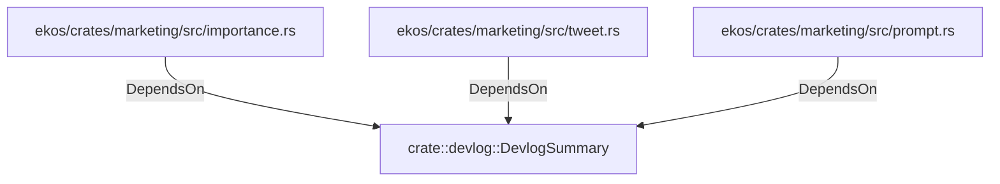

# crate::devlog::DevlogSummary (RustModule)

## Properties

_No compiled properties._

## Relationships

### DependsOn

- ← ekos/crates/marketing/src/importance.rs (`0660ec22-f9ab-533c-9a20-0b0ad28d9200`)
- ← ekos/crates/marketing/src/tweet.rs (`3372ee6e-2a1d-50b2-a3ae-b17eb421301b`)
- ← ekos/crates/marketing/src/prompt.rs (`49e3daf4-be3b-5889-a66e-372e8980f187`)

## Diagram

## Evidence

_No evidence cited._
