# ekos_artifact::ArtifactId (RustModule)

## Properties

_No compiled properties._

## Relationships

### DependsOn

- ← ekos/crates/recovery/src/python_analyzer.rs (`196ca3fd-e85c-5ab9-a142-50f63dc586b9`)
- ← ekos/crates/recovery/src/github_analyzer.rs (`09117129-0fa3-5361-a92f-97212fff36cb`)
- ← ekos/crates/recovery/src/git_analyzer.rs (`f908320d-aaa8-525a-9521-e6581d42da30`)
- ← ekos/crates/recovery/src/crypto_analyzer.rs (`c5652a0f-42a3-5e1c-82d4-0cf4d37fab34`)
- ← ekos/crates/recovery/src/pentaho_analyzer.rs (`ce3d2f1b-e1c6-55d7-92bc-c1b69f76dbca`)
- ← ekos/crates/ledger/src/lib.rs (`21938f45-b767-5933-9e71-12e15ff53eb1`)
- ← ekos/crates/recovery/src/local_docs_analyzer.rs (`d4eeb831-bfb8-592d-ad11-0e13adad2090`)
- ← ekos/crates/cli/src/commands/recover.rs (`7e02bcf9-a7b4-5099-8255-130d9ef401bb`)
- ← ekos/crates/recovery/src/rust_analyzer.rs (`50cde56d-1f82-53a6-bc71-b5b2f7c711bc`)
- ← ekos/crates/recovery/src/confluence_analyzer.rs (`d1b7d840-ae82-5a26-b381-06fb944d4e3c`)

## Diagram

```mermaid
graph TD
    nd12637a7d0be51088bf2024c0661d7ac["ekos_artifact::ArtifactId"]
    n196ca3fde85c5ab9a14250f63dc586b9["ekos/crates/recovery/src/python_analyzer.rs"]
    n196ca3fde85c5ab9a14250f63dc586b9 -->|DependsOn| nd12637a7d0be51088bf2024c0661d7ac
    n091171290fa35361a92f97212fff36cb["ekos/crates/recovery/src/github_analyzer.rs"]
    n091171290fa35361a92f97212fff36cb -->|DependsOn| nd12637a7d0be51088bf2024c0661d7ac
    nf908320daaa8525a9521e6581d42da30["ekos/crates/recovery/src/git_analyzer.rs"]
    nf908320daaa8525a9521e6581d42da30 -->|DependsOn| nd12637a7d0be51088bf2024c0661d7ac
    nc5652a0f42a35e1c82d40cf4d37fab34["ekos/crates/recovery/src/crypto_analyzer.rs"]
    nc5652a0f42a35e1c82d40cf4d37fab34 -->|DependsOn| nd12637a7d0be51088bf2024c0661d7ac
    nce3d2f1be1c655d792bcc1b69f76dbca["ekos/crates/recovery/src/pentaho_analyzer.rs"]
    nce3d2f1be1c655d792bcc1b69f76dbca -->|DependsOn| nd12637a7d0be51088bf2024c0661d7ac
    n21938f45b76759339e7112e15ff53eb1["ekos/crates/ledger/src/lib.rs"]
    n21938f45b76759339e7112e15ff53eb1 -->|DependsOn| nd12637a7d0be51088bf2024c0661d7ac
    nd4eeb831bfb8592dad110e13adad2090["ekos/crates/recovery/src/local_docs_analyzer.rs"]
    nd4eeb831bfb8592dad110e13adad2090 -->|DependsOn| nd12637a7d0be51088bf2024c0661d7ac
    n7e02bcf9a7b450998255130d9ef401bb["ekos/crates/cli/src/commands/recover.rs"]
    n7e02bcf9a7b450998255130d9ef401bb -->|DependsOn| nd12637a7d0be51088bf2024c0661d7ac
    n50cde56d1f8253a6bc71b5b2f7c711bc["ekos/crates/recovery/src/rust_analyzer.rs"]
    n50cde56d1f8253a6bc71b5b2f7c711bc -->|DependsOn| nd12637a7d0be51088bf2024c0661d7ac
    nd1b7d840ae825a26b38106fb944d4e3c["ekos/crates/recovery/src/confluence_analyzer.rs"]
    nd1b7d840ae825a26b38106fb944d4e3c -->|DependsOn| nd12637a7d0be51088bf2024c0661d7ac
```

## Evidence

_No evidence cited._
