# ekos_runtime::Runtime (RustModule)

## Properties

_No compiled properties._

## Relationships

### DependsOn

- ← ekos/crates/cli/src/commands/ekl.rs (`bc65014d-7e0a-5fdc-8a2b-fde4edce2935`)
- ← tests/integration/tests/integration.rs (`23e9eb43-c8df-52b5-a581-f2efba7085ea`)
- ← benchmark/benches/runtime_load_neighborhood.rs (`ea98c002-3a2b-5dd6-9aee-01db9fa9bde1`)
- ← ekos/crates/cli/src/commands/query.rs (`76b10d14-834f-5bcb-8858-f46092b1989c`)
- ← ekos/crates/ekl/src/interpreter.rs (`9c2cb6e4-ee09-503f-8cf5-ccfaf23ecd79`)
- ← ekos/crates/cli/src/commands/ask.rs (`e7e75efa-39cb-5182-b056-2fd16dfdc739`)
- ← ekos/crates/cli/src/commands/mcp.rs (`ff76bb73-9285-5295-927c-5cb33a5bbc25`)
- ← ekos/crates/cli/src/commands/docs.rs (`5503d15b-112f-541f-8189-8be05a060beb`)

## Diagram

```mermaid
graph TD
    n91d0a10438fd5f95be7f51ec6f752da8["ekos_runtime::Runtime"]
    nbc65014d7e0a5fdc8a2bfde4edce2935["ekos/crates/cli/src/commands/ekl.rs"]
    nbc65014d7e0a5fdc8a2bfde4edce2935 -->|DependsOn| n91d0a10438fd5f95be7f51ec6f752da8
    n23e9eb43c8df52b5a581f2efba7085ea["tests/integration/tests/integration.rs"]
    n23e9eb43c8df52b5a581f2efba7085ea -->|DependsOn| n91d0a10438fd5f95be7f51ec6f752da8
    nea98c0023a2b5dd69aee01db9fa9bde1["benchmark/benches/runtime_load_neighborhood.rs"]
    nea98c0023a2b5dd69aee01db9fa9bde1 -->|DependsOn| n91d0a10438fd5f95be7f51ec6f752da8
    n76b10d14834f5bcb8858f46092b1989c["ekos/crates/cli/src/commands/query.rs"]
    n76b10d14834f5bcb8858f46092b1989c -->|DependsOn| n91d0a10438fd5f95be7f51ec6f752da8
    n9c2cb6e4ee09503f8cf5ccfaf23ecd79["ekos/crates/ekl/src/interpreter.rs"]
    n9c2cb6e4ee09503f8cf5ccfaf23ecd79 -->|DependsOn| n91d0a10438fd5f95be7f51ec6f752da8
    ne7e75efa39cb5182b0562fd16dfdc739["ekos/crates/cli/src/commands/ask.rs"]
    ne7e75efa39cb5182b0562fd16dfdc739 -->|DependsOn| n91d0a10438fd5f95be7f51ec6f752da8
    nff76bb7392855295927c5cb33a5bbc25["ekos/crates/cli/src/commands/mcp.rs"]
    nff76bb7392855295927c5cb33a5bbc25 -->|DependsOn| n91d0a10438fd5f95be7f51ec6f752da8
    n5503d15b112f541f81898be05a060beb["ekos/crates/cli/src/commands/docs.rs"]
    n5503d15b112f541f81898be05a060beb -->|DependsOn| n91d0a10438fd5f95be7f51ec6f752da8
```

## Evidence

_No evidence cited._
