# std::collections::HashSet (RustModule)

## Properties

_No compiled properties._

## Relationships

### DependsOn

- ← ekos/crates/recovery/src/python_analyzer.rs (`196ca3fd-e85c-5ab9-a142-50f63dc586b9`)
- ← ekos/crates/compiler-core/src/pass.rs (`5189d0a2-3e2b-529e-adbf-3984a77be404`)
- ← ekos/crates/docs-gen/src/lib.rs (`6ca4fba0-18e5-59b7-9876-7dae72e2ce0e`)
- ← ekos/crates/ledger/src/fact_ledger.rs (`eadcb59e-818f-5d1e-af87-ff29aba11423`)
- ← ekos/crates/cli/src/commands/identity.rs (`f6e3418b-d664-536b-8a69-b723a534ff1a`)
- ← ekos/crates/recovery/src/rust_analyzer.rs (`50cde56d-1f82-53a6-bc71-b5b2f7c711bc`)
- ← ekos/crates/semantic/src/lib.rs (`54021a72-4846-550c-960f-e63303e4d103`)
- ← ekos/crates/runtime/src/ai.rs (`e85e734d-ef58-5185-835a-34896d2da3f1`)
- ← ekos/crates/identity/src/similarity.rs (`e66f3285-3368-5aa7-be23-fe2abc068cad`)
- ← ekos/crates/runtime/src/lib.rs (`7d8cf6bd-fac1-56d9-a742-4db7a455ab7c`)

## Diagram

```mermaid
graph TD
    n300a79fd7e6a5273831bc41c8e471117["std::collections::HashSet"]
    n196ca3fde85c5ab9a14250f63dc586b9["ekos/crates/recovery/src/python_analyzer.rs"]
    n196ca3fde85c5ab9a14250f63dc586b9 -->|DependsOn| n300a79fd7e6a5273831bc41c8e471117
    n5189d0a23e2b529eadbf3984a77be404["ekos/crates/compiler-core/src/pass.rs"]
    n5189d0a23e2b529eadbf3984a77be404 -->|DependsOn| n300a79fd7e6a5273831bc41c8e471117
    n6ca4fba018e559b798767dae72e2ce0e["ekos/crates/docs-gen/src/lib.rs"]
    n6ca4fba018e559b798767dae72e2ce0e -->|DependsOn| n300a79fd7e6a5273831bc41c8e471117
    neadcb59e818f5d1eaf87ff29aba11423["ekos/crates/ledger/src/fact_ledger.rs"]
    neadcb59e818f5d1eaf87ff29aba11423 -->|DependsOn| n300a79fd7e6a5273831bc41c8e471117
    nf6e3418bd664536b8a69b723a534ff1a["ekos/crates/cli/src/commands/identity.rs"]
    nf6e3418bd664536b8a69b723a534ff1a -->|DependsOn| n300a79fd7e6a5273831bc41c8e471117
    n50cde56d1f8253a6bc71b5b2f7c711bc["ekos/crates/recovery/src/rust_analyzer.rs"]
    n50cde56d1f8253a6bc71b5b2f7c711bc -->|DependsOn| n300a79fd7e6a5273831bc41c8e471117
    n54021a724846550c960fe63303e4d103["ekos/crates/semantic/src/lib.rs"]
    n54021a724846550c960fe63303e4d103 -->|DependsOn| n300a79fd7e6a5273831bc41c8e471117
    ne85e734def585185835a34896d2da3f1["ekos/crates/runtime/src/ai.rs"]
    ne85e734def585185835a34896d2da3f1 -->|DependsOn| n300a79fd7e6a5273831bc41c8e471117
    ne66f328533685aa7be23fe2abc068cad["ekos/crates/identity/src/similarity.rs"]
    ne66f328533685aa7be23fe2abc068cad -->|DependsOn| n300a79fd7e6a5273831bc41c8e471117
    n7d8cf6bdfac156d9a7424db7a455ab7c["ekos/crates/runtime/src/lib.rs"]
    n7d8cf6bdfac156d9a7424db7a455ab7c -->|DependsOn| n300a79fd7e6a5273831bc41c8e471117
```

## Evidence

_No evidence cited._
