# super::store::open_store (RustModule)

## Properties

_No compiled properties._

## Relationships

### DependsOn

- ← ekos/crates/cli/src/commands/ekl.rs (`bc65014d-7e0a-5fdc-8a2b-fde4edce2935`)
- ← ekos/crates/cli/src/commands/dbt.rs (`d3579ceb-9751-53ad-b6be-693f17509a70`)
- ← ekos/crates/cli/src/commands/build.rs (`306def2e-bd5a-5784-9453-692c119e8d43`)
- ← ekos/crates/cli/src/commands/branch.rs (`8ae8543c-ebb4-545a-b5fe-5735e3953e88`)
- ← ekos/crates/cli/src/commands/identity.rs (`f6e3418b-d664-536b-8a69-b723a534ff1a`)
- ← ekos/crates/cli/src/commands/diff.rs (`162a5e91-5e60-5951-9a1c-14c60cd6109b`)
- ← ekos/crates/cli/src/commands/query.rs (`76b10d14-834f-5bcb-8858-f46092b1989c`)
- ← ekos/crates/cli/src/commands/ask.rs (`e7e75efa-39cb-5182-b056-2fd16dfdc739`)
- ← ekos/crates/cli/src/commands/commit.rs (`f48ae11b-a9a7-54f0-8cc6-a192b1641436`)
- ← ekos/crates/cli/src/commands/mcp.rs (`ff76bb73-9285-5295-927c-5cb33a5bbc25`)
- ← ekos/crates/cli/src/commands/docs.rs (`5503d15b-112f-541f-8189-8be05a060beb`)

## Diagram

```mermaid
graph TD
    n313631437d61534f801251c26b5e28a1["super::store::open_store"]
    nbc65014d7e0a5fdc8a2bfde4edce2935["ekos/crates/cli/src/commands/ekl.rs"]
    nbc65014d7e0a5fdc8a2bfde4edce2935 -->|DependsOn| n313631437d61534f801251c26b5e28a1
    nd3579ceb975153adb6be693f17509a70["ekos/crates/cli/src/commands/dbt.rs"]
    nd3579ceb975153adb6be693f17509a70 -->|DependsOn| n313631437d61534f801251c26b5e28a1
    n306def2ebd5a57849453692c119e8d43["ekos/crates/cli/src/commands/build.rs"]
    n306def2ebd5a57849453692c119e8d43 -->|DependsOn| n313631437d61534f801251c26b5e28a1
    n8ae8543cebb4545ab5fe5735e3953e88["ekos/crates/cli/src/commands/branch.rs"]
    n8ae8543cebb4545ab5fe5735e3953e88 -->|DependsOn| n313631437d61534f801251c26b5e28a1
    nf6e3418bd664536b8a69b723a534ff1a["ekos/crates/cli/src/commands/identity.rs"]
    nf6e3418bd664536b8a69b723a534ff1a -->|DependsOn| n313631437d61534f801251c26b5e28a1
    n162a5e915e6059519a1c14c60cd6109b["ekos/crates/cli/src/commands/diff.rs"]
    n162a5e915e6059519a1c14c60cd6109b -->|DependsOn| n313631437d61534f801251c26b5e28a1
    n76b10d14834f5bcb8858f46092b1989c["ekos/crates/cli/src/commands/query.rs"]
    n76b10d14834f5bcb8858f46092b1989c -->|DependsOn| n313631437d61534f801251c26b5e28a1
    ne7e75efa39cb5182b0562fd16dfdc739["ekos/crates/cli/src/commands/ask.rs"]
    ne7e75efa39cb5182b0562fd16dfdc739 -->|DependsOn| n313631437d61534f801251c26b5e28a1
    nf48ae11ba9a754f08cc6a192b1641436["ekos/crates/cli/src/commands/commit.rs"]
    nf48ae11ba9a754f08cc6a192b1641436 -->|DependsOn| n313631437d61534f801251c26b5e28a1
    nff76bb7392855295927c5cb33a5bbc25["ekos/crates/cli/src/commands/mcp.rs"]
    nff76bb7392855295927c5cb33a5bbc25 -->|DependsOn| n313631437d61534f801251c26b5e28a1
    n5503d15b112f541f81898be05a060beb["ekos/crates/cli/src/commands/docs.rs"]
    n5503d15b112f541f81898be05a060beb -->|DependsOn| n313631437d61534f801251c26b5e28a1
```

## Evidence

_No evidence cited._
