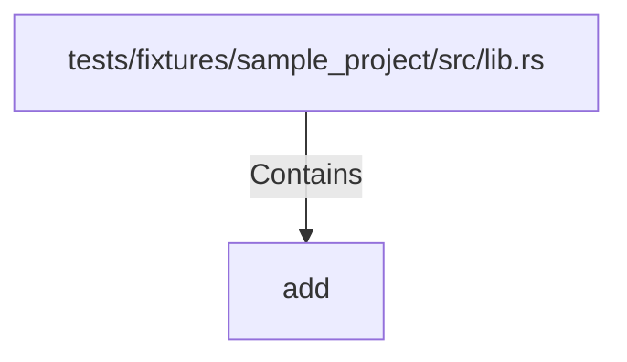

# add (RustSymbol)

## Properties

| Key | Value |
|---|---|
| `kind` | function |

## Relationships

### Contains

- ← tests/fixtures/sample_project/src/lib.rs (`60fa950d-11d5-5886-9228-fdd15f9f832e`)

## Diagram

## Evidence

_No evidence cited._
